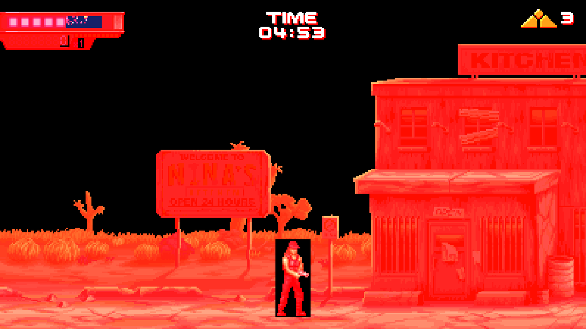
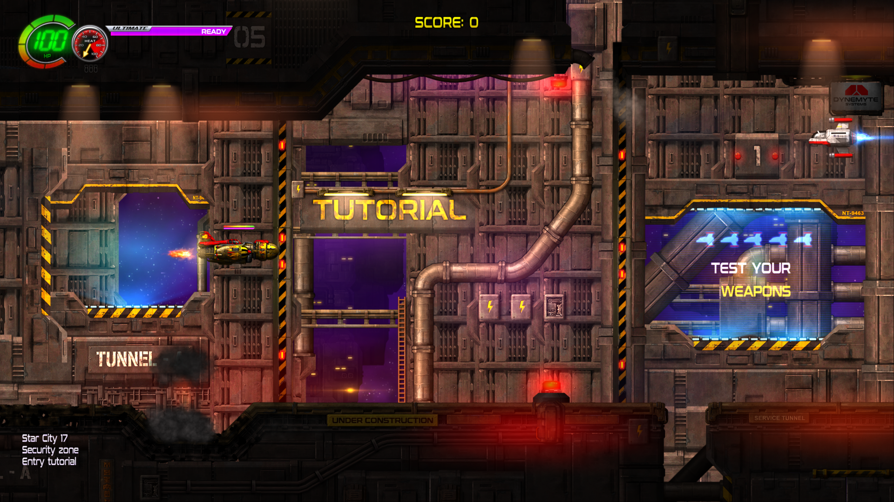
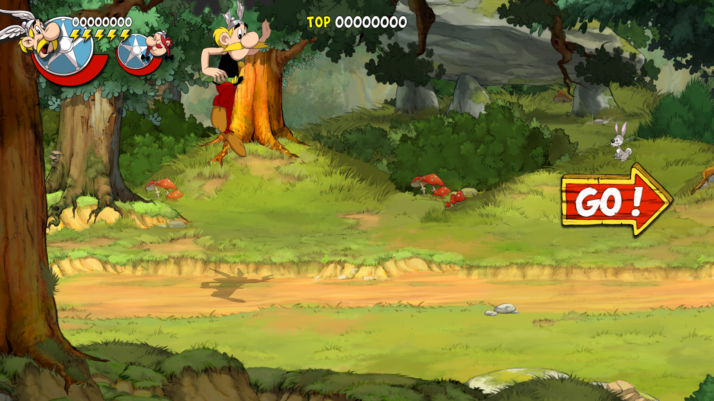
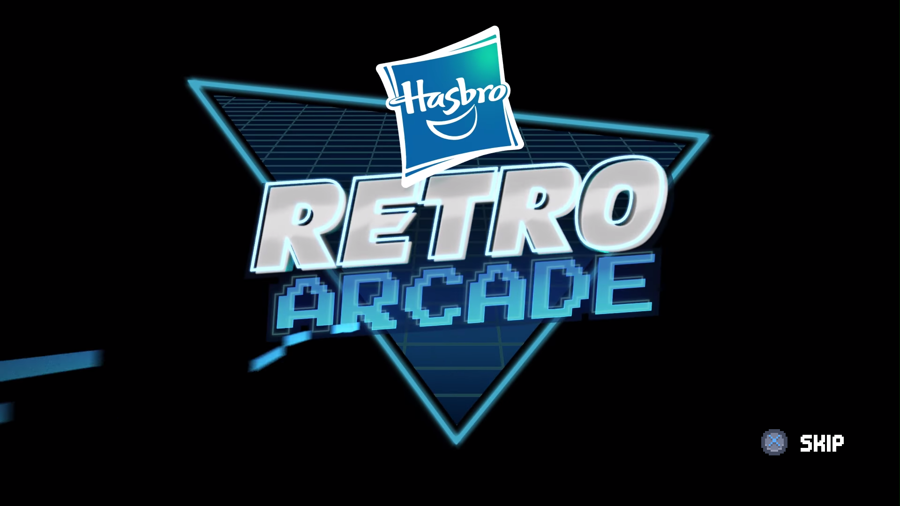
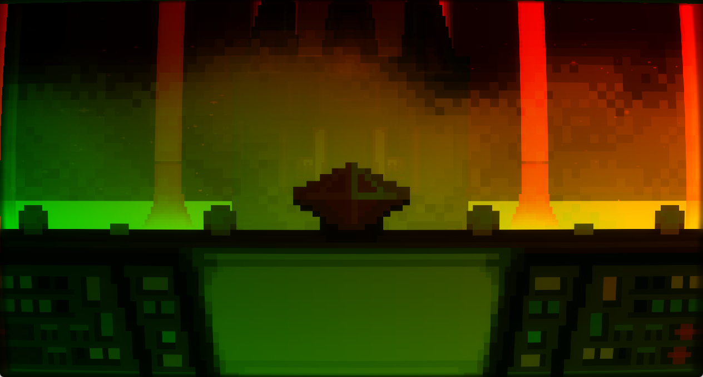
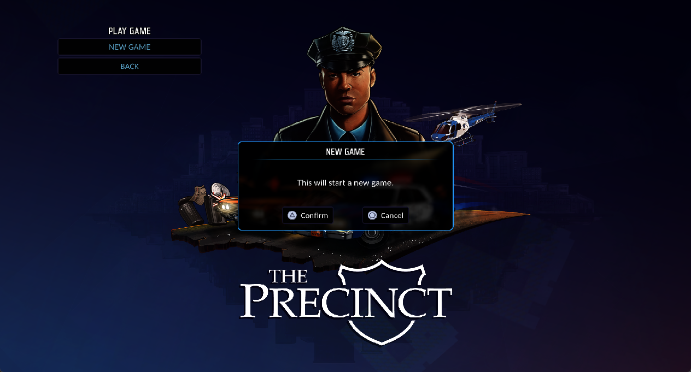
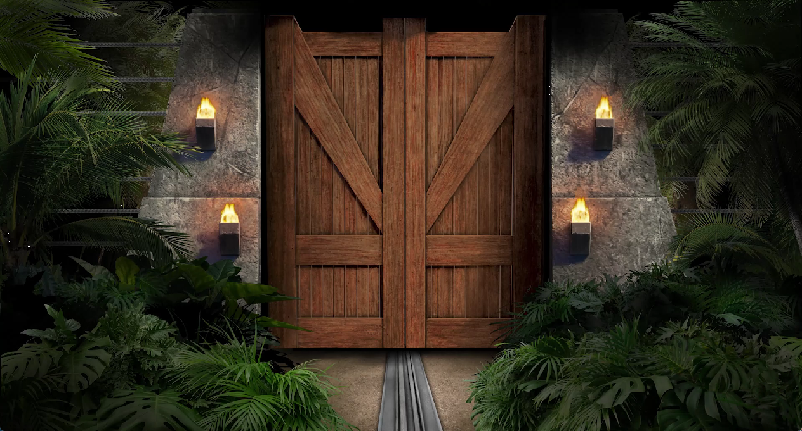
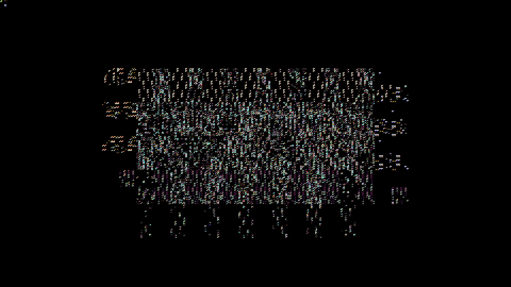

# PS5PCEM

PS5PCEM is an experimental PlayStation 5 emulator and interoperability research
project written in Zig. It can load decrypted PS5 executables, run selected
x86-64 guest code directly on Windows, execute AGC command streams, translate a
growing RDNA2 shader subset to SPIR-V, and present the resulting frames through
Vulkan.

> [!IMPORTANT]
> This is an early development project, not a general-purpose game emulator.
> Rendering, synchronization, firmware coverage, and title compatibility are
> incomplete. Use only software and system files that you are legally allowed
> to access.

## Support the project

If you would like to support continued PS5PCEM development, you can do so on
[Boosty](https://boosty.to/ps5pcem) or
[Patreon](https://www.patreon.com/c/PS5PCEM).

## Current status

- Native guest execution is available on Windows x86-64; inspection, decoding,
  and HLE components also build on Linux and macOS.
- Live VideoOut reaches a Vulkan swapchain, while host audio accepts decoded
  guest buffers at 48 kHz. SceAvPlayer uses FFmpeg for H.264/AAC media and
  returns synchronized NV12 video plus stereo PCM through the title's own
  allocation and file callbacks.
- Titles can save. A mounted slot becomes a writable `/savedata0`, so a game
  stores its progress through the ordinary file API and finds it again on the
  next run; the launcher groups every local slot by title ID.
- A native Windows launcher maintains a recent-game library with installed cover
  art, persists sound and input profiles, and starts `game-run` with controller,
  keyboard, or hybrid controls.
  Sony's own pads are read directly over HID, so a DualSense or DualShock 4
  works without a translation layer; the launcher reports which one it found and
  can drive its motors and light bar as a check.
- Guest vertex and pixel shaders can render sampled textures using AGC vertex
  tables, per-instruction V# mappings, `VertexIndex`, PARAM exports, and
  fragment interpolation.
- Three-dimensional scenes now reach the screen rather than only flat composited
  output. Merged NGG vertex programs translate, including fetch-shader
  continuations that end their attribute prolog with `S_SETPC_B64`. A bound
  depth allocation is a real attachment that later passes can also sample, and
  compute stages exchange typed 2D, array and 3D images between themselves.
  Fifty-six host formats are reachable, spanning the BC1–BC7 blocks, signed and
  unsigned integer and normalized channels, R16/RG16, half-float and
  `RGBA32_FLOAT`. Sampled T# views detile their mip range, including a non-zero
  base level; GPU compute detile covers 4/8/16-byte 2D and 3D standard/PRT
  surfaces, while RB+ and MSAA still fall back to the CPU. Bound stencil planes become packed depth+stencil
  attachments with the guest compare and update operations, and matching
  colour/depth sample counts 2/4/8 stay on the host image through a later
  resolve.
- Persistent render targets, large writable storage buffers, resident storage
  images, and bounded texture and pipeline caches keep frame resources on the
  GPU across draws and dispatches. Compute chains can pass typed 2D, array, and
  3D images directly to later sampled or storage bindings without an intervening
  guest-memory round trip. A bound depth allocation becomes a resident
  attachment and can be sampled by a later pass, so guest depth testing,
  depth writes, stencil test/write, and multi-sample depth reach the rasterizer.
- Vulkan work uses ordered batches and timeline-tagged lifetime tracking. The
  default compatibility profile waits for each submitted batch; the opt-in
  timeline scheduler allows multiple batches to remain in flight and waits
  only at a real readback, guest synchronization boundary, or exhausted
  reusable-resource ring.
- Compute and graphics shader-module/pipeline misses can run through an opt-in
  on-demand FIFO compiler worker. The worker is idle-free when the queue drains,
  serializes access to the shared Vulkan driver cache, and overlaps compilation
  with preparation of the emulator's bounded LRU cache entries.
- Guest image allocations share one range-based alias registry across colour
  and separate depth/stencil targets, storage images, and sampled textures. It
  can record the canonical writer and each representation's resident generation,
  chooses direct resolves only for identical storage signatures, and routes
  reinterpretations or partial overlaps through current guest memory.
- Vulkan image layout/access state is tracked per aspect, mip, and array layer.
  Color/depth attachments, sampled and storage images, transfers, resolves, and
  readbacks derive barriers from the preceding subresource use. Its opt-in
  optimization merges compatible aspects and removes redundant read-only barriers.
- Runtime shaders can pass through a common typed IR pipeline before SPIR-V:
  lowering records operands and memory metadata, validation builds basic blocks
  and reachability. The default live path emits from decoded instructions;
  `PS5_GPU_SHADER_IR=1` selects legalized IR and `PS5_GPU_SSA=1` additionally
  constructs phi/def-use state, folds constants, and runs iterative DCE.
- Long-running title execution uses a freeing, thread-safe allocator, and
  aligned Windows direct-memory ranges share 64 KiB section views. Temporary
  uploads/readbacks and 16 KiB guest pages therefore no longer accumulate as
  an ever-growing host commit charge.
- The opt-in GPU page tracker tracks 16 KiB guest pages by generation. Tracked
  writable pages are armed read-only; the first native CPU store is handled as
  an invalidation fault, restores the guest protection, and advances the page
  generation. Unchanged buffers and textures can therefore remain resident
  without hashing or uploading their complete payload every frame.
- Graphics and compute queues retain recursively referenced indirect command
  buffers and register lists, so an AGC arena can be recycled while a real
  `WAIT_REG_MEM` continuation remains blocked and later resumes in place.
- Windows guest-thread waits use an uncancelable address wait, and process
  exceptions are delivered at a safe point on the requested guest pthread with
  its own TLS and stack identity. Unity stop-the-world handshakes therefore no
  longer depend on a synthetic semaphore failure to make progress.
- Title plugins can be mapped explicitly before execution; later
  `sceKernelLoadStartModule` calls receive stable handles and
  `sceKernelDlsym` resolves readable export names inside the selected PRX.
- Unity plug-ins may also be mapped with deferred constructors, so
  `sceKernelLoadStartModule` can start them once with the title's real argument
  block instead of running them prematurely during graph initialization.
- Terminator 2D now reaches gameplay with the intended color balance, textured
  backgrounds, characters, and UI. Its publisher logo screens render exactly as
  on the console: the sprite batcher's solid fills are honored, so the logos sit
  on a clean black background instead of the sprite atlas. Direct render-target
  scanout, GPU-resident storage and bulk tiled-texture staging reduced warmed-up frames
  from roughly 208–240 ms to 22–65 ms in the current startup capture; first-use
  texture uploads remain scene-dependent.
- Jets 'n' Guns 2 now renders its animated 3840×2160 title screen, complete main
  menu, loading screen, and tutorial gameplay instead of a black framebuffer.
  The complete ordered final pass without an explicit color target is retained
  until VideoOut supplies the scanout target.
  Recovered graphics SGPR values and live storage-buffer bounds are supplied as
  runtime data, so changing sprite batches no longer generates dozens of new
  vertex pipelines per frame. After warm-up, pipeline misses fall to zero and
  the observed 53-draw startup frames take roughly 113–124 ms on the current
  RTX 3070 Ti test host, down from approximately 1–1.8 seconds before the
  specialization fix. Firmware-default mutex handling now distinguishes the
  CRT's nested `trylock` guard from a duplicated blocking slow-path lock, so the
  decoder/output threads no longer deadlock when `START GAME` joins them.
- Asterix & Obelix: Slap Them All! now completes its Unity and PSN plug-in
  bootstrap, creates AGC shaders from four-byte-aligned headers, and reaches
  repeated 1920×1080 VideoOut frames. Its ATL intro is decoded by SceAvPlayer
  into title-owned NV12 surfaces. Synchronous AGC completion now advances the
  driver's paired CPU retirement label, removing the Unity graphics worker's
  three-second watchdog spin on every frame. Resident fullscreen copies remain
  on the GPU, and the translated guest pixel shader converts the staged NV12
  planes directly into the Vulkan render target instead of expanding and
  transferring a full RGBA frame through host memory. Completion delivery uses
  one display interval instead of a fixed 250 ms delay and coalesces equivalent
  release edges while retaining retry semantics. On the current RTX 3070 Ti
  host, the observed 48-draw gameplay cadence fell from roughly 3.1 seconds,
  then 240–250 ms and 46–49 ms, to typically 28–31 ms per frame. Frame-scoped
  command-buffer batching cuts the same workload from 52 Vulkan submissions to
  13 ordered batches; 256 descriptor/scalar slots and a persistently mapped
  read-only upload ring retain every draw's state until its fence completes.
  The final Unity compositor also retains the guest negative-height viewport as
  scanout orientation, so the scene and UI are no longer vertically inverted.
  A 3,000-flip validation run remained submission-clean and reproduced the
  gameplay shown below.
- Cat Quest III now enters its 3840×2160 Unity graphics loop and presents the
  startup splash upright. Its identity compositor uses a non-indexed procedural
  full-screen triangle rather than the previously recognized six-index quad.
  The matched resident-copy path now accepts both one-instance forms while
  retaining the existing shader, resource, format, and full-extent checks, so
  the compositor's negative-height viewport reaches scanout without matching
  ordinary textured triangles. Startup save discovery also hides interrupted
  slots that contain only firmware metadata or empty staging files. A
  reproduced `path.txt`-only settings slot previously made the title fail on a
  missing `Data.dat` and wait forever after its 13-draw startup frame; it now
  completes the search without mounting that incomplete slot and continues
  presenting frames.
- Jurassic Park Classic Games Collection now resolves the observed Font,
  FontFt, JPEG, Pad, VideoOut, Posix, and AGC driver imports, completes its
  Unity bootstrap, and reaches a stable visible 3840×2160 intro frame. Both the
  original and extended SceAvPlayer ABIs open the title's MP4 assets through
  FFmpeg. The matched movie pass accepts either NV12 plane order, recovers the
  decoder's padded row pitch, scales the 1920×1080 source into the scanout
  target, and retains the last valid image while Unity changes clips instead of
  presenting a cleared decoder surface as solid green.
- That title now leaves its intro rather than sitting on it. Its splash and
  intro clips play in sequence — gate, loop, close — with sound, and it reaches
  its menu and holds it at interactive rates. What kept it on the intro was a
  presentation that never ended: the title takes only the pictures from a movie
  and mixes its own sound, so the audio stream was never read to its end and a
  player that waited for every stream to finish stayed active forever. A
  sampler the shader assembles in registers rather than loading, and the
  instructions that assemble it, are the rest of what the menu needed. The
  alternate `IMAGE_SAMPLE_A` encoding now follows the same gradient-free sample
  semantics instead of rejecting the fragment program. Fullscreen passes also
  discard a stale undersized depth attachment before framebuffer creation; this
  removes the NVIDIA device loss that appeared when the newly translated draw
  first ran. A regression run completed more than 1,200 flips and reproduced
  the illuminated gate scene without a failed submission. No gameplay
  compatibility is claimed yet.
- The Precinct now plays both observed intro movies with synchronized video and
  audio, leaves the movie pipeline, renders its complete 1920×1080 title scene,
  and reaches the `PLAY GAME` menu and readable `NEW GAME` confirmation. Natural
  scalar loops and terminal shader branches lower to structured SPIR-V, so the
  title's artwork and UI text no longer disappear. Fixed-function
  `EliminateFastClear`, `FmaskDecompress`, and `DccDecompress` packets preserve
  the canonical resident Vulkan image instead of executing their dummy pixel
  shader as an ordinary draw; this removes the full-screen white overwrite that
  previously hid the finished scene. Holding `Triangle` now starts `NEW GAME`;
  the cold world transition completes, reaches the `Cross` prompt, and renders
  the first observed in-engine gameplay scene. Initial shader and pipeline
  compilation remains slow, and broader gameplay has not yet been validated.
- Mighty Morphin Power Rangers: Rita's Rewind now resolves its Fiber, Pad,
  offline NP, AGC 1.1, and AGC driver imports, then sustains the title's real
  1920×1080 graphics and audio loop. Native Windows fibers preserve suspended
  guest execution across `sceFiberRun`, `sceFiberSwitch`, and
  `sceFiberReturnToThread`; `scePadGetHandle` exposes the system-associated
  primary controller even when the title does not call `scePadOpen`. Its guest
  shaders use the newly decoded `V_SAD_U32`, `V_MUL_HI_I32`, and
  `V_CVT_FLR_I32_F32`, so the animated publisher sequence, menu, and post-menu
  scene render through the title's indexed VS/PS, multi-target, and sampled-image
  passes instead of the diagnostic triangle or CRT static. A narrowly matched
  CRT-composite compatibility path scales the title's 480×270 RGBA8 scene to its
  1920×1080 target while leaving the remaining post-processing chain intact.
  The observed warmed intro frames take roughly 13–20 ms on the current RTX
  3070 Ti host, with smooth audio; the heavier post-menu scene is functional but
  remains a performance target.
- PS VR2 libraries currently expose only compatibility/no-device behavior.
  VR plugins can initialize far enough to load Unity assets, but headset
  rendering, tracking, controllers, and a host OpenXR bridge do not exist yet.
- Offline bootstrap coverage now includes a fully-installed PlayGo profile and
  language/to-do queries, mount-root-aware `/app0` paths, software PNG decoding,
  save-data mount/dialog lifecycles, POSIX semaphores and pthread barriers,
  local listener sockets, sign-in and player-review dialog state, GameUpdate
  request lifecycles, conservative offline NP handles, offline telemetry
  handles, and split AJM batch jobs.
- NGS2 now preserves system/rack/voice lifecycles, parses RIFF/WAVE geometry,
  applies play/pause/resume/stop/kill events, reports 32-bit voice-state flags,
  and paces silent render grains instead of spinning a host core. The legacy
  `libSceAudiodec` lifecycle also performs real ATRAC9, MP3, and MPEG-4 AAC
  decoding; NGS2 voice mixing is still incomplete.
- AGC resource registration now reports deterministic backing-memory
  requirements and retains owner handles instead of leaving output sizes
  uninitialized. This prevents otherwise valid titles from turning stack data
  into enormous direct-memory allocation requests during renderer startup.
- Unreal Engine titles can mount multi-gigabyte PAKs, initialize ICU, load
  cooked configuration and shader archives, and emit real AGC acquire, release,
  wait, event, DMA, indirect-register, draw and flip packets. Tetris Effect:
  Connected now completes a measured startup frame containing 595 guest draws
  and 63 compute dispatches without a shader-lowering, validation, fence, or GPU
  failure. Typed 2D/3D storage images,
  bounded LDS/DS workgroup memory, `image_load`/`image_store`, sampled-image
  LOD/bias/offset and gather forms, cube coordinates and sampling, scalar
  bitfield operations, `V_LDEXP_F32`, and vertex-stage image fetches cover the
  observed startup shaders. Read-only compressed compute `image_load` uses a
  sampled BC view because Vulkan cannot expose BC images as storage images.
  Vulkan color and sampled-image formats now also preserve `R16_UNORM`,
  `R16_UINT`, and `RGBA8_UINT` typing. AGC completions remain ordered until the
  guest interrupt thread acknowledges its retirement condition, preventing the
  event-before-node race that previously stopped rendering at a nondeterministic
  flip. An unattended measured run advanced through 49 VideoOut cycles, with
  most post-bootstrap cycles taking about 3.3–3.8 seconds on the current test
  host. The next observed `0xe060`-byte generated pixel shader is now decoded
  within its exact AGC `shader_size` instead of hitting the old 4,096-instruction
  limit. The particle scene below remains the latest verified visible result;
  this is not yet a menu or gameplay claim, and synchronous GPU work is still
  much slower than real time.

### Screenshot



*A live Terminator 2D gameplay frame produced by the current guest VS/PS,
sampled-texture, render-target, and Vulkan presentation paths. Texture alpha,
component swizzles, and sRGB sampling now preserve the title's intended color
balance.*



*A live 3840×2160 Jets 'n' Guns 2 tutorial frame reached through `START GAME`
and the title's loading screen. The ship, HUD, layered level art, lighting, and
text are produced by the guest multi-draw, sampled-texture,
persistent-render-target, compute, and VideoOut paths.*



*A live 1920×1080 Asterix & Obelix: Slap Them All! gameplay frame captured at
flip 512. The scene, characters, HUD, and prompt come from the title's guest
draws. The final fullscreen compositor remains GPU-resident, while scanout
preserves the guest viewport's vertical orientation without a per-frame
host-memory round trip.*



*A live 1920×1080 Rita's Rewind publisher/title intro frame produced by the
guest indexed vertex, sampled fragment, render-target composition, and VideoOut
paths. The corresponding animation and audio remain smooth in the observed
run; this is an intro milestone rather than a gameplay claim.*



*Rita's Rewind after the title menu, rendered from the real 480×270 guest scene
target and carried through the 1920×1080 CRT/post-processing chain. The strict
CRT-composite compatibility path removes the former full-screen static while
preserving the title's pixel-art presentation.*



*The Precinct's live 1920×1080 title menu and `NEW GAME` confirmation, composed
by the guest graphics and compute passes after both SceAvPlayer intro movies.
Structured shader control flow restores the UI text, while fixed-function DCC
decompression no longer executes its constant-white helper shader over the
completed scene. This capture predates the now-verified transition into the
first in-engine gameplay scene.*



*A live Jurassic Park Classic Games Collection intro frame presented from the
title's 1920×1080 NV12 movie surface through its 3840×2160 VideoOut target. The
legacy SceAvPlayer path, padded decoder pitch, Y/UV conversion, render-target
selection, and Vulkan scanout all run in the observed title process. The same
scene is now reproduced after enabling the title's alternate image-sample
encoding and rejecting its stale 1×1 depth attachment; gameplay is not claimed.*



*The first recognizable Tetris Effect render produced by the title's startup
graph: 595 guest draws and 63 compute dispatches complete without a rejected
draw. This 1920×1080 `R11G11B10_FLOAT` intermediate is converted for display
because the registered 3840×2160 VideoOut target is still black. It is an early
particle-scene milestone, not a title-screen or gameplay claim.*

### Observed title milestones

These are development captures, not compatibility ratings. They describe the
furthest repeatable point reached with legally supplied local title content;
the repository contains none of that content.

| Title | Observed milestone | Current limit |
|---|---|---|
| **Terminator 2D: No Fate** | Reaches gameplay with correct color reproduction and clean title-provided backgrounds, characters, HUD elements, and textures; publisher logo screens and menus now match the console capture; warmed-up startup frames measure 22–65 ms on the current test host | First-use texture staging and the remaining compression metadata are incomplete |
| **Pistol Whip** | Maps the native PS VR2 plugin and Burst module, then starts loading Unity asset archives | Headset, tracking, controller, and host OpenXR support are intentionally deferred |
| **Propagation: Paradise Hotel** | Mounts the 8.8 GiB UE PAK, completes ICU/config bootstrap, opens the cooked Global shader archive, creates AGC shaders, and submits the first DCB | This milestone predates the new synchronization packet constructors and needs a fresh run; VR presentation still has no host headset bridge |
| **Tetris Effect: Connected** | Completes the Unreal bootstrap and a measured startup frame with 595 guest draws and 63 compute dispatches, including typed 2D/3D storage images, `64×64×64 RGBA16_FLOAT` volumes, layered post-process targets, `RGBA32_FLOAT` exposure surfaces, a `10_10_10_2_UNORM` lookup target, and the mixed image/LDS prepass. Ordered AGC completion acknowledgement removes the intermittent retirement race, and the latest unattended run advanced through 49 VideoOut cycles. Most post-bootstrap cycles measured about 3.3–3.8 seconds on the current RTX 3070 Ti host. The first generated `0xe060`-byte material pixel shader is now decoded within its exact AGC allocation instead of the old fixed instruction ceiling | The latest verified visible output is still the recognizable 1920×1080 HDR particle target shown above. The exact registered 3840×2160 VideoOut target remains black, so presentation falls back to a converted `R11G11B10_FLOAT` intermediate. NGG/fetch-shader continuations, exact layered rendering, final scanout aliasing/tonemapping, one oversized guest-buffer descriptor, and performance remain incomplete; neither a menu nor gameplay is claimed |
| **The Precinct** | Links the complete six-image guest graph, starts Unity plug-ins through `sceKernelLoadStartModule`, indexes its audio assets, and plays both observed intro movies as synchronized 3840×2160 NV12 video and 48 kHz stereo PCM. It renders the complete 1920×1080 title artwork, opens `PLAY GAME`, and displays the readable `NEW GAME` confirmation shown above. Holding `Triangle` enters the cold world load; an earlier guarded run reached the `Cross` prompt and produced the first verified in-engine gameplay image. Target-thread exception delivery completes Unity's stop-the-world handshake, resident typed storage images preserve its compute graph, and dynamic compute scalars prevent runtime SGPR values from generating a new Vulkan pipeline every frame. Its world-load frame measures 2.1 s where it measured 5.1 s, after descriptor recovery stopped replaying each kernel's prolog once per resource it names | The first world transition still takes several minutes on the current RTX 3070 Ti test host because first-use shader translation, NVIDIA pipeline compilation, synchronous submission, and resource staging remain expensive. The former title- and shader-signature-specific NVIDIA compiler guard has been removed in favor of the general shader path, so the transition needs a fresh end-to-end validation before current gameplay compatibility is claimed |
| **Jets 'n' Guns 2** | Resolves title content through `/app0`, completes AGC resource registration, and sustains the full graphics/compute/VideoOut loop. Targetless final passes are preserved through flip, while dynamic SGPR data and descriptor-sized buffer bounds keep streamed sprite batches on stable Vulkan pipelines. `START GAME` now passes the loading screen and reaches the recognizable 3840×2160 tutorial gameplay shown above; the unattended run remained live beyond flip 300. Firmware-default mutex compatibility preserves the CRT's recursive `trylock` guard without leaking recursion into the audio workers' blocking slow path | The cold transition into the first dense gameplay scene still takes roughly 30–40 seconds on the current RTX 3070 Ti host. Once loaded, observed 227–256-draw frames take about 0.6–1.6 seconds, dominated by synchronous Vulkan submission, resource staging, and first-use work; broad input and in-game audio compatibility still need longer validation |
| **Asterix & Obelix: Slap Them All!** | Maps the Unity/PSN plug-in graph, passes GameUpdate, trophy, entitlement, WebApi, and player-review bootstrap calls, accepts four-byte-aligned AGC shader headers, and reaches repeatable 1920×1080 gameplay. SceAvPlayer returns the ATL intro as correctly decoded NV12 frames; the translated guest pixel shader converts the staged planes on the GPU, resident fullscreen copies avoid the former GPU→CPU→GPU round trip, and synchronous AGC retirement removes the three-second Unity polling timeout. Equivalent completion edges are coalesced and paced by one display interval instead of the former fixed 250 ms delay. Frame-scoped command buffers, a 256-set descriptor/scalar ring and mapped read-only/index upload snapshots reduce the observed 48-draw workload from 52 Vulkan submissions to 13. Scanout orientation follows the final compositor's negative-height viewport, keeping gameplay and UI upright. The latest 3,000-flip run remained submission-clean and reproduced gameplay at typically 28–31 ms per frame on the current RTX 3070 Ti host | Gameplay is verified through the opening forest scene. The remaining submissions preserve actual guest ordering, compute-writeback and presentation boundaries. Roughly 751 KiB of storage upload and 192 KiB of storage readback per gameplay frame, broader input/audio coverage and longer play-session stability remain targets |
| **Cat Quest III** | Enters the Unity graphics loop and presents repeated 3840×2160 startup frames. The resident identity-compositor path recognizes the title's one-instance procedural full-screen triangle as well as the existing indexed-quad form, and carries its negative-height viewport into scanout, keeping the startup splash upright | Validation currently covers startup and splash presentation only; menu progression, gameplay, input, audio, and longer-run stability are not claimed |
| **Jurassic Park Classic Games Collection** | Resolves the observed firmware graph, enters Unity, opens the splash and intro MP4 assets through both SceAvPlayer ABIs, and presents the recognizable Jurassic gate intro shown above through the title's 3840×2160 VideoOut buffers. The matched NV12 path accepts UV/Y descriptor order, derives the 2048-byte decoder pitch from the plane layout, performs the observed 2× conversion, and rejects cleared all-zero surfaces during clip changes. It leaves the intro as well: the splash and intro clips play in sequence with sound, and the title reaches its menu and holds it at interactive rates. The alternate `IMAGE_SAMPLE_A` fragment encoding now translates and executes; a general attachment-extent check prevents stale 1×1 depth state from invalidating the 3840×2160 framebuffer. The latest regression run remained submission-clean beyond flip 1,200 and reproduced the illuminated gate scene | Gameplay is not claimed. Remaining shader operations, broader menu interaction, and a longer play-session regression still need validation |
| **Mighty Morphin Power Rangers: Rita's Rewind** | Resolves the observed Fiber, Pad, offline NP, AGC 1.1, and AGC driver imports, enters a stable 1920×1080 graphics/audio loop, and renders the animated publisher sequence, title menu, and post-menu scene shown above. Native cooperative fibers retain suspended guest stacks, `scePadGetHandle` supplies a readable primary controller, and exact `V_SAD_U32`, `V_MUL_HI_I32`, and `V_CVT_FLR_I32_F32` lowering removes the diagnostic shader fallback. Holding `Cross` advances through the title prompt, and the observed intro remains smooth at roughly 13–20 ms per frame on the current RTX 3070 Ti host | The exact guest CRT composite still produces static on the current host, so a strict shader-signature fallback performs the observed 4× RGBA8 scene scale before downstream post-processing. Dense post-menu frames can contain roughly 255 draws and currently take about 470 ms, dominated by repeated guest-buffer staging; broad gameplay and input compatibility are not claimed yet |

## Components

Eleven modules cover the independent subsystems and their end-to-end composition:

| Module | What it does |
|---|---|
| **`memory`** | Reserves fixed guest ranges, manages sparse mappings and permissions, and provides opt-in 16 KiB GPU-source page generations |
| **`rdna2`** | Decodes RDNA2 machine code and provides optional CFG/SSA optimization, legalization, and direct IR-to-SPIR-V emission |
| **`gpu`** | Decodes, snapshots, schedules, and executes the stateful part of submitted GPU command streams |
| **`vulkan`** | Owns the host Vulkan device and provides gated timeline scheduling, image-alias coherency, caches, and the renderer boundary |
| **`window`** | Owns the native host window and its platform message loop |
| **`input`** | Reads Sony pads over HID, falls back to XInput, polls the host keyboard, and applies launcher remapping profiles |
| **`loader`** | Reads, maps, and relocates bare ELF64 and decrypted PS5 SELF module images |
| **`hle`** | High-level emulation of guest firmware, files, saved games, memory, synchronization, media, network, and platform services |
| **`cpu`** | Dispatches guest execution and provides the Windows x86-64 native machine bridge |
| **`diag`** | Attributes guest addresses to modules and explains contained faults |
| **`runtime`** | Composes memory, loader, HLE, and the optional CPU execution path |

A build defaults to `ReleaseSafe` rather than `Debug`. An emulator interprets
guest instructions, translates guest shaders and converts guest pixels once per
frame, so an unoptimized build is not a slower version of the same program but
one that cannot keep up: converting a single movie frame costs six times more
under `Debug`, and a title's startup measured 7.7 seconds against 2.1. Safety
checks are kept, because everything here reads data the emulator did not
produce and a checked failure explains far more than undefined behaviour.
`-Doptimize=Debug` selects the unoptimized build when a debugger needs it, and
`-Doptimize=ReleaseFast` drops the checks for roughly another six per cent.

None of them depends on anything beyond the Zig standard library. The tooling
cross-compiles to Windows, Linux, and macOS. Direct guest execution currently
requires Windows x86-64; the other targets still build the inspection and HLE
layers but report the native bridge as unsupported.

The repository includes these command-line tools and hardware probes:

```sh
zig build run         -- shader.bin    # disassemble a shader
zig build module-info -- eboot.bin     # inspect a bare ELF or decrypted PS5 SELF
zig build module-info -- eboot.bin sce_module/libc.prx # include a guest provider
zig build module-info -- eboot.bin --names names.txt   # recover published names
zig build pm4-dump    -- capture.bin   # decode a captured GPU command stream
zig build graph-info  -- eboot.bin     # map and relocate the reachable PRX graph
zig build game-run    -- eboot.bin     # load, initialize, and enter the title
zig build game-run    -- --app0 full/game patched/eboot.bin # use full content with a patched executable
zig build build-launcher               # install only the native Windows launcher
zig build launcher                      # open the native Windows launcher
zig build vulkan-smoke                 # run the headless compute/graphics probe
zig build vulkan-smoke -- --probe-spv out/compute-0xADDRESS.spv # compile a saved compute module
zig build vulkan-window-smoke          # present a diagnostic frame through a Win32 swapchain
```

On Windows, `game-run` now creates a Vulkan VideoOut window by default and
attaches the live AGC command queues before entering guest code. Set
`PS5_HEADLESS=1` to keep loader/CPU diagnostics windowless. A missing Vulkan
loader, compatible presentation device, or host window is reported and the
title continues through the previous headless path.

`game-run` keeps command-line parsing in the process startup arena but gives
the runtime and renderer `std.heap.smp_allocator`. Unlike an arena, this
allocator returns superseded frame, staging, shader, and container allocations
when their normal `free` paths run; long asset-loading sessions therefore do
not retain every historical temporary buffer until process exit.

If the process bootstrap returns after handing work to guest pthreads,
`game-run` reports their names and entry points rather than treating the return
as an immediate process exit. The window and runtime remain alive while a
non-audio guest worker is still running; audio-only leftovers do not keep a
finished title open forever.

The recommended Windows entry point is `zig-out\bin\ps5pcem.exe` (or
`zig build launcher`). The launcher remembers up to eight recently selected
game directories, reads each title from `sce_sys/param.json`, and uses
`sce_sys/icon0.png` as its library cover. Hovering a card reveals a small remove
button which forgets only that library entry; installed content and saves are
never deleted. It also persists sound state,
FPS-counter preference, input mode, keyboard bindings, and interface language
in `ps5pcem.ini` next to the executable. English is the default; Russian,
German, and French are available from Settings. It looks for `eboot.bin` in the
selected directory and its common `decrypted` subdirectory, then starts the
sibling `game-run.exe` with the full content directory mounted as `/app0`.
`zig build launcher` installs only the launcher and `game-run` dependencies
before starting the installed executable; it does not rebuild unrelated tools.
The optional counter updates the measured guest flip rate once per second in
the Vulkan game-window title. Direct command-line runs can enable it with
`PS5_SHOW_FPS=1`.

Input profiles can use a controller, a remappable keyboard profile, or both at
once. A DualSense or DualShock 4 is read straight from HID over either USB or
Bluetooth and takes precedence; XInput remains the path for Xbox-compatible
pads and for anything presenting itself as one. WASD controls the left stick;
Alt plus the arrow keys controls the right stick. The launcher passes these preferences through
`PS5_INPUT_MODE`, `PS5_CONTROLLER_INDEX`, `PS5_KEYMAP`, `PS5_SHOW_FPS`, and
`PS5_AUDIO_DISABLED`, so direct CLI and automated runs keep their previous
behaviour unless those variables are set.

Saved games are kept at the emulator home in `savedata/<titleId>/<slot>/`, keyed
by the product code the title publishes about itself. That is deliberate: a
title's installation is read-only, can sit on removable media and is replaced
wholesale when it is patched, so a save must outlive all three, and keying by
the published identifier means two dumps of the same game share their saves
while two different games never do. The slot name comes from the guest, so it is
sanitized before it becomes a directory: separators, the drive colon and parent
links become underscores rather than being dropped, since dropping them would
let two distinct names collapse onto one and overwrite each other's saves. A
name that cannot be a directory at all falls back to a fixed one instead of
failing the mount, because losing the save is worse than putting it somewhere
predictable.

Development launchers under `zig-out/bin` resolve emulator home back to the
repository root, while a packaged launcher uses its own directory. Direct CLI
and launcher starts therefore share one save, log, and cache root. The Saves
page scans every title directory and groups the visible slots by title ID,
rather than appearing empty merely because a different library tile is selected.

A mount resolves the slot and points `/savedata0` at it; the title's own files
are then written through the ordinary file API. Mounting a slot that does not
exist reports it missing unless the title asked for one to be created, because a
title probing for a save it never wrote expects to be told so rather than handed
an empty one. Everything a title ships stays read-only; the save mount is the
one place writing is allowed. The block-shaped save API is backed by a separate
per-title blob under `sce_sdmemory`, loaded when the title reserves it and
written when the title asks for it to be synchronized.

Reading a save back matters as much as writing one. A title asks whether its
save exists before it opens it, and that question is answered by the metadata
path rather than by opening the file, so a save mount that resolved only opens
against its own root still reported every save missing. Jets 'n' Guns 2 showed
this exactly: it rewrote its profile from scratch on every run instead of
loading it, because each existence check said the file was not there. Listing
the slots a title has written is answered too, since a title does not know which
of its saves exist and has no other way to find out, and a mount reports whether
it opened an existing save or made a new one — always claiming the latter has a
title treat its own progress as absent.

XInput cannot enumerate Sony's controllers at all: it reports only
Xbox-compatible devices, so a pad plugged straight into the host is invisible to
it and appears connected only when a translation layer puts a virtual Xbox pad
in front of it. The input module therefore opens the device over HID and decodes
its reports. Both the DualSense (including the Edge revision) and the
DualShock 4 are covered, over USB and over Bluetooth: the fields are the same in
every form and only their offsets move, because Bluetooth prefixes the payload
and the DualSense carries its triggers ahead of the button bytes. The
directional pad arrives as one of eight compass positions rather than four
independent bits. Reads are overlapped and never block; a poll drains the
driver's queue and keeps the newest report, because the queue holds several
samples once a frame runs long and answering with the oldest would make the
sticks lag by however far behind the emulator had fallen.

The same path drives the pad. Output reports carry both motors and the light
bar, and over Bluetooth they are shifted along and end in a checksum the pad
verifies before acting, so a report built for the cable is ignored over the air.
The launcher's input page reports which pad it found and offers a one-second
test that runs both motors while sweeping the light bar through its colours; the
button mirrors the colour it is currently showing, so a pad that rumbles but
never lights up is visible without watching the hardware. The device is opened
shared and for writing where the host allows it, falling back to reading only
when another process already holds it for output.

Graphics bring-up runs can set `PS5_CAPTURE_FIRST_FRAME=1` to write the first
submitted guest draw to `out\first-frame.ppm`. `PS5_PROBE_FRAGMENT_COLOR=1`
replaces the guest fragment shader with a fixed-color diagnostic, and
`PS5_SKIP_COMPUTE=1` skips guest compute dispatches to shorten pipeline tests.
`PS5_COMPUTE_TRANSLATE_ONLY=1` goes further through resource recovery and SPIR-V
translation but stops before Vulkan pipeline creation and dispatch. It is useful
for separating translation/binding failures from GPU execution faults.
`PS5_DUMP_COMPUTE_SPIRV=1` saves newly translated compute modules under `out`,
where `vulkan-smoke --probe-spv` can compile one in a clean Vulkan session.
`PS5_VULKAN_PREFER_INTEGRATED=1` selects an integrated adapter ahead of a
discrete GPU on multi-adapter systems, which is useful for separating a
vendor-driver failure from guest shader translation.
`PS5_TRACE_GRAPHICS_FRAME=<flip>` performs an expensive readback and writes a
PPM after every draw of one selected frame; it is opt-in because a dense 4K
frame can otherwise transfer several GiB and appear to freeze the title. These
diagnostic switches deliberately change rendering or timing and are not
compatibility or correctness modes.

`PS5_CPU_WAIT_DIAGNOSTICS=1` restores the verbose repeated-wait, futex-churn,
and scheduler-watchdog reports used during CPU synchronization debugging. They
are disabled during normal play because several parked engine workers printing
to the same console can themselves introduce frame and audio stalls.

New GPU architecture paths are independently gated for title A/B testing. They
are disabled in ordinary `game-run` launches; the startup log prints every
effective value so a captured report is self-describing:

| Variable | Experimental path |
|---|---|
| `PS5_GPU_SHADER_IR=1` | typed RDNA2 IR as the executable SPIR-V input |
| `PS5_GPU_SSA=1` | SSA construction, constant folding, and shader DCE |
| `PS5_GPU_ASYNC_PIPELINES=1` | FIFO worker for first-use pipeline compilation |
| `PS5_GPU_CANONICAL_ALIASES=1` | shared generations and canonical writers for overlapping image caches |
| `PS5_GPU_DEPTH_TRANSFER=1` | single-sample guest depth/stencil import and writeback |
| `PS5_GPU_IMAGE_STATE_OPT=1` | read-only barrier elision and compatible aspect merging |
| `PS5_GPU_TIMELINE_SCHEDULER=1` | multiple in-flight submissions retired by timeline tick |
| `PS5_GPU_DEFER_STORAGE_WRITES=1` | GPU-authoritative small compute outputs until an exact CPU consumer |
| `PS5_GPU_PAGE_TRACKER=1` | 16 KiB guest-page generations backed by CPU write faults |
| `PS5_GPU_EXPERIMENTAL=1` | enables all nine paths together |

`PPSA25872` automatically enables the timeline scheduler and deferred small
storage writeback after measured title-specific A/B passes. Set
`PS5_GPU_SYNC_SUBMITS=1` and `PS5_GPU_EAGER_STORAGE_WRITES=1` to force the two
conservative paths when comparing performance or diagnosing a driver issue.

Enable only one variable when isolating a regression, then remove it before the
next run. For example:

```powershell
$env:PS5_CAPTURE_FIRST_FRAME = "1"
$env:PS5_GPU_SSA = "1"
.\zig-out\bin\game-run.exe "X:\path\to\title\eboot.bin"
Remove-Item Env:PS5_GPU_SSA
```

The compatibility run with none of these variables set is the required
baseline. A title-specific result is not promoted to the default until its
captured frame, steady-state frame time, target readback volume, and Vulkan
smoke result all match or improve on that baseline.

For a native optimized build, install Zig 0.16 and use a current Vulkan driver:

```powershell
zig build -Doptimize=ReleaseFast
.\zig-out\bin\game-run.exe "X:\path\to\decrypted-title\eboot.bin"
```

When the decrypted executable is stored separately from the installed content,
pass the content root through `--app0`:

```powershell
.\zig-out\bin\game-run.exe --app0 "X:\path\to\title" `
  "X:\path\to\title\decrypted\eboot.bin"
```

Some Unity titles load native plugins after startup rather than naming them in
the executable's dependency tables. Until live graph extension is available,
`PS5_PRELOAD` maps those PRXs during the safe dependency-first load phase. The
value is a semicolon-separated list of relative paths or unique basenames:

```powershell
$env:PS5_PRELOAD = "plugin-a.prx;plugin-b.prx"
.\zig-out\bin\game-run.exe --app0 "X:\path\to\title" `
  "X:\path\to\title\decrypted\eboot.bin"
```

Preloading does not emulate the device or service behind a plugin; it only
makes the module, its initializer, and its own exported symbols available to
the guest process.

`module-info` is where the pieces meet. It reads a module, works out every
symbol the module imports, and checks each one against the firmware registry
plus any guest PRX providers passed after it:

```
sample_module.elf
  container     bare_elf
  type          sce_dynexec
  entry         0x1000
  module        sample_app v1.0

segments (2 loadable)
  0x000000001000 size 0x2000     r-x
  0x000000003000 size 0x1000     rw-

needed modules
  [B] libkernel v1.1

imported libraries
  [A] libkernel v1

exports (0)

imports (4)
  ok   rTXw65xmLIA  libkernel  func  jump_slot
  ok   pO96TwzOm5E  libkernel  func  jump_slot
  MISS 1jfXLRVzisc  libkernel  func  jump_slot
  MISS 6UgtwV+0zb4  libkernel  func  jump_slot

2/4 imports provided
1 relocations reference no symbol
```

The gap between what a module asks for and what exists is the work remaining
before it can run — a more honest measure than any aggregate progress figure.
A `~` instead of `ok` means the symbol matched on identifier alone, because the
module named a library the registry does not know; it may well be the wrong
implementation.

A missing import is only actionable once it has a name, and an identifier is a
hash that cannot be turned back into one. `--names <list>` takes a file of
candidate names, one per line, hashes each, and prints the name of every import
one of them accounts for:

```
  MISS HgX7+AORI58  libkernel  func  jump_slot  sceKernelAioSubmitReadCommands
  MISS 2SKEx6bSq-4  libkernel  func  jump_slot  sceKernelBatchMap
```

The list is supplied rather than built in: which names exist is not something
this project knows. Feeding a large one costs nothing in confidence, because a
name that hashes correctly is evidence on its own and a wrong guess never
matches.

`graph-info` performs the stricter check: it uses the runtime's real fixed
address space, recursively discovers adjacent PRX files, publishes their guest
exports, and applies every relocation without executing guest code. If a strong
import stops a module, the diagnostic includes the module path, NID, library,
and symbol type. This separates a linkage gap from a later initializer or CPU
fault.

---

# `rdna2` — shader decoder

RDNA2 is the GPU architecture behind the PlayStation 5. Its shaders ship as raw
GPU machine code rather than as a portable intermediate representation, so any
tool that inspects, recompiles, or validates them has to start by decoding that
machine code.

## Status

The frontend now recognizes every major GFX10 shader family used by the PS5:
the scalar `SOP1`, `SOP2`, `SOPK`, `SOPC`, `SOPP` and `SMEM` encodings, vector
`VOP1`, `VOP2`, `VOP3`, `VOP3P`, `VOPC` and `VINTRP`, buffer/typed-buffer
`MUBUF` and `MTBUF`, `FLAT`, `DS`, image `MIMG`, and `EXP`. Their architectural
one/two-word bodies, optional literals and MIMG NSA address words are retained,
so a real shader stream stays synchronized even when an individual opcode has
not been lowered yet.

Known scalar ALU/load operations and the common vector ALU, compare, buffer,
flat, LDS, image/sample and export opcodes have named operands and transfer
metadata. An unrecognized opcode inside a known family yields an `unsupported`
instruction with its family, numeric opcode, exact raw words and reason. SDWA
and DPP extension words now retain scalar-bank selection, byte/word selectors,
sign extension, source/output modifiers, DPP lane control and row/bank masks.

`control_flow.zig` splits decoded programs at direct branch targets and
terminators, validates that every direct target begins an instruction and emits
typed branch/fallthrough edges with SCC/VCC/EXEC predicate domains. It discovers
forward selection merges, derives a dominator hierarchy for nested and shared
merge regions, and records backward edges separately. `ir.zig` now owns the
runtime program passed to a backend instead of serving only as a side analysis.
Its explicit typed, validated, optimized, and legalized stages retain ALU,
memory, image, interpolation, export, synchronization, source operands, branch
targets, side effects, and memory-access metadata. IR validation builds its own
basic-block successor graph and reachability report; the current conservative
optimizer removes only non-leader scalar/vector NOPs, preserving every PC and
branch destination needed by control-flow emission. Compute, fragment, and
ordinary or fetch-inlined vertex programs all reach the SPIR-V backend through
this IR boundary. The SPIR-V 1.5 writer translates 32-bit move,
integer/bitwise/floating-point ALU, SDWA extraction, and the supported DPP/VOP3
modifiers. The native VOP3 table includes unsigned sum-of-absolute-differences
(`V_SAD_U32`), lowered exactly as `abs(src0 - src1) + src2`; Rita's Rewind uses
it in the address/index arithmetic of its vertex shaders. Signed high-word
multiplication (`V_MUL_HI_I32`) uses the exact two's-complement correction over
the unsigned 64-bit product, and `V_CVT_FLR_I32_F32` applies GLSL `Floor` before
the signed conversion. `V_LDEXP_F32` maps to GLSL `Ldexp`, while `S_BFM_B32`,
`S_BFE_U32`, and paired `S_BFE_U64` preserve the scalar field widths and packed
offsets used by Tetris Effect. Rita's Rewind exercises the former operations in
its CRT fragment shader. Acyclic scalar
selections become structured
`OpSelectionMerge`/`OpBranchConditional` regions and register values crossing
their joins use hierarchical `OpPhi` state merging. The Tetris Effect
compositor exercises this path with 2,401 instructions, 131 basic blocks, and
76 selections. Natural loops lower with `OpLoopMerge`. Irreducible cycles and
other unstructured graphs become a block-index dispatcher (`OpLoopMerge` plus
`OpSwitch`) that preserves VCC/EXEC per-lane predicates instead of skipping
branches. The linear diagnostic pass remains only when even that shape cannot
be represented.

Executable MUBUF lowering covers byte/short/dword scalar and vector transfers
plus the ten common 32-bit buffer atomics; `glc` atomics preserve their returned
old value in the guest VGPR. A binding may select a different staged V# at each
instruction PC, retain the resolved SOFFSET, and use Vulkan `VertexIndex` for
per-vertex fetches even when one guest SGPR is reused by several attributes.
Compute V# recovery follows late `s_load_dwordxN` and nested
`s_buffer_load_dwordxN` producers across EXEC/VCC bounds branches. The producer
immediately preceding a memory instruction takes priority over the dispatch
snapshot, because guest shaders routinely reuse dimension SGPRs before loading
the real descriptor into them.

Compute LDS is declared as bounded SPIR-V Workgroup memory using the size encoded
by `COMPUTE_PGM_RSRC2`. Lowering covers 32/64/96/128-bit DS reads and writes,
paired `read2`/`write2` byte addressing (including `st64` scaling), signed and
unsigned byte/short reads, the common 32-bit integer/bitwise atomics,
`s_barrier`, and `v_readfirstlane_b32`. General 2D `image_load` and full-mask
`image_store` use independent typed storage-image bindings, so one shader can
mix `R8_UINT`, `R16_UINT`, `R32_UINT`, `R11G11B10_FLOAT`, `RGBA8_UNORM`,
`RGBA8_UINT`, `RGBA16_FLOAT`, and `RGBA32_FLOAT` without optional
read/write-without-format device features. Both consecutive and NSA coordinate
VGPR encodings are accepted for 2D and 3D loads/stores, and the observed
single-slice 2D-array store uses the same typed path. A read-only BC image load
is fetched through a sampled descriptor because Vulkan does not permit block-
compressed storage images. General multi-layer arrays, mip, MSAA, partial-mask
store, and image-atomic forms remain explicit future work.

Graphics modules connect vertex `EXP POS0` to `BuiltIn Position`, vertex
`PARAM0..31` exports to Vulkan locations, fragment VINTRP instructions to the
matching inputs, and fragment `EXP MRT0..7` to colour locations 0..7. Hardware
CB slot *n* is Vulkan colour attachment *n*; unused slots stay unused rather
than compacting the locations. Hardware-only
M0 setup and EXEC restoration from unavailable pixel-prolog SGPRs are tolerated
without inventing guest data. Fragment EXEC/VCC predicates use the subgroup
local invocation index rather than a compute-only builtin. The current MIMG
path lowers normalized 2D/3D/cube `image_sample`, explicit LOD and bias,
level-zero samples with packed offsets, and the observed four-result
`image_gather4` form through dimension-specific combined sampled-image
descriptor arrays. The alternate opcodes 0x80 above the gradient forms retain
the same operand layout; in particular `IMAGE_SAMPLE_A` is accepted as the
gradient-free `IMAGE_SAMPLE` alias used by Jurassic Park. Vertex and fragment
`image_load` use an explicit-LOD texel
fetch when the guest supplies integer 2D coordinates. Compute programs
additionally support the observed `image_sample_lz` forms with explicit LOD 0,
including NSA coordinates and per-instruction recovery of reused T#/S# SGPRs.
Sampled-image staging detiles 2D surfaces and thick 3D volumes, including
`R32_FLOAT`, `RGBA16_UNORM`, `RGBA8_UNORM`, `RGBA8_UINT`, `R16_UNORM`,
`R16_UINT`, `R11G11B10_FLOAT`, `RGBA16_FLOAT`, `RGBA32_FLOAT`, and
`10_10_10_2_UNORM`, into matching Vulkan formats. Resource dimension and depth
are part of the cache key so 2D/3D aliases cannot reuse an incompatible image
view.
Compressed/masked exports, non-trivial image operands,
and the remaining graphics system VGPRs are still incomplete.

## Building

Requires Zig 0.16.

```sh
zig build test                 # run the test suite
zig build check                # compile every module without running tests
zig build                      # build zig-out/bin/rdna2-disasm
zig build run -- shader.bin    # build and run
```

Cross-compilation needs no additional toolchain — Zig ships its own:

```sh
zig build -Dtarget=x86_64-linux-gnu  -Doptimize=ReleaseFast
zig build -Dtarget=x86_64-macos      -Doptimize=ReleaseFast
zig build -Dtarget=aarch64-macos     -Doptimize=ReleaseFast
zig build -Dtarget=x86_64-windows    -Doptimize=ReleaseFast
```

## Usage

The input is a raw shader binary: a sequence of little-endian 32-bit words, with
no container or header.

```sh
rdna2-disasm shader.bin
rdna2-disasm --cfg shader.bin
rdna2-disasm --check-fragment shader.bin
rdna2-disasm --write-fragment shader.bin module.spv
```

`--cfg` prints control-flow statistics and back edges. `--check-fragment`
requires a fully structured fragment translation, while `--write-fragment`
writes that SPIR-V module for an external validator or driver reproducer.

```
0x00000000: s_mov_b32 s0, s1
0x00000004: s_mov_b32 s1, 0x0000002a
0x0000000c: s_add_u32 s2, s10, s0
0x00000010: s_cmp_eq_u32 scc, s10, 0
0x00000014: s_cbranch_scc0 0x0000001c
0x00000018: s_endpgm
0x0000001c: s_endpgm
```

Three details in that output are worth pointing out, because they are where a
naive decoder goes wrong:

- The instruction at `0x04` takes a 32-bit literal from the following word, so
  the next instruction starts at `0x0c`, not `0x08`.
- The second operand of the comparison prints as `0`. It is not a register but
  an inline constant: source code 128 encodes the integer zero.
- The `s_endpgm` at `0x18` does not end the program. The branch above it targets
  `0x1c`, so the code after it is reachable and decoding continues.

Unimplemented opcodes are reported in place, with the raw words retained:

```
0x00000000: unsupported family=SOP1 opcode=0x02 raw=[0xbe800200] reason=SOP1 opcode is not implemented
```

## Using it as a library

`build.zig` exposes the decoder as a module named `rdna2`, independent of the
CLI:

```zig
const rdna2 = @import("rdna2");

var program = try rdna2.decodeProgram(allocator, code);
defer program.deinit(allocator);

var cfg = try rdna2.buildControlFlow(allocator, &program);
defer cfg.deinit(allocator);

var shader = try rdna2.translateSpirv(allocator, &program, .{
    .stage = .compute,
    .local_size = .{ 8, 8, 1 },
});
defer shader.deinit(allocator);

for (program.instructions.items) |inst| {
    if (inst.opcode.isBranch()) {
        std.debug.print("branch at 0x{x} -> 0x{x}\n", .{ inst.pc, inst.branch_target });
    }
}
```

`decodeInstruction` decodes a single instruction if you want to drive the walk
yourself; `formatInstruction` and `formatProgram` write text to any
`std.Io.Writer`.

## Layout

| File | Contents |
|---|---|
| [src/rdna2/isa.zig](src/rdna2/isa.zig) | Families, opcodes, operand kinds |
| [src/rdna2/operand.zig](src/rdna2/operand.zig) | Operand and inline-constant decoding |
| [src/rdna2/instruction.zig](src/rdna2/instruction.zig) | Instruction representation, literal fetching |
| [src/rdna2/scalar_alu.zig](src/rdna2/scalar_alu.zig) | SOP family decoders, comptime opcode tables |
| [src/rdna2/scalar_memory.zig](src/rdna2/scalar_memory.zig) | GFX10 SMEM load decoding and offsets |
| [src/rdna2/vector_alu.zig](src/rdna2/vector_alu.zig) | VOP1/2/3/3P/C and interpolation decoding |
| [src/rdna2/vector_memory.zig](src/rdna2/vector_memory.zig) | Buffer, typed, flat, LDS, image and export decoding |
| [src/rdna2/decoder.zig](src/rdna2/decoder.zig) | Dispatch, parsing a program to `s_endpgm` |
| [src/rdna2/control_flow.zig](src/rdna2/control_flow.zig) | Basic blocks and validated CFG edges |
| [src/rdna2/ir.zig](src/rdna2/ir.zig) | Typed nodes, CFG validation, reachability, optimization, and backend legalization |
| [src/rdna2/spirv.zig](src/rdna2/spirv.zig) | Deterministic SPIR-V 1.5 module writer |
| [src/rdna2/disasm.zig](src/rdna2/disasm.zig) | Textual output |
| [src/main.zig](src/main.zig) | Command-line front end |

## Design notes

**Opcode tables are expanded at compile time.** `buildTable` in
[src/rdna2/scalar_alu.zig](src/rdna2/scalar_alu.zig) turns a declarative list of
`{encoding, opcode}` pairs into a direct-index array, so a lookup is one indexed
load. The same pass rejects duplicate encodings and out-of-range entries as
compile errors, which means a mistake in a table cannot reach a test — it stops
the build. The conventional alternative, scanning a list of pairs at runtime,
costs up to 46 comparisons per instruction for `SOP2` alone.

**Mnemonics are not stored twice.** `Opcode` variant names are the assembler
mnemonics, so `mnemonic()` is `@tagName`. A hand-written decoder usually carries
a parallel several-hundred-line switch that has to be kept in sync with the enum
by hand.

**Errors are typed.** An invalid encoding returns a specific error
(`UnsupportedScalarSource`, `MissingLiteralConstant`, `MissingEndProgram`, …)
rather than a boolean paired with an out-parameter string.

**No allocation on the instruction path.** `decodeInstruction` and everything
below it are allocation-free; the operand list is returned by value. Only
`decodeProgram` allocates, to hold the instruction vector and the branch-target
set.

## Roadmap

1. Validate family/opcode fields against a captured shader corpus and finish
   DPP subgroup lowering, VOP3 modifiers plus the remaining opcode tables.
2. Extend SSA legalization from the current 32-bit scalar/vector core to packed
   16/64-bit values and make more implicit VCC/EXEC effects explicit without
   weakening the conservative tuple dependencies used by memory/image ops.
3. Extend image lowering to array/mip/MSAA, partial-mask store, compare-gather,
   and image-atomic forms; finish the remaining DS operations, masked/multiple
   exports, and system VGPRs against captured resource and stage metadata.

---

# `gpu` — command streams

[src/gpu/pm4.zig](src/gpu/pm4.zig) decodes what a title actually sends to the
graphics hardware. A PS5 title does not ask a graphics API to draw: it builds
packets in its own memory — state changes, register writes, draws, dispatches,
fences — and submits the buffer. Everything the GPU ever does arrives that way,
so this stream is the real interface to emulate, and it is the same stream
whichever layer hands it over. Replacing the graphics library and emulating the
kernel device both end up holding one of these buffers, so the decoder depends
on neither choice and on nothing else in the tree.

The decoder provides legibility: a buffer of opaque words becomes a sequence of
named commands with their bodies delimited. The next layer is now executable.
[`gpu.state`](src/gpu/state.zig) retains context, shader, user-config and config
registers across submissions, including zero-valued writes, plus the latest
synchronization, event and flip state. [`gpu.executor`](src/gpu/executor.zig)
applies direct, native Gen5 and legacy AGC indirect register lists,
`ACQUIRE_MEM`, `RELEASE_MEM`, 32/64-bit `WAIT_REG_MEM`, standard and AGC
`WRITE_DATA`, `EVENT_WRITE` and `SetFlip`. An unmet wait returns `blocked` and
its exact resume word; it never changes guest memory to manufacture progress.

`INDIRECT_BUFFER` is followed recursively in both its ordinary 4-dword and
conditional 14-dword forms. Chain packets end their parent stream, conditional
packets retain the branch selected before a wait, and ordinary packets return
to the next parent command. Guest ranges are read only through the backend;
unaligned/null targets, active cycles and nesting beyond sixteen stream frames
are rejected. A blocked child returns a fixed root-to-leaf continuation, so
resuming it does not replay draws, events or memory writes before the wait.

[`gpu.scheduler`](src/gpu/scheduler.zig) owns separate graphics and compute FIFO
queues. It copies each root DCB and recursively snapshots reachable ordinary or
conditional indirect buffers plus native and legacy indirect register lists.
The snapshot remains readable at the original guest addresses while all other
backend operations stay live. A blocked queue head therefore retains both its
exact continuation and the payload it will consume after resuming, even if AGC
recycles the caller's arena. Later work stays behind it; work on the other queue
can still run. Once a real `RELEASE_MEM` writes the awaited label, the scheduler
rechecks guest memory and resumes the exact nested stream position before
draining the rest of the FIFO. It never fabricates a fence value to break a
wait.

[`gpu.resources`](src/gpu/resources.zig) turns that lossless register state into
typed GFX10 resources at the draw/dispatch boundary. It decodes 128-bit buffer
and sampler descriptors, 256-bit image descriptors, stage-relative inline
user-SGPR data, all eight color targets and the depth/stencil target. The result
retains 48-bit addresses, unified formats, views and mip ranges, component
selection, PS5 swizzle modes, MSAA state and CMASK/FMASK/DCC/HTILE metadata.
Color-target state also retains the GFX10 linear-CMASK selector so the backend
can reject an unsupported metadata layout instead of applying a tiled equation
to it.
The same snapshot now decodes viewport transforms, viewport/screen scissor
intersection, cull/front-face/polygon state, per-target blend controls and color
control, so a renderer does not need to interpret raw context-register offsets.
It also reads which depth-clip convention the title selected, because the two
conventions disagree about what a position means rather than about how it is
drawn: a guest clipping Z to `-W..W` places the near plane where Vulkan, which
clips to `0..W`, places the middle of the scene.
Snapshots allocate nothing and do not duplicate mutable GPU state: partial PM4
writes remain in the register banks and are interpreted only when work consumes
them.

[`gpu.shaders`](src/gpu/shaders.zig) joins those values with relocated AGC
shader metadata. It decodes the direct-resource map, EUD/SRT sizes and all four
resource-class maps without allocating, then obtains the SRT root from the
metadata-declared `ShaderResourceTable` user-SGPR pair. It does not assume
`s0:s1`. The stage snapshot supports the complete 64-word GFX10 user-data
window and keeps an NGG export program separate from the GS bank that supplies
its user data. Every metadata and descriptor-table access goes through a
checked guest-memory reader; offsets beyond `srt_size_dw` are rejected before a
read. A renderer can iterate resolved read-only/read-write images, samplers and
constant buffers through the same typed descriptors used by inline resources.

The same snapshot resolves the direct fetch-shader and extended-user-data
pointers and captures embedded vertex-buffer/vertex-attribute tables as one
checked unit. Up to 32 input semantics retain their semantic index, hardware
VGPR mapping, element flags, raw AGC attribute format, byte offset, instance
rate and decoded 128-bit V# descriptor. Attribute lookup uses the semantic byte,
not the hardware-mapping byte; incomplete table pairs and indices outside the
supported domain are rejected before any guest read.

[`gpu.scalar_provenance`](src/gpu/scalar_provenance.zig) initializes physical
SGPRs from that immutable user-data snapshot (at `s8` for an NGG export
program), evaluates a bounded scalar shader prefix and performs checked SMEM
loads. Graphics evaluation can walk the shader-analysis cache's already decoded
instruction stream while keeping guest data loads live, avoiding a second
fetch/decode pass for every draw. Each known value carries its user-data,
immediate, program-counter and memory roots; each load records its exact guest
address, destination range and whether it stays inside the declared SRT.
Unknown instruction lengths, unresolved branches, inaccessible memory and
invalid 48-bit addresses stop the walk explicitly instead of inventing state.
Draw/dispatch diagnostics expose this load plan together with the direct and
vertex tables, ready for the shader translator to consume.

[`gpu.shader_analysis`](src/gpu/shader_analysis.zig) incrementally reads only
the guest words required by the RDNA2 decoder, including literals and MIMG NSA
words. When a relocated AGC header is available, decoding is bounded by its
exact `shader_size`, so large generated material shaders can exceed the
headerless 4,096-instruction safety ceiling without reading embedded metadata
or the next allocation as code. It owns the decoded program, validated CFG and
typed IR as one diagnostic snapshot. Live submission tracing reports words,
instructions, blocks, edges and opaque IR nodes, then attempts SPIR-V lowering
for vertex, pixel and compute stages and records either the module size or the
exact blocking semantic.

[`gpu.tiling`](src/gpu/tiling.zig) is the API-neutral bridge from those guest
resources to host staging memory. It implements the exact GFX10 address XORs
for linear, Standard 256 B/4 KiB/64 KiB, partially-resident 64 KiB, depth Z_X
and render-target R_X layouts. `TextureLayout` extends the original one-level
`Layout` without invalidating it: up to sixteen mips are placed smallest first,
small levels share the exact 4 KiB/64 KiB mip-tail positions, and 3D resources
use thick blocks plus depth block-slices. The Oberon 16-pipe/8-packer RB+
equations include array-slice and 2x/4x/8x MSAA sample bits for both color and
depth layouts. The same contract includes exact pipe-aligned GFX10 HTILE
pattern-21 addressing: one dword per 8×8 region in a 32 KiB, 1024×512-pixel
metadata block.

Every `SubresourceLayout` exposes one checked `sourceByteOffset` consumed by CPU
tile/detile, direct `MemoryReader` staging and the Vulkan compute detile pass.
First-use uploads of large 4-byte standard 256 B/4 KiB/64 KiB (and linear)
surfaces detile on the GPU; other families keep the CPU path. Its
pointer-free `ComputeDetileKey` plus 84-byte `ComputeDetileParams` carry block,
tail, pitch, slice, sample and 64-bit buffer-offset data with a stable all-u32
layout suitable for SPIR-V scalar constants. Buffer, image, BC-block,
color-target and depth-target adapters allocate nothing and reject overflow or
short ranges. Live draw diagnostics now report family, 3D block dimensions,
sample count, mip/tail boundary and complete guest allocation size.

The executor is deliberately independent of Vulkan and guest-memory ownership.
Its backend interface supplies checked reads/writes and optional callbacks for
barriers, releases, waits, events, flips, draws and dispatches. Tests use an
in-memory backend, live AGC submission uses the identity-mapped guest address
space, and the Vulkan renderer attaches through the same draw/dispatch boundary.

Three decisions are worth stating. Body length is stored biased by one, so there
is no way to encode an empty body and a decoder that assumed otherwise would
misplace every following packet. Bounds are enforced on every step, because a
stream is read out of guest memory where a title's bug — or an address this
emulator resolved wrongly — can claim more than the buffer holds; a body that
does not fit is reported, not clipped. And only opcodes with a documented
meaning are named: an invented name in a trace is worse than a number, since a
number invites you to look it up and a wrong name does not.

Register commands carry an offset within a bank rather than an absolute index,
so the bank is recovered from the opcode before the offset means anything — two
different banks have a register at offset zero. `pm4-dump` prints a capture one
packet per line with its word offset, and counts the draws and dispatches:

```
00000: CLEAR_STATE 1 dwords
00002: SET_CONTEXT_REG context[0xa206] x2
00006: SET_SH_REG shader[0x2c0c] x1
00009: NUM_INSTANCES 1 dwords
00011: DRAW_INDEX_AUTO 2 dwords
00014: R_RELEASE_MEM 7 dwords
00021: PAD
00022: WAIT_REG_MEM 5 dwords predicated
```

## Roadmap

The shared GFX10 staging contract covers mip tails, thick 3D blocks, Oberon RB+
MSAA addressing, and compute-detile constants. Compute submissions translate
the supported RDNA2 ALU/SMEM/MUBUF/DS and storage-image paths, specialize
bounded scalar prologs, bind guest buffers and independently typed 2D/3D images,
and copy device writes back to guest memory. Graphics draws
consume decoded color targets, viewport/scissor, cull/front-face, write-mask and
blend state, then execute guest vertex/fragment SPIR-V. Render-target images are
persistent across draws and are materialized back to guest memory only before a
CPU-visible synchronization point, a dependent texture upload, or `SetFlip`.

Supported 2D and 3D image/sampler descriptors feed fragment `image_sample`, and
2D descriptors feed compute `image_sample_lz`. AGC
vertex tables provide distinct position and texture-coordinate buffers even
when the shader reuses one V# SGPR, and vertex PARAM exports now supply the
fragment interpolation inputs. `ACQUIRE_MEM`, `RELEASE_MEM`, `WAIT_REG_MEM`,
`DMA_DATA`, `WRITE_DATA`, and `EVENT_WRITE` retain checked guest ordering.
`DMA_DATA` decodes source/destination selectors, cache policy, immediate-fill
and copy forms, and routes guest-memory transfers through the renderer
boundary. `SetFlip`
resolves its VideoOut slot and buffer index, selects the cached target with the
matching guest address, and publishes the frame through an API-neutral sink.

The remaining stages are:

1. Add remaining layer views, texture component swizzles, the remaining
   compressed DCC/FMASK states, HTILE Z-range/HiZ handling, and CMASK
   states coupled to FMASK. First-use sampled uploads now detile the T#
   mip range into a Vulkan image whose mip 0 is the view's base level.
2. Indirect drawing now executes. `SET_BASE` records the argument base,
   indirect dispatches already ran against it, and `DRAW_INDIRECT` /
   `DRAW_INDEX_INDIRECT` / the `*_MULTI` forms read the same argument records
   and issue host draws. Remaining graphics work is layers, metadata, and
   first-use cost.
3. Cover the remaining explicit-LOD operands and image operations seen in
   captures. `IMAGE_SAMPLE_D` now supplies SPIR-V Grad, 1D samples a height-1
   2D view, and DPP `quad_perm` shuffles inside the quad. Irreducible control
   flow and VCC/EXEC per-lane predicates lower through a dispatcher; the
   former Jurassic Park device loss was an invalid framebuffer pairing caused
   by a stale undersized depth attachment, not shader control flow. The
   alternate gradient-free image-sample encoding is already accepted.
4. Continue reducing first-use texture work and the per-draw submission cost
   for the remaining uncompressed layer and metadata paths, and validate state
   and resource invalidation against longer title captures.

The live path is now connected end to end: AGC DCB submission executes against
the Vulkan backend, VideoOut registration identifies the requested display
allocation, and CPU, EOP and PM4 flips reach the Win32 swapchain. This is a real
game-output window, but not yet a promise of a stable game video stream. A title
will only present after its shaders, target formats, tiling and resource usage
all fit the currently supported subsets. Diagnostic shader fallbacks remain
limited to bring-up paths and are reported when selected.

---

# `vulkan` — host renderer foundation

[`vulkan.Renderer`](src/vulkan/backend.zig) loads the platform Vulkan loader at
runtime, so building and testing the emulator does not require Vulkan SDK
headers or a link-time loader library. Initialization requires Vulkan 1.2 — the
minimum core version that accepts the translator's SPIR-V 1.5 modules — and
prefers a discrete device with one queue family supporting both graphics and
compute. Validation is requested for debug builds when
`VK_LAYER_KHRONOS_validation` is installed and otherwise disabled cleanly.

The renderer owns instance/device lifetime, the selected queue, a transient
command pool with reusable frame command buffers and one lifetime timeline semaphore,
host/device memory-type selection, one descriptor layout with 64 storage
buffers, separate 64-entry 2D and 3D combined sampled-image arrays, typed
storage images, a 256-set descriptor/scalar ring, a persistently mapped 128 MiB
read-only/index upload arena, its pool, persistent guest render targets, and
image/view/sampler/render-pass/framebuffer creation. It also owns bounded
LRU compute and graphics-pipeline caches plus a 1,024-entry sampled-image LRU.
When `PS5_GPU_ASYNC_PIPELINES=1`, first-use compute and graphics pipelines are created by
[`vulkan.pipeline_compiler`](src/vulkan/pipeline_compiler.zig), an on-demand
single-worker FIFO which serializes the shared driver cache and falls back to a
correct inline drain if the host cannot create a thread. The Vulkan-driver
cache is persisted as
`vulkan_pipeline_cache.bin` between runs; invalid, unreadable, or oversized
cache data simply falls back to an empty driver cache, so it can only affect
startup compilation time, never correctness.
`stageGuestStorageBuffer` keys coherent allocations by exact guest address and
size, with 64 slots and a 128 MiB per-range cap. Large writable ranges remain
GPU-authoritative across descriptor-slot rebinding; a real guest consumer reads
back only the requested prefix, while eviction materializes the complete dirty
range. Small buffers retain eager visibility. This removes the former
multi-megabyte upload/readback cycle from every dispatch while keeping cache and
descriptor-set growth bounded.

Guest-memory cache identity is generation-based when the embedding enables
`PS5_GPU_PAGE_TRACKER=1`. The first GPU observation then arms each writable
16 KiB guest page as
host-read-only. A native guest write fault or checked HLE write restores its
logical protection and advances the page generation, so a stable buffer or
texture reuses its resident Vulkan copy without a complete byte hash. Uploads
verify the generation again after copying; a range modified concurrently is
accepted only as a snapshot and is not cached as current.

Graphics draws record until a real guest ordering packet, compute/readback
dependency, or VideoOut flip closes the batch. Each draw binds
an immutable descriptor set and scalar slice; read-only guest buffers and index
data receive aligned snapshots in the mapped frame arena. Vulkan objects used
by recorded commands carry the batch's retirement tick. A submit signals the
timeline semaphore once for every command-buffer prefix in that batch.
Compatibility mode immediately waits for the submitted tick;
`PS5_GPU_TIMELINE_SCHEDULER=1` instead reuses command buffers, descriptor sets,
storage-image leases, and deferred objects only after their owning tick has
completed, waiting for the oldest tick when a bounded ring fills.

`dcbBackend` adapts checked guest reads and writes plus synchronization,
draw/dispatch and flip callbacks to [`gpu.executor`](src/gpu/executor.zig)
without adding a Vulkan dependency to the command processor. A direct compute
packet resolves `COMPUTE_PGM`, reads
`COMPUTE_NUM_THREAD_X/Y/Z`, incrementally decodes guest code, and emits SPIR-V
1.5 from decoded instructions. `PS5_GPU_SHADER_IR=1` routes emission through
typed validation/legalization; `PS5_GPU_SSA=1` additionally enables SSA. The
backend then creates or reuses its compute pipeline, binds the active storage set and
dispatches the packet's XYZ group counts. Errors remain
visible in diagnostics, but missing compute state and selected resource or
translation gaps skip only that dispatch instead of stopping the complete
command queue. Before general translation, exact compact AGC UAV-clear kernels
execute directly against checked guest memory. They cover `R8_UINT`, `R32_UINT`,
`RGBA8_UNORM`, `RGBA8_UINT`, `RGBA16_FLOAT`, and dual `RGBA32_FLOAT` targets,
apply the inverse descriptor storage swizzle, and use the render-target/depth
tiling layout for each written texel. A separately matched bounds-checked upload
kernel copies `R8_UINT` buffers into `RGBA8_UINT` 3D images and `R16_UINT`
buffers into `R16_UINT` 3D images; linear volumes use aligned rows and
consecutive depth slices through the same texture-layout contract. General
single-sample 2D/3D `image_load`/`image_store` dispatches now stage each T# through
the same texture-layout contract, bind up to eight independently typed Vulkan
storage images, accept consecutive or NSA coordinate VGPRs, and retile writable
results into guest memory after completion.
An exact packed `RGBA8` V# clear shape operates directly on an already resident
color attachment, avoiding a full-frame storage-buffer transfer and stale
aliased image contents.
Mip, array, MSAA, compressed and partial-mask store forms remain explicit
unsupported work rather than taking a narrow fast path. Draw callbacks count
work by default. When both vertex and pixel
program registers are present,
`DRAW_INDEX_AUTO` decodes both guest programs, resolves AGC vertex resources,
lowers matching PARAM/VINTRP stage interfaces, creates or reuses a pipeline
keyed by SPIR-V and decoded graphics state, and records a Vulkan draw into the
active guest color target. Existing target bytes are detiled only when a target
first enters the cache; later draws reuse its Vulkan image. The image is tiled
back before a matching sampled-image upload or display read, at `SetFlip`, and
at CPU-visible PM4 synchronization points. This preserves guest-visible ordering
while avoiding a full-frame readback after every draw. A half-bound graphics
program fails explicitly.

[`vulkan.image_alias`](src/vulkan/image_alias.zig) is the common coherency
registry for colour targets, depth targets, storage images, and uploaded sampled
images. Every cached representation has a stable token, guest byte range,
storage signature, required generation, resident generation, and canonical
authority. Writes advance a monotonic generation across all overlapping ranges,
not only exact base-address matches. Compatible equal-range storage can resolve
directly; format reinterpretations and partial overlaps publish the dirty
authority and rebuild from guest memory. Canonical writer selection requires
`PS5_GPU_CANONICAL_ALIASES=1`; compatibility mode materializes all overlapping
dirty writers. Depth and stencil allocations receive
separate alias tokens even when Vulkan packs them into one attachment.

[`vulkan.image_state`](src/vulkan/image_state.zig) tracks layout, access mask,
pipeline stages, aspect, mip, and layer for every persistent host image. Barrier
planning is transactional: an undersized output buffer cannot partially commit
state. Repeated read-only use in one layout is free, while read/write and
write/write reuse preserves a Vulkan memory dependency even without a layout
change. Barrier elision and aspect merging require
`PS5_GPU_IMAGE_STATE_OPT=1`; compatibility mode retains conservative hazards.
Persistent colour/depth targets, sampled textures, and storage images all use
this path; swapchain and short-lived diagnostic images retain their local
presentation barriers.

Recovered vertex and fragment SGPR values are read from the mapped scalar buffer
at draw time instead of becoming SPIR-V constants. Storage-buffer shaders query
the descriptor's live word count with `OpArrayLength`, so changing streamed
addresses, values, or batch extents does not create a new shader module or
graphics-pipeline key. Indexed draws retain `INDEX_BASE`, buffer size and index
type; `DRAW_INDEX_OFFSET_2` uploads the exact 16- or 32-bit guest index range.
`enable_graphics_probe` retains the fixed-shader diagnostic only for draws with
no guest graphics programs. Compute dispatch captures scalar user data,
optionally resolves
the AGC header through the embedding callback, maps every declared
constant-buffer table entry, and associates each executable MUBUF resource SGPR
with the matching descriptor-array element. Before translation,
`scalar_provenance` executes the straight scalar prefix and checked SMEM reads;
resolved SGPRs specialize that prefix out of SPIR-V while unresolved values
still fail explicitly. The executable memory subset covers signed/unsigned
byte and short, MUBUF dword x1/x2/x3/x4 and SMEM dword up to x16, plus V# stride-based `idxen` and `offen`.
It also covers V# `add_tid` addressing and 32-bit MUBUF exchange, add/subtract,
signed/unsigned min/max and bitwise atomics. A `glc` atomic writes the old value
back to its source VGPR, and atomic target ranges participate in the same DCB
readback as stores. Swizzled descriptors use V# `index_stride` to permute each
dword address, while short loads/stores are split into byte operations so they
remain correct across both linear and swizzle-separated dword boundaries.
Dynamically unresolved SMEM and images remain explicit unsupported semantics.
For the supported fragment subset, inline 2D/3D image and sampler descriptors are
decoded from user SGPRs. Compute sampling also recovers descriptors from the
exact preceding scalar loads or the dispatch SRT after SGPR reuse. Both paths
detile into a sampled Vulkan image, transition it to shader-read layout, and bind
it through dimension-specific combined-image bindings. Cache identity includes
the guest payload hash; rewriting the same address replaces its stale image,
while descriptor SGPR addresses are excluded from scalar specialization to
avoid recompiling a pipeline for every streamed texture. Non-linear surfaces are
read once into a checked contiguous allocation and detiled in host memory,
avoiding one guest callback per texel for large streamed textures. Legacy
detiling walks macro-block rows and reuses their local offset table instead of
recomputing checked coordinates for every texel. Thick render-target volumes use
the shared 3D texture layout and upload all depth slices into a Vulkan 3D image.
MIMG lowering supports normalized two-coordinate 2D and three-coordinate 3D
sampling, explicit level-zero samples with packed offsets, the observed
four-result gather, and vertex/fragment 2D texel fetches. Compute
`image_sample_lz` retains explicit LOD 0 and NSA coordinates. Array/cube
dimensions, mip chains, compare-gather variants, and the remaining sampling
operands remain incomplete.

With `PS5_GPU_TIMELINE_SCHEDULER=1`, draw and dispatch batches continue
asynchronously until a PM4 synchronization, readback, cache-reuse, or
presentation dependency needs their timeline tick. Compatibility mode waits
after each ordered batch.
`ACQUIRE_MEM`, `RELEASE_MEM`, `WRITE_DATA`, and events consequently wait for
ordered submitted work without a device-idle drain or materializing unrelated
render targets and storage buffers. Exact-address consumers publish only the
resource range they actually need, while image reconstruction additionally
publishes dirty partial-range aliases. The executor remains responsible
for deciding whether `WAIT_REG_MEM` is satisfied and preserving its
continuation. `RELEASE_MEM` immediate 32/64-bit values and clock/counter
selections publish their exact-width result only after Vulkan work completes;
reserved data selections are rejected. Completed render targets are retained by
guest address. `SetFlip` resolves its registered VideoOut slot and sends the
matching address and dimensions to the presentation path; diagnostic captures
can still request a CPU-visible linear frame explicitly.

Compact `[gpu frame]` diagnostics report frame time, draw/dispatch/submit counts,
fence wait time, categorized upload/readback volume, GPU-resident storage,
draw/dispatch/materialization time, render-target hits, and current buffer and
texture cache sizes. Progress captures include selected later flips rather
than only the first presented image, which makes missing textures and frame-state
regressions visible during title bring-up.

When initialized with a native Win32 handle, the renderer enables
`VK_KHR_surface`, `VK_KHR_win32_surface` and `VK_KHR_swapchain`, selects a queue
that can present to that surface, and creates an RGBA8/BGRA8 FIFO swapchain. The
presentation path keeps one persistent upload buffer and acquire fence for the
swapchain lifetime. It aspect-fits the guest RGBA8 frame with nearest-neighbour
scaling. A resident render target is blitted directly to the acquired swapchain
image without a guest-memory round trip; CPU-visible frames retain the persistent
upload fallback. Both paths perform the required transfer/present layout
transitions and call `vkQueuePresentKHR`. Bursts collapse to the latest pending
frame; if no image is immediately available, that stale frame is dropped rather
than stalling guest execution on the display refresh rate.
The window owns its Win32 message loop on a dedicated host thread so a flip from
any guest pthread can use the serialized GPU submission boundary safely.

`vulkan-smoke` is an explicit hardware test rather than part of `zig build test`,
so machines without a Vulkan runtime can still build and test every module. The
probe creates a valid compute shader module and pipeline, dispatches it, copies
known words from coherent host staging through a device-local storage buffer
into coherent readback memory, inserts the required host/transfer barriers,
waits on the submitted timeline tick and compares every byte. It then submits
synthetic RDNA2 programs through the real DCB executor. The first program's
`s_load_dwordx8` fetches two V# descriptors from a guest table,
`buffer_load/store_dwordx4`
copies four dwords between descriptor-array elements, subword operations verify
unsigned and signed extension plus byte/short RMW, and a non-zero
`idxen+offen` access uses the decoded V# stride. A second four-invocation
program uses `add_tid` to select one dword per lane, runs all ten supported
`buffer_atomic_* glc` operations, and stores the final returned old value
through another add-thread-id descriptor. A third program checks swizzled load
and store addresses, including an indexed dword at physical byte 36 and a
logical short whose two bytes land at physical bytes 3 and 32. All programs run
twice, checking guest-visible writeback plus allocation and pipeline miss/hit
paths. Finally, the fixed diagnostic draw first proves the render-target path.
Synthetic vertex and fragment RDNA2 programs are then written into guest memory:
the vertex shader converts the DCB-provided vertex index, calculates three
positions and exports `POS0`; fragment variants export an MRT0 color or sample a
4×4 guest texture. Three guest draws pass through the real decoder/translator,
decoded graphics state and exact pipeline cache, render into a 64×64 guest RGBA8
target, validate its tiled writeback, execute the PM4 synchronization packets and
verify that `SetFlip` delivers the completed frame to a presentation sink.

The final image probes run an RDNA2 `image_load`/NSA `image_store` copy over a
4×4 `RGBA8_UINT` surface, including the guest's 256-byte linear row pitch,
Vulkan storage-image transitions, and guest-visible readback. A second compute
kernel samples a 4×4 `RGBA8_UNORM` texture with `image_sample_lz`, explicit LOD 0
and an NSA Y coordinate, then verifies the returned float. They can be isolated
while diagnosing image support with `PS5_IMAGE_SMOKE_ONLY=1`.

```sh
zig build vulkan-smoke
```

Run only the storage and sampled compute image probes from PowerShell:

```powershell
$env:PS5_IMAGE_SMOKE_ONLY='1'; zig build vulkan-smoke
```

```text
Vulkan 1.4.357: NVIDIA GeForce RTX 3070 Ti
device API 1.4.329, queue family 0, validation off
headless smoke passed: 1 compute dispatch, 64 staging bytes copied and verified
translated RDNA2 passed: 8 dispatches, pipelines 5/3 miss/hit, buffers 8/6 miss/hit
graphics DCB probe passed: 1 diagnostic + 3 guest draws, pipelines 3/1 miss/hit
guest RDNA2 frame passed: 1152 colored pixels in 64x64 RGBA8 target
sampled image passed: 1 guest texture upload
storage image passed: 4x4 RGBA8_UINT load/store and guest writeback
PM4 synchronization + SetFlip passed: 1 presented frame
```

The isolated image command above passes both the NSA storage writeback and
compute sampled-image checks on the current Vulkan test host. The complete
probe also passes its translated compute, guest graphics, render-target
writeback, sampled/storage image, PM4 synchronization, and `SetFlip` coverage.

The explicit window probe exercises the same swapchain sink used by live
VideoOut and keeps a generated frame visible for two seconds:

```sh
zig build vulkan-window-smoke
```

```text
Win32 Vulkan presentation passed: NVIDIA GeForce RTX 3070 Ti, 320x180 guest frame -> 960x540 swapchain
```

---

# `memory` — guest address space

Guest x86-64 code executes natively and contains absolute addresses. Relocating
the whole process to an arbitrary host allocation is therefore not an option: a
guest address must be the same numeric address in the host process.

[src/memory/root.zig](src/memory/root.zig) reserves the native layout before a
module is loaded. The documented inclusive ranges correspond to these half-open
intervals in the implementation:

| Area | Guest range | Size |
|---|---:|---:|
| System managed | `0x00_0004_0000 .. 0x07_FFFF_C000` | just under 32 GiB |
| System reserved | `0x08_0000_0000 .. 0x0F_C000_0000` | 31 GiB |
| Device | `0x0F_E000_0000 .. 0x0F_F000_0000` | 256 MiB |
| User (Windows/Linux) | `0x10_0000_0000 .. 0xFC_0000_0000` | 944 GiB |
| User (macOS) | `0x70_0000_0000 .. 0xFC_0000_0000` | 560 GiB |

These are reservations, not allocations of physical RAM. Pages are committed
in 16 KiB units only when `mapFixed` or `map` creates a guest mapping. `unmap`
decommits those pages while retaining the outer reservation, so the same guest
address cannot be taken by an unrelated host allocation between uses.

Direct memory is different from a private mapping: its physical offset has a
stable identity. [src/memory/backing_store.zig](src/memory/backing_store.zig)
provides one sparse shared object for the pool, and mappings of the same offset
are coherent aliases. Writing through one guest virtual address is immediately
visible through every other address mapped to those physical pages. The pool's
capacity remains virtual; mapped pages consume backing/commit resources, and
physical working-set pages are faulted on first touch.

Direct and flexible memory are cut from one supply of a little under 13.5 GiB,
which is what the console leaves a title after the system takes its share, so
the direct pool is what remains once the flexible budget is set aside. Reporting
the two independently would promise more memory than the console has, and a
title sizes its allocators from both answers during startup — which is exactly
when it would budget for memory that was never going to exist.

Windows has permanent low-address mappings, notably `KUSER_SHARED_DATA`, inside
the system-managed window. A single `VirtualAlloc` reservation would therefore
fail even though almost the whole window is free. Initialization scans with
`VirtualQuery` and reserves every free extent as a placeholder at its exact
address. Private and unaligned mappings retain 16 KiB placeholder/view
boundaries. Fully aligned direct-memory mappings use 64 KiB Windows section
views instead, matching the host allocation granularity and avoiding four
separate view/commit operations per group of guest pages. Views are restored
as placeholders and coalesced on unmap, while mapping metadata and protection
remain accurate at 16 KiB guest-page boundaries. A requested mapping that lands
in a host-owned hole fails explicitly. Linux uses
`MAP_FIXED_NOREPLACE`; macOS uses a non-destructive fixed hint and rejects a
result returned at any other address. No path uses a `MAP_FIXED` operation that
could overwrite an unrelated host mapping.

The shared direct-memory backend is a page-file section with `SEC_RESERVE` on
Windows, a sparse `memfd` on Linux, and an immediately unlinked POSIX shared
memory object on macOS. Section/file views replace only ranges already owned by
the address space. Teardown restores the reservation before closing the backing
object.

The address-space API also owns the sorted mapping table. Loader segments,
private allocations, direct-memory mappings, flexible-memory mappings, and
metadata-only virtual reservations all go through it, so overlap checks, page
protections, names, and memory queries cannot disagree between subsystems.
Partial protection, metadata, and unmap operations split table entries at exact
16 KiB boundaries. Reads and writes validate the complete committed range
before dereferencing the identity-mapped pointer.

---

# `loader` — guest module images

Guest executables are ELF64 for x86-64, but with vendor extensions that make a
stock ELF reader useless: the object types sit outside the standard range and
are rejected outright, and dynamic linking tables use two SDK-dependent
layouts. Titles normally wrap those ELF structures in a PS5 SELF container.

Parsing remains read-only and non-owning: an `Image` borrows the caller's file
buffer. Bare ELF and decrypted/fake-signed PS5 SELF inputs share the same public
API. `loadImage` is the action boundary. It places `PT_LOAD` pages in a
`memory.AddressSpace`, copies file bytes, applies relocations through a supplied
symbol resolver, and installs final ELF page protections.

## Why the format needs its own reader

**SELF offsets are not ELF offsets.** The ELF header and program-header table
sit near the start of a SELF, while each program payload has a separate physical
container offset. The loader resolves every logical `p_offset` through the SELF
segment table. Newer images can also append `PT_SCE_DYNLIBDATA` directly after
the final stored payload while omitting logical NOTE and alignment bytes.
Encrypted or compressed segments are rejected explicitly; this component does
not contain keys or a decompressor.

**Two dynamic-table layouts coexist.** Older modules keep strings, symbols, and
relocations in an unmapped `PT_SCE_DYNLIBDATA` segment and use `DT_SCE_*` offsets
within it. Newer PS5 modules use standard `DT_STRTAB`, `DT_SYMTAB`, `DT_RELA`,
and `DT_JMPREL` virtual addresses inside mapped load segments. `DynamicInfo`
records which addressing mode was found and exposes one checked table-access API
to import discovery, relocation, and TLS export collection.

**Imports do not name what they need.** A symbol name looks like:

```
rTXw65xmLIA#A#A
└─────────┘ │ │
 identifier │ └── module code
            └──── library code
```

The two short codes are meaningless on their own. They refer to library and
module declarations carried in the same module's dynamic tables, so resolving
one import means reading three things together. [src/loader/ids.zig](src/loader/ids.zig)
decodes the codes — a variable-length encoding, one to three characters by
magnitude, sharing the alphabet used by symbol identifiers.

Declarations are packed into a single 64-bit word: identifier in the top 16
bits, version below it, and a string table offset in the low 32.

## What is parsed

| | |
|---|---|
| [src/loader/self.zig](src/loader/self.zig) | PS5 SELF header, segment table, and decrypted-payload validation |
| [src/loader/elf.zig](src/loader/elf.zig) | Header and program headers, validation, segment lookup |
| [src/loader/dynamic.zig](src/loader/dynamic.zig) | Dynamic entries, module and library declarations, symbol names |
| [src/loader/ids.zig](src/loader/ids.zig) | Library and module code encoding |
| [src/loader/symbols.zig](src/loader/symbols.zig) | The dynamic symbol table |
| [src/loader/relocations.zig](src/loader/relocations.zig) | Relocation entries and their types |
| [src/loader/imports.zig](src/loader/imports.zig) | Walks all of the above into a list of imports |
| [src/loader/exports.zig](src/loader/exports.zig) | Owns the process-wide registry of mapped guest exports |
| [src/loader/linker.zig](src/loader/linker.zig) | Resolves symbols and writes RELA results |
| [src/loader/tls.zig](src/loader/tls.zig) | Owns `PT_TLS` templates, module IDs, and static Variant II layout |
| [src/loader/image_loader.zig](src/loader/image_loader.zig) | Maps segments, copies bytes, links, and finalizes protections |

Validation is deliberately strict — a module that fails these checks is not
something to load with best effort, since proceeding means interpreting whatever
follows as code. Malformed names are rejected rather than guessed at: a bare
identifier with no library code would otherwise resolve against an arbitrary
library.

## Collecting imports

`imports.collect` is where the tables come together. A relocation names a symbol
index; the symbol names a string; the string carries an identifier plus the two
codes; and the codes only mean anything against the module's own declarations.
Four structures have to be read to learn one fact.

Some distinctions the walk preserves, because they change what a caller must do:

- **Relocations without a symbol** — a `RELATIVE` entry adjusts an address by
  the load bias and imports nothing. Counted, not listed.
- **Symbols the module defines itself** — skipped; only undefined ones have to
  come from outside.
- **Imports whose codes match no declaration** — still reported, with the raw
  codes retained. Dropping them would hide why a module fails to load.
- **Malformed symbol names** — counted and stepped over. One bad entry should
  not make the rest of a module unreadable.

## Mapping and relocation

`loadImage` normalizes every load segment to 16 KiB pages. Overlapping boundary
pages are merged, all pages are staged read/write, and `filesz` bytes are copied
to the exact `load_bias + p_vaddr` address. Anonymous committed pages supply the
required zero-filled `memsz - filesz` tail. Its `prepareImage` and `linkImage`
halves expose the same operation in two phases: a process can map every PRX and
publish all ordinary and TLS exports before applying any cross-module
relocation. This supports mutual dependencies without load-order guesses.
Relocations are applied before staging permissions are replaced with the union
of the ELF flags for each page, so a future read-only GOT remains writable only
during linking.

The following x86-64 RELA forms are applied:

| Type | Computation |
|---|---|
| `R_X86_64_RELATIVE` | `load_bias + addend` |
| `R_X86_64_64` | resolved symbol address plus addend |
| `R_X86_64_GLOB_DAT` | resolved symbol address |
| `R_X86_64_JUMP_SLOT` | resolved callable address |
| `R_X86_64_DTPMOD64` | TLS ID of the module defining the symbol |
| `R_X86_64_DTPOFF64` | module-relative TLS symbol offset plus addend |
| `R_X86_64_TPOFF64` | module-relative offset minus its static thread-pointer offset |

Defined symbols resolve inside the mapped module. Undefined symbols go through
the caller's `loader.Resolver`; unresolved strong symbols abort the load, while
unresolved weak symbols become zero. TLS imports use a separate resolver path:
an ordinary function address is never accepted as a TLS offset.

The ordinary guest registry copies each global/weak export's NID, library,
version, module, type, and relocated address. Resolution prefers the complete
key and retains an identifier-only fallback for incomplete metadata. Unloading
an image removes all of its exports before its pages disappear.

Every image with a non-empty `PT_TLS` segment receives a stable, non-zero module
ID. The process registry copies its initialized `tdata`, records the zero-filled
`tbss` extent, and lays modules out below the thread pointer according to AMD64
TLS Variant II. The layout preserves both module alignment and the ELF
`p_vaddr` alignment bias. Unloading removes the template and exports but does
not renumber modules or repack surviving offsets, because relocation results
already written into memory must remain valid.

Thread creation snapshots the registry under one lock, then allocates an
identity-mapped per-thread region in the guest user window. At least 128 KiB of
prefix space below the thread pointer holds the static Variant II blocks,
zero-filling each module's complete `memsz` before overlaying its `tdata`. The
TCB contains the self pointer at `FS:0`, the DTV pointer at `FS:8`, the pthread
handle at `FS:0x10`, the stack canary used by guest runtimes, and libc's errno
slot at `FS:0x80`. The DTV records the registry generation, maximum module ID,
and the address of every static block. `__tls_get_addr` resolves its module and
offset pair through that same per-thread DTV.

Startup metadata is retained after relocation instead of being discarded with
the parsed dynamic table. `MappedImage` publishes the mapped `PT_SCE_PROCPARAM`
range plus ordered `DT_PREINIT_ARRAY`, `DT_INIT`, and `DT_INIT_ARRAY` functions.
Array entries are read only after relocations and final page protections are in
place, and every non-sentinel target must resolve to executable guest memory.
Preinitializers are accepted only from an executable; `DT_INIT` precedes its
`DT_INIT_ARRAY` entries for the same image.

---

# `hle` — firmware emulation

Guest binaries do not ship the firmware they call into. Every import is a numeric
identifier, and the runtime is expected to supply an implementation. This module
provides that machinery and the firmware libraries built on top of it.

## Symbol identifiers

An import is an 11-character identifier derived from the export name: SHA-1 over
the name plus a fixed salt, with the first eight bytes of the digest re-encoded
in a base64 variant. [src/hle/nid.zig](src/hle/nid.zig) computes it.

Computing identifiers rather than hard-coding them is what makes the rest safe.
An implementation is registered under a readable name and can assert the
identifier it is expected to produce:

```zig
.{
    .name = "sceKernelAllocateDirectMemory",
    .function = abi.erase(&sceKernelAllocateDirectMemory),
    .expect_id = "rTXw65xmLIA",
}
```

A misspelled name now fails at registration. With opaque string constants it
would instead surface much later, as an import the guest cannot resolve, with
nothing to point at the cause.

The implementation is pinned by tests against published name/identifier pairs;
breaking it would break symbol resolution for every guest module.

## Symbol registry

[src/hle/symbols.zig](src/hle/symbols.zig) is what the dynamic linker resolves
against. A lookup is keyed on the identifier *together with* the library and
module it was requested from, plus their versions — the same identifier can be
exported by more than one library. A fallback lookup by identifier alone exists
for imports that carry no usable metadata; it is ambiguous by construction and
documented as a last resort.

## Firmware runs on a host stack

A guest calls firmware directly, so firmware executes on the calling guest
thread's stack — one megabyte, typically, because that is what the title asked
for. Host code needs far more: opening a file reserves a path buffer of tens of
kilobytes, and a compiler allocates a function's whole frame on entry, before
any branch can return early. A firmware call can therefore overrun the guest
stack *without ever reaching the code that needed the room*.

That was not a theory. Replacing one entry point's body with `return -1` left
the title running; restoring a single call into a function that merely *contains*
a path to `openFile` killed it, and raising the guest stack to eight megabytes
made the same code work again.

The overrun also lands outside every guest mapping, so the guest fault handler
declines it and the process dies with nothing to explain why.

[src/hle/host_stack.zig](src/hle/host_stack.zig) therefore switches to a
per-thread host stack for the duration of every call. Arguments travel through
memory rather than registers, which keeps the assembly to a single function that
knows nothing about any signature — it takes a context pointer and a target and
returns nothing, so floating-point and aggregate returns need no special
handling. Nested firmware calls stay on the stack the outer one established.

## Calling convention

Guest code is compiled for the System V AMD64 ABI. On Linux and macOS that is
also the host convention; on Windows the host uses Microsoft x64, which passes
different registers and reserves shadow space.

Every guest-callable function is therefore declared `callconv(abi.guest)`.
Omitting it on Windows still compiles — it just reads arguments from the wrong
registers, surfacing later as nonsensical parameter values. Routing the decision
through [src/hle/abi.zig](src/hle/abi.zig) keeps it in one place.

Off x86-64 that convention is not expressible at all, and guest code could not
run there anyway: guest binaries are x86-64 machine code executed natively, not
interpreted. Such builds fall back to the host default so the tooling still
compiles, and `abi.can_run_guest_code` records that nothing there is actually
callable from a guest.

## Implemented libraries

**`libkernel` — virtual and direct memory** ([src/hle/libs/kernel_memory.zig](src/hle/libs/kernel_memory.zig))

"Direct memory" is the guest's name for physical video memory. A title reserves
a physical range, then maps it into its address space; the two steps are
separate. Reservation bookkeeping covers placement, alignment, overlap
rejection, exhaustion, and release. `sceKernelMapDirectMemory` validates that
the complete physical range was reserved, translates CPU/GPU protection bits,
and either commits the exact `MAP_FIXED` address or performs an aligned first-fit
search in the user window. The resulting mapping carries its physical offset in
the central address-space table and maps the runtime's sparse shared backing
store. Multiple virtual mappings of one physical range are coherent. Releasing
a physical reservation while one of its mappings remains live returns `EBUSY`.

Two behaviours here follow from how titles actually use the API rather than from
what the calls appear to mean in isolation.

A fixed mapping into a range the title reserved earlier **commits inside the
reservation** instead of releasing it first. A title reserves a window once and
fills it in pieces, so releasing would give up its claim on everything not yet
mapped. It is also the only way that works: the host placeholder covering a
reservation has to be split for the sub-range, and releasing part of it tries to
coalesce with neighbouring free space that belongs to a different placeholder.

Physical memory is **released in whatever shape the title asks for**, not only
in the shape it was allocated. Titles routinely allocate in one arrangement and
hand memory back in another, so a release can cover part of a reservation, carve
a hole out of its middle, or span several. What the release does not cover stays
reserved. A range covering nothing reserved is still an error: it means the
title believes it owns memory it does not.

Flexible memory uses the same address-space table without inventing a second
allocator. The runtime exposes the platform-default 4 GiB budget, derives the
available amount from live `.flexible` mappings, and searches the
system-managed window from `0x02_0000_0000` before falling back to the user
window. Fixed mappings, no-overwrite mappings, encoded alignment requests,
partial unmaps, and zero-filled reuse are covered by the same lifecycle rules.

**`libkernel` — module loading** ([src/hle/modules.zig](src/hle/modules.zig))

A title does not reach all of its own code through the dynamic tables. Some
modules it loads itself, by path, at the point it needs them. The runtime maps
the reachable dependency graph plus any modules requested through
`PS5_PRELOAD` before guest code runs. `sceKernelLoadStartModule` then resolves a
request to that published set and returns a stable handle. Loading the same PRX
again would produce a second copy with its own relocations and duplicate state
the title expects to be shared.

Each published module retains the registration ID of its own guest exports.
`sceKernelDlsym` hashes the readable name supplied by the title and searches
only the module selected by the handle, including function, object, and
untyped exports. This prevents two Unity plugins that publish the same callback
name from aliasing each other. Truly on-demand mapping is still future work;
an unlisted late module returns `ENOENT` rather than being loaded while guest
threads are active.

Path matching ignores separator style and case. The case part is not
defensiveness: this title asks for `Il2CppUserAssemblies.prx` while shipping
`Il2cppUserAssemblies.prx`, so an exact match would refuse a module the title
installed itself. The relative path is tried before the bare file name, so two
modules sharing a name stay distinguishable.

Virtual reservations occupy guest addresses without committing host pages.
`sceKernelReserveVirtualRange` can create either a fixed or first-fit
reservation, and a later fixed flexible mapping consumes it. Memory queries use
the guest's 72-byte `VirtualQueryInfo` ABI, report half-open ranges, preserve
the original guest protection bits, and support both containing and next-range
lookups. Protection changes and names are applied to exact subranges, splitting
mapping metadata where required.

Large reservations use the system-managed window when their requested size
cannot fit below the ordinary user range; a usable hint is retained and an
aligned fallback is searched when necessary. Range validation now distinguishes
metadata-only reservations from committed readable or writable pages before an
HLE implementation dereferences a pointer. Windows CRT allocations passed by
guest libraries are accepted only after `VirtualQuery` confirms that the full
host range is committed with the required permission, preventing a reserved
placeholder from reaching a host `memcpy`.

| Export | State |
|---|---|
| `sceKernelAllocateDirectMemory` | Implemented |
| `sceKernelReleaseDirectMemory` | Implemented |
| `sceKernelGetDirectMemorySize` | Implemented |
| `sceKernelMapDirectMemory` | Implemented for fixed and searched mappings |
| `sceKernelMapFlexibleMemory` | Implemented for fixed and searched mappings |
| `sceKernelMapNamedFlexibleMemory` | Implemented, including alignment and names |
| `sceKernelMunmap` | Implemented, including partial mappings |
| `sceKernelVirtualQuery` | Implemented for containing and next-range queries |
| `sceKernelQueryMemoryProtection` | Implemented |
| `sceKernelAvailableFlexibleMemorySize` | Implemented |
| `sceKernelConfiguredFlexibleMemorySize` | Implemented |
| `sceKernelMprotect` | Implemented |
| `sceKernelSetVirtualRangeName` | Implemented |
| `sceKernelReserveVirtualRange` | Implemented for fixed and searched reservations |

**`libkernel` — pthread bootstrap and TLS** ([src/hle/libs/kernel_threading.zig](src/hle/libs/kernel_threading.zig))

Guest pthread and attribute handles are stable opaque pointers, matching the
firmware ABI. The manager owns their lifecycle,
copies attributes at creation, creates one TLS/TCB/DTV mapping per thread, and
reclaims it after join or detached completion. The initial process thread uses
the same path through `Runtime.prepareInitialThread`, so it does not receive a
special TLS layout.

The implemented lifecycle surface includes `create`, `join`, `detach`, `self`,
`equal`, `exit`, `yield`, `once`, and `sceKernelUsleep`, with both
`scePthread*` and POSIX spellings where the firmware exports both. Attributes
cover copy/get, stack address and size, guard size, detach state, affinity,
inherit-sched, scheduling parameters and policy, and solo scheduling. POSIX TLS
keys store values per guest thread and run guest destructors for up to the four
standard passes. POSIX wrappers return plain positive errno values; sce entry
points return kernel statuses.

Thread execution is connected through an explicit backend adapter. Every start
request contains the entry point, argument, pthread identity, scheduling hints,
a mapped guest stack with a no-access guard, and a ready `ThreadContext`
containing the guest `fs_base`. HLE code never replaces a host segment register.
The `cpu` dispatcher consumes this contract and calls its machine bridge only
across guest instruction execution. Until a dispatcher is attached, creation,
positive-duration sleep, and guest callbacks from `once` report `ENOSYS`.
`scePthreadExit` runs key destructors itself and, because its ABI returns `void`,
continues thread exit if a destructor callback fails.

**`libkernel` — pthread synchronization** ([src/hle/libs/kernel_sync.zig](src/hle/libs/kernel_sync.zig))

Mutexes, condition variables, reader/writer locks, and reusable pthread
barriers use stable opaque guest handles backed by host-owned records. Null
and adaptive static initializers are materialized lazily with their ABI type.
Firmware-default mutexes preserve the recursive nesting used by Gen5 CRT static
guards, while explicitly error-checking/adaptive mutexes remain strict. Mutexes
track ownership, recursive depth, type, origin, protocol metadata, and timed/try
operations. A condition wait can adopt an otherwise uncontended mutex acquired
entirely by the guest fast path, then atomically publishes itself and releases
that mutex before always reacquiring it on return, including after a timeout.
Reader/writer locks
retain per-thread reader ownership and prefer a queued writer over new readers
so writers cannot be starved indefinitely. Barriers retain their generation
across reuse, wake every participant at the threshold, and return the console's
`PTHREAD_BARRIER_SERIAL_THREAD` result to exactly one participant.

Blocking is scheduler-neutral. Every object has a monotonic sequence number;
the backend receives the number observed before parking and can therefore avoid
a lost wakeup when a signal races with the unlock-to-wait transition. Wake
requests carry the same object key, the new sequence, and either one or all as
the waiter limit. Timed waits accept relative microseconds for sce entry points
and clock-tagged absolute nanosecond deadlines for POSIX entry points. The CPU
dispatcher provides the production wait/wake path; the HLE-only fallback yields
solely so isolated unit tests can exercise state transitions.

**System-libc bootstrap ABI** ([src/hle/libs/kernel_runtime.zig](src/hle/libs/kernel_runtime.zig))

The genuine `libc.prx` is now the provider for its 2,922 exports instead of a
parallel HLE libc. Its 120 lower-level imports resolve through a focused
libkernel bridge plus `libSceLibcInternalExt` and `libSceSysmodule`. Data imports
such as `__stack_chk_guard` and `__progname` are registered as storage addresses,
not function stubs. Runtime hooks provide per-thread errno/TLS, clocks, sleep,
process parameters, process `argc`/`argv`, sized empty sanitizer callback
tables, and rtld callbacks. `libSceLibcInternalExt` also keeps the fixed-capacity
per-thread LIFO used by `__cxa_thread_atexit` and invokes registered guest
destructors through the current-thread callback bridge during forced TLS and
process-exit finalization.
Only anomalously long synchronous host GPU execution is excluded from the
emulated process clock while an AGC submit is active. The first 100 ms of every
submit remains visible to the guest, so ordinary multi-submit frames advance
game clocks normally; excess host translation/readback latency is hidden to
avoid false engine watchdogs on work that would be asynchronous on the console.
Owner-aware `__cxa_guard_acquire`, `release`, and `abort` handling prevents a
recursive static initializer from deadlocking the guest while preserving the
one-initializer contract. Operations whose backing subsystem is not implemented
yet return `ENOSYS` or `ENOENT` instead of reporting false success.

The Unity support PRXs also receive the small `libkernel_unity`, `libScePosix`,
RTC, system-parameter, app-content, and network-control bootstrap surface they
need to relocate. App-content temporary storage is answered by
`sceAppContentTemporaryDataMount2`, which fills a zero-terminated `/temp0`
mount point rather than returning `ENOSYS` with an untouched buffer — Unity's
temporary-file layer builds paths from that string, so leaving it uninitialised
looks like an unrelated null dereference later. This is still bootstrap
coverage, not a claim that filesystems, networking, event flags, or semaphores
are complete. POSIX `sem_init`/wait/post/destroy use the fixed kernel semaphore
store, `inet_ntop` formats IPv4/IPv6 addresses locally, and a bounded virtual
listener socket covers bind/listen/accept/name, options, select and send without
exposing the host network. Peer traffic still reports the offline state, and
`ftruncate` preserves the read-only filesystem policy. The semaphore store has
room for 1,024 entries because Unity Baselib can create more than 64 before its
first frame.

**Title bootstrap services** ([src/hle/libs/system_service.zig](src/hle/libs/system_service.zig),
[src/hle/libs/user_service.zig](src/hle/libs/user_service.zig),
[src/hle/libs/pad.zig](src/hle/libs/pad.zig))

The runtime exposes one stable signed-in user and one neutral connected local
controller. User login is delivered once through the service event API; later
polls report `NO_EVENT`. System preferences, safe-area and HDR defaults, the
notice-screen flag, and music-player suppression retain coherent state. System
UI actions that cannot exist without a shell return `UNAVAILABLE`.

The primary pad can be acquired through either `scePadOpen` or the
system-associated `scePadGetHandle` path. The latter is required by titles that
never explicitly open their login user's controller before polling it. Offline
NP state and reachability callback registration succeeds without fabricating a
state transition; no callback is delivered while the stable offline profile is
unchanged.

**`libSceFiber` — cooperative guest execution** ([src/hle/libs/fiber.zig](src/hle/libs/fiber.zig))

On Windows x86-64, each initialized guest fiber is backed by a native Windows
fiber. `sceFiberRun`, `sceFiberSwitch`, and `sceFiberReturnToThread` therefore
preserve the suspended guest registers, mixed guest/HLE call frames, stack, and
resume point instead of treating a switch as a successful no-op. The public
128-byte `SceFiber` record retains its ABI signatures, state, entry argument,
name, and caller-provided context range, while Windows owns the guarded host
stack required for safe native switching. `sceFiberGetSelf`, finalization,
cross-thread ownership checks, and runtime reset are implemented; this backend
is intentionally limited to the Windows native-execution target.

**`libSceUlt` — user-level threads** ([src/hle/libs/ult.zig](src/hle/libs/ult.zig))

`sceUltInitialize` and `sceUltFinalize` succeed so a title's job system can
start. Runtimes, waiting-queue and queue-data pools, mutexes, semaphores, and
queues keep host-side state keyed by the firmware objects the title allocated.
ULTs are started through the existing pthread path. Work-area size queries
return the aligned byte counts those creates expect.

Kernel user-edge event queues retain registrations and pending event payloads,
and their waits use the same sequence-aware dispatcher contract as pthread
synchronization. VideoOut filter `-13` and graphics filter `-14` use that same
queue implementation, preserving each registration's identifier and user data.
Main direct-memory allocation, named direct mappings, stack queries, and live
pthread scheduling metadata are also exposed. `sceKernelBatchMap` applies
checked direct/flexible map, unmap, and protection batches with the 32-byte PS5
entry layout used by Unreal Engine. RTC entry points provide coherent UTC/local
clocks, tick conversion, resolution, leap-year, and day-of-week results.

The APR/AMPR path now owns a read-only file registry and complete command-buffer
lifecycle: it resolves guest paths to stable IDs and sizes, records reads with
their 64-bit file offsets, continues a recorded file through gather/scatter
commands that reuse the next destination or offset, records map begin/end,
wait-on-address/counter, write-address/counter, and marker/nop packets at their
measured sizes, maps and unmaps AMM ranges into reserved guest VA on submit,
publishes write-address values on submit, submits reads
synchronously into checked guest memory, permits the short read expected at EOF,
and delivers completion through the registered AMPR event queue. A failed path resolution writes the ABI-defined
sentinels (`id = 0xffffffff`, `size = 0`, and the failing index), allowing an
engine to take its loose-file fallback without treating uninitialized memory as
a multi-gigabyte allocation. Malformed headers, oversized transfers and invalid
IDs are rejected rather than reported as successful I/O. The implementation is
in [src/hle/apr.zig](src/hle/apr.zig) and the guest ABI wrappers remain in
[src/hle/libs/kernel_runtime.zig](src/hle/libs/kernel_runtime.zig) and
[src/hle/libs/bootstrap_services.zig](src/hle/libs/bootstrap_services.zig).

PlayGo presents the already dumped `/app0` tree as one fully installed base
chunk. Initialize/open/close state, locus, ETA, progress, prefetch and install
speed use checked guest buffers and reject invalid handles or chunk IDs.
Language-mask and to-do-list queries describe the same already-installed local
package. This lets an offline title mount complete local content without
pretending a download service or remote entitlement exists.

SaveData exposes transaction-resource creation, persistent writable `/savedata0`
mounts, slot search, prepare/commit/unmount calls, and the immediate headless
dialog lifecycle. Camera2 consistently reports no attached camera, while Universal
Data System contexts, handles, events, and property calls form an offline
telemetry sink. RTC conversion also includes `sceRtcGetTime_t`.

**Offline network, dialogs, and headless audio**
([src/hle/libs/network.zig](src/hle/libs/network.zig),
[src/hle/libs/dialogs.zig](src/hle/libs/dialogs.zig),
[src/hle/libs/audio.zig](src/hle/libs/audio.zig))

Net, SSL, HTTP/HTTP2, and NP Web API preserve their normal context and request
lifecycles without opening host sockets. Local URI parsing, byte-order helpers,
the virtual listener described above, and current RTC/network ticks remain
available, while DNS and peer traffic return deterministic offline errors.
NetCtl reports a disconnected interface. Common, message, web-browser, IME,
and sign-in dialogs finish immediately with coherent headless results instead
of blocking on unavailable UI. The software `libScePngDec` implementation
parses PNG metadata and decodes non-interlaced grayscale, palette, RGB, and
RGBA images into checked guest RGBA/BGRA buffers, including scanline filters
and palette transparency. Adam7 input is recognized but not decoded yet.

AudioOut, AudioIn, and AudioOut2 expose paced ports, queues, speaker metadata,
`sceAudioOut2PortGetState` connected-primary reports, and atomic multi-port
`sceAudioOutOutputs` batches. A batch validates all ports but submits and paces
its one host-audible quantum only once; silent controller and auxiliary ports no
longer multiply the duration of the call. The WinMM device pre-rolls real PCM,
uses a one-millisecond host timer period, and re-primes after an underrun with a
short de-click fade. The ordinary reserve starts at 42 ms and grows in four-buffer
steps, up to about 170 ms, only when the running title actually starves the host
device. The measured `PPSA25872` profile starts at 128 ms because its mixer
producer can pause for roughly 100–120 ms during startup and scene work, without
imposing that initial latency on other titles. NGS2 supplies stable
system/rack/voice handles with checked parent lifetimes, parses ordinary
RIFF/WAVE geometry, walks bounded linked voice-parameter lists, applies
play/pause/resume/stop/kill events on render, reports exact 32-bit state flags,
and preserves a neutral pan matrix. Each silent float32 render grain is paced at
48 kHz, preventing a title's software-DSP worker from becoming a host busy loop;
actual NGS2 voice synthesis and mixing remain incomplete. AJM owns state per
codec instance and performs real ATRAC9 (`codec 1`) and MP3 (`codec 0`) decoding
for contiguous and split-buffer jobs. Initialize, codec-info, gapless, stream
byte counts, decoded-frame counts, and total sample sidebands are preserved.
ATRAC9 output supports signed 16-bit, signed 32-bit, float, and planar layouts.
MPEG-4 AAC (`codec 2`) decodes ADTS, raw, and SAF jobs through FAAD2, and Opus
(`codec 24`) decodes packets through libopus; unknown AJM codecs are still
rejected instead of being reported as successful silent PCM. The legacy
`libSceAudiodec` path implements library init/term, checked decoder
create/delete/reset, codec metadata, and real ATRAC9, MP3, and MPEG-4 AAC
decode through the shared codec backend. FSB-backed fallback
previews are resampled to the 48 kHz host mix, use short de-click envelopes,
and drain once. Direct fallback mixing is disabled by default because replaying
a clip beside the title's real AudioOut/AJM mix is heard as echo; it remains
available explicitly with `PS5_AUDIO_FALLBACK_MIX=1`.

[src/hle/libs/av_player.zig](src/hle/libs/av_player.zig) implements the
SceAvPlayer lifecycle, callback-based file input and title-owned allocations.
FFmpeg probes and decodes container media into source-resolution NV12 video and
interleaved signed 16-bit, 48 kHz stereo PCM. Video and audio have independent
locks and buffered decoder processes, playback timestamps share one monotonic
clock, pause/seek/loop/end-of-stream state is retained, and the software-decoder
ABI reports aligned pitch, allocation height, and visible crop consistently.
Both extended and legacy stream-info calls are available; current-time,
normal-speed trick mode, stream disable, and bounded media-clock advancement
cover the older Unity middleware used by Asterix without letting a long host
shader stall skip its complete intro movie.

A presentation also ends when its clock passes the duration of its source, not
only when every stream has been read to exhaustion. A stream reports its own
end when the title reads it that far, and a title is free to read one stream
and ignore the other — playing a movie for its pictures while its own mixer
owns the sound is ordinary. Waiting for both leaves such a player active for
as long as the process runs, and a title that advances when playback stops
never advances; Jurassic Park sat on its intro for exactly this reason, with
its clock ninety seconds past a three-second clip. The duration comes from the
source itself, so the answer does not depend on which streams were read. It
cannot cut a slow playback short either: while a stream is still delivering,
the reported position is bounded by the frames actually handed over, and the
clock only runs free once a stream has genuinely ended. Looping sources and
sources of unknown length are left alone.

The additional early-bootstrap surface in
[src/hle/libs/bootstrap_services.zig](src/hle/libs/bootstrap_services.zig)
provides conservative platform/GPU command stubs for native title
initialization. VideoOut is no longer only a headless counter: it retains
up to sixteen registered display allocations and four attribute groups,
publishes the contiguous sixteen-label ABI used by the driver, accepts the
blank `-1` flip used during startup, and delivers completed flips through the
VideoOut event-queue filter with the caller's user data. Register, change and
unregister operations are validated; CPU and EOP flips pass through the live
DCB backend, and a normal flip becomes complete only after the presentation
callback accepts the frame.

**Sound output** ([src/hle/audio_device.zig](src/hle/audio_device.zig))

A title hands over one buffer of samples at a time and expects the call to take
about as long as the sound lasts, because that is how it keeps time with audio.
That wait now comes from a host device making room for the next buffer rather
than from a sleep, so the clock is the real one and the samples are heard
instead of discarded. Eight buffers stay in flight: one is not enough, because
the device runs dry between finishing a buffer and the title handing over the
next. At the common 256-frame/48 kHz configuration this provides about 43 ms
of scheduling margin, enough to absorb ordinary Windows jitter and short shader
compilation stalls. Actual underruns are reported separately from device
failures, and access to the single host device is serialized across guest audio
threads.

One port is audible, because there is one pair of speakers. A title opens a main
output port and often others besides; letting each claim the device would
interleave unrelated streams. The rest keep the silent path, which is what they
had before.

Failure to open a device is never reported to the title. Having no sound card,
being denied access to one, or being refused a format are facts about the host,
not about the title, so the caller falls back to sleeping and behaves exactly as
it did before. The same applies to a device that stops working mid-run: losing
sound is not a reason to stop a title. Output is Windows-only for now; elsewhere
the ports are silent and correctly paced.

**Asynchronous file reads** ([src/hle/libs/kernel_aio.zig](src/hle/libs/kernel_aio.zig))

A title hands over a batch of read requests and receives an identifier; later it
asks whether that batch is done and collects the results. Engines that stream
assets do all of their loading this way, so a title built on one cannot read a
single file without it.

The reads happen where the batch is submitted, so a batch is always finished by
the time anyone asks. That is a legal outcome of the interface rather than a
shortcut around it — a caller has to cope with a request that completed at once,
because a fast device does exactly that — and the alternative, a thread pool of
our own, would invent an ordering between requests that a title could come to
depend on before there is any real device to justify it.

Writes are accepted as batches and then reported, request by request, as having
failed, with the same refusal the filesystem gives a direct write. A title told
its save was written when it was not carries on and loses it somewhere further
along, where nothing points back here. A batch naming nowhere to put an outcome
is refused before any of it runs, since finding out halfway would leave some
requests done and the caller unable to learn which.

**Title content and devices** ([src/hle/filesystem.zig](src/hle/filesystem.zig),
[src/hle/libs/kernel_files.zig](src/hle/libs/kernel_files.zig),
[src/hle/libs/kernel_ioctl.zig](src/hle/libs/kernel_ioctl.zig))

A title sees the directory holding its executable as `/app0`, and nothing above
it: a path that escapes the mount is refused rather than resolved against the
host, because on hardware a title cannot reach there either. The mount is
read-only, and anything that would modify it is refused rather than ignored, so
a title never proceeds believing its data was stored. Each descriptor carries
its own position and reads positionally, so two descriptors on one file cannot
disturb each other, and a descriptor closed during a read cannot have a reused
slot's position corrupted afterwards.

The mount roots themselves (`/app0`, `/hostapp`, and `/host`) stat as existing
directories. This matters independently of child lookup: managed runtimes often
verify every parent before opening a known file, and must not see a missing
`/app0` beside a successfully resolved `/app0/content.txt`.

Directories are first-class descriptors rather than failed file opens.
`sceKernelGetdents` and `sceKernelGetdirentries` emit fixed 512-byte PS5/BSD
records with stable names and types, which lets cooked engines enumerate their
content and configuration trees through the same confined `/app0` mount.

Device nodes share that namespace because that is how a title reaches them, but
they are answered here rather than from the host, which has no such devices.
`/dev/gc` is the graphics core and `/dev/dipsw` the console's mode switches.
A device is not a file: it needs no mount, since whether a game directory
happens to be attached has nothing to do with whether hardware exists; reading
or seeking one reports `ENODEV` rather than an empty file; and `stat` describes
it as the character device it is.

Control requests are decoded rather than passed through as opaque numbers. A
request code is a packed record — direction, payload length, device group and
command number — so a trace reads as `/dev/gc 0x81 #46 inout 4 bytes` instead of
`0xc004812e`, followed by the bytes that actually travelled inward. That
decoding is the specification any future implementation has to satisfy, and it
is what a real driver's requests are now recorded as.

What a shipped `libSceAgcDriver` asks for is documented in
[src/hle/libs/kernel_ioctl.zig](src/hle/libs/kernel_ioctl.zig): which request
comes first, what answering it unlocks, and — for the one whose payload looks
like a request but is not — why. It was obtained by running the driver against
this layer and reading its own diagnostics, then confirming each reading against
its machine code.

Mode-switch reads are answered as clear, which is the state of a retail console
and not an invented value; only the byte count the request itself declares is
written, through a pointer checked against the guest address space, and only up
to a bound. The device state in
[src/hle/graphics_device.zig](src/hle/graphics_device.zig) now retains trap
resources, compute and graphics modes, suspend queries, and the full matrix of
56 queues requested by the shipped driver. Each 64-byte queue registration is
validated by engine, family, index, ID, alignment, aperture and completion page
before the resulting queue state is published. Command `#40` now validates and
retains the tessellation-factor ring's 256-byte-aligned address and dword-sized
byte count. Command `#42` retains the two 16-bit HS offchip parameters in the
argument order recovered from the wrapper. Their exact 16-byte and 4-byte
payloads were confirmed against both the shipped driver's machine code and this
title's live requests. No unknown `/dev/gc` command remains in the observed
startup sequence; any unverified request is still refused with `ENOTTY`.

The shipped driver also relies on addresses that look like hints but are part
of its ABI. Its 2 MiB direct-memory pool remains at `0xfe0000000`, the small
`/dev/gc` aperture remains at `0xfe0200000`, and the AGC firmware-services table
therefore lands at the required `0xfe0040000`. Relocating either range makes the
backported library stop with its own fatal FS-table diagnostic.

**Services this machine does not have** ([src/hle/libs/services.zig](src/hle/libs/services.zig))

A large title links against a great deal it will run without: an online account
system, a headset, a store, a voice channel, an accelerator. A missing import
stops a module linking at all, so until each is answered the title cannot start
far enough to reach the parts that do work.

Every answer here says the facility is unavailable rather than that the call
succeeded, and that distinction is the point. A title told its request succeeded
goes looking for a result nothing produced — a session to join, a headset pose,
a file the accelerator was to have fetched — and fails somewhere with nothing
pointing back. A title told the facility is absent takes the path it already has
for a console with no network, no peripheral and no entitlement: a path its own
authors wrote and tested.

The refusal is the kernel's own "not implemented", which sits outside every
service library's numbering. Each library numbers its errors in a space of its
own, and a code invented inside one of those could be mistaken for a documented
outcome and acted upon; this one cannot be.

Library and module names are recorded separately, because they routinely differ
— a library whose name ends in a version digit usually lives in a module without
one. Binding under the wrong module leaves an import that matches on identifier
alone, which the loader rightly refuses: a bare identifier is no evidence that
this is the implementation the caller meant.

**Graphics command construction** ([src/hle/libs/agc.zig](src/hle/libs/agc.zig))

A title does not ask the graphics library to draw. It asks it to *write*: each
entry point appends one command to a buffer the title owns, and the buffer is
handed over later in a single submission. What these have to get right is
therefore not rendering but bookkeeping — how much room a command takes, and
that the buffer stays a walkable sequence of commands afterwards.

Unimplemented constructors write a correctly formed no-operation of the size
the real command would have taken, which is not the same as filling the space
with zeroes. Zeroes decode as a register write of one word and desynchronise the
rest of the stream. `Dispatch`, indexed and auto-indexed draws, instance state,
release/wait/event/acquire, DMA, and `SetFlip` now write real typed PM4 packets.
`SetCx/Sh/UcRegistersIndirect` emits the native Gen5
`0x9f`/`0x63`/`0x64` packets, and `SetShRegisterRangeDirect` emits an exact-size
`SET_SH_REG` packet with a matching size query, including the title's 16-word
user-data ranges. Fixed-slot commands keep a valid no-operation in their unused
tail. Shader constructors validate their AGC headers, relocate internal
pointers and program addresses, and apply the recovered program-register pairs.
Everything remains walkable through [`gpu.pm4`](src/gpu/pm4.zig).

`sceAgcGetRegisterDefaults2` and its internal variant expose the complete Gen5
version-10 primary/internal pointer tables instead of an all-zero placeholder.
This matters before command decoding: titles use those tables to construct the
state lists that contain color-target, viewport, shader and user-config
registers. Direct SH/UC list constructors now coalesce consecutive entries into
real register packets. Index-buffer address/count/size and indexed-offset draws
also emit typed packets whose state is retained through submission.

Patch entry points for implemented wait, release, DMA and indirect-register
commands validate the existing opcode and update its address or register count
in place; data-packet payload lookup returns the real writable body. Remaining
placeholder packets still accept harmless patches. Frame capture, submission
validation and shader debugging report themselves off, which is the retail
answer and the one that stops a title waiting for a capture nobody will take.
Resource-registration setup reports checked backing-memory requirements,
initializes the caller-owned store, exposes the maximum name length, and
allocates stable owner handles. Typed resource registration is accepted because
submission consumes the resource addresses directly; enumeration and name/type
lookup remain unimplemented, so no host-side resource database is claimed.

**GPU submission** ([src/hle/libs/agc_submit.zig](src/hle/libs/agc_submit.zig))

The submission entry points are where a title hands its GPU work over, and by
the time a call arrives every draw, state change and fence of a frame is already
sitting in the buffer. Intercepting it therefore yields a complete description
of a frame without modelling any of the calls that built it. Each submitted
range is checked against the guest address space and then decoded through
[`gpu.pm4`](src/gpu/pm4.zig), so a trace shows what was asked for rather than an
address and a length. In a batch, a null entry is skipped rather than ending the
batch, since the arrays are indexed in parallel and stopping early would drop
every buffer after a hole the title left deliberately.

The same submission enters persistent graphics/compute queues through
[`gpu.scheduler`](src/gpu/scheduler.zig) and
[`gpu.DcbExecutor`](src/gpu/executor.zig). Register state therefore survives
between buffers; label writes reach checked guest memory; acquire, release,
wait, event and flip packets become typed state. A blocked head retains its own
root DCB plus recursive snapshots of referenced command/register data and the
complete root/indirect resume path while later submissions on that queue remain
FIFO-ordered. The other queue continues, and a real release label makes the
scheduler recheck and resume the blocked stream without replaying earlier side
effects or forcing memory to a satisfying value.

The title's shipped driver uses three consecutive `/dev/gc` operations for this
path. Command `#49` has an exact 72-byte preamble layout and reports completion
through the word at byte 64. Command `#50` has a 24-byte queue-list layout whose
entries are packed 16-byte indirect-buffer descriptors; command `#51` commits
the queue through an 8-byte payload. All three result sentinels are cleared only
after their checked operation is accepted. A `#50` descriptor names the whole
reserved ring allocation rather than only its producer prefix, so the executor
stops at the driver's exact `0xffff1000` uncommitted-tail marker. Other malformed
packets are not clipped or reinterpreted as that marker.

The AGC driver's event-queue API now registers and deletes graphics filter
`-14`, decodes event type and context ID from the fields used by that filter,
and retains the caller's user data. A graphics completion is published under ID
zero; a compute completion uses its queue owner as both ID and context. Release
edges collected while a DCB is executing enter an asynchronous FIFO only after
the complete scheduler pass returns. Repeated release contexts in one pass are
coalesced because one interrupt-handler scan retires every completed ring node.
If equivalent work completes while its edge is still pending, the FIFO rearms
that entry instead of appending an unbounded duplicate. It retains the edge
until `AgcInterruptThread` signals a retirement condition and retries an event
consumed before the guest published its matching ring node. The initial and
retry windows are one 16 ms display interval rather than the former 250 ms
delay. The completion worker and host ticker share a serialized drain path, so
concurrent pumps cannot deliver or remove the same head twice. A command buffer
that remains blocked on `WAIT_REG_MEM` is deliberately not signalled early;
tracking the originating owner across a later cross-queue resume remains a
future extension.

Successful `sceAgcCreateShader` calls also retain the association between each
published GPU program address and its relocated AGC header. At draw/dispatch
time the backend can therefore capture the active stage's metadata, hardware
user-data window and exact SRT root, then resolve guest descriptors through the
same checked memory interface as indirect DCBs. Live tracing reports each
unique shader once, including its selected NGG user-data bank, scalar-prefix
stop reason and SMEM provenance, direct fetch/EUD pointers, embedded vertex
layout, four resource counts and the first resolved descriptor of each class.

Submissions are accepted rather than refused, which is the opposite of the
choice made for the graphics device, and the difference is what a caller does
with the answer. A refused device request is one whose reply the driver stores
and dereferences, so false success crashes it. A submission returns only a
status and the title is not blocked on it, so reporting failure would abort a
frame the title had already fully described — and lose the description with it.

An earlier bootstrap capture reached two submissions of 466 and 530 dwords. With
its real register constructors restored, the decoder walks 38 and 42 packets
respectively and observes one draw plus three dispatches in each. Those early
bootstrap draws do not bind a color or depth target, but their context, shader
and user-config lists reach the persistent tracker and the typed draw-state
callback without an invalid packet or a stopped queue.

### Live title bring-up (current)

On Windows, `game-run` with a full content tree attaches a Vulkan VideoOut
window, loads the reachable module graph, and feeds submitted DCBs into the
scheduler and Vulkan backend. Observed startup work now includes:

- GDS initialization and several compute dispatches (including buffer-copy
  shapes) that complete successfully when V# descriptors resolve. Exact compact
  typed image-clear kernels also update tiled guest render-target/depth memory
  without entering the incomplete general MIMG translator. The observed bounded
  buffer-to-volume kernel uploads both 1×1×1 and 16×16×16 3D images.
- Guest VS/PS translation for common RDNA2 ALU, per-vertex MUBUF fetches,
  PARAM/VINTRP interfaces, sampling, and color export. The renderer uses exact
  instruction-PC mappings when one shader SGPR addresses multiple attributes.
- AGC vertex-buffer entries supply their resolved address, stride, byte offset,
  and `VertexIndex` addressing. A diagnostic triangle is used only when guest
  vertex resources or translation remain unavailable.
- Persistent color targets accumulate multi-draw output on the GPU and defer
  detile/readback until an exact guest-memory consumer requires it. VideoOut can
  blit an exact resident target directly into the swapchain.
- A strict fragment-instruction and resource-shape matcher recognizes the
  observed Rita's Rewind CRT composite only when its two signed high multiplies,
  floor conversion, five samples, completed MRT0 export, two image bindings,
  six indices, and exact 4× RGBA8 geometry all agree. That bounded path performs
  a nearest-neighbour scene scale and then returns to the normal guest
  post-processing chain; unrelated shaders continue through Vulkan unchanged.
- Large writable guest storage buffers remain GPU-authoritative in bounded
  coherent allocations across dispatches. Small synchronization payloads and
  explicitly consumed prefixes are still published immediately, preserving the
  guest-visible ordering contract.
- Sampled images use a 32-entry content-aware LRU, and both the graphics- and
  compute-pipeline caches recycle their least-recently-used entry instead of
  dropping later work after reaching their fixed capacity. Colour attachments now recycle on the same
  terms. Refusing them once the bound was reached froze the cache on whichever
  allocations it happened to see first, so a scene working through more
  attachments than the bound had its later draws dropped and never recovered:
  Rita's Rewind reached gameplay issuing over five hundred draws a frame of
  which eighteen still found a target. A recycled attachment owes its contents
  to the guest, so it is published before it goes away and a later sample or
  flip still reads what was drawn into it.
- Scalar values a shader reads at runtime no longer become part of it. Both the
  graphics and compute paths bind them, so a title that changes a transform or a
  tint between draws reuses one pipeline instead of generating another: the
  observed Terminator 2D scene holds five graphics pipelines where it once
  accumulated thousands, and the driver's own on-disk cache becomes useful
  because the same module is presented again rather than a new one.
- Local and global data share are carried further, including the append and
  thread-id-relative `DS` operations, alongside the added `V_CVT_OFF_F32_I4` and
  the further `image_load`, `image_store` and `image_sample` forms observed in
  captures.
- A resource a shader assembles rather than loads is now recovered. A 64-bit
  scalar operation is free to name a constant, and each class of constant
  widens differently: an integer inline constant carries its sign into the
  upper word, a literal occupies only the lower one, and a float inline
  constant denotes the double it names rather than the single its encoding
  holds. Treating every constant source as unknown lost whole descriptors,
  because a sampler built from immediates in registers is made entirely of
  operations of that shape. `S_BFM_B64`, `S_BFE_U64`, `S_BITREPLICATE_B64_B32`
  and `S_WQM_B64` are evaluated rather than declared and skipped, and
  `S_BFM_B64`, `S_LSHL_B64` and `S_LSHR_B64` translate.
- `V_CVT_F32_UBYTE0` through `3` translate. Vertex colours and other
  normalized attributes arrive packed four to a dword and this is how a shader
  takes them apart; all four selectors belong together, since a program that
  unpacks a colour uses every one of them and supporting some translated
  none of them.
- `SET_BASE` is decoded, so the base an indirect draw or dispatch measures its
  arguments from is known. Indirect dispatches and the four indirect draw
  packets execute against that base: counts, instance ranges, and index
  starts are read from the argument records, and a multi packet issues each
  record in order.
- `vulkan-smoke --probe-spv` reports what the translator produced for a given
  program, which is how a module the host compiler rejects is separated from one
  the translator built wrongly.
- A rejected flip names the error that rejected it, and a refused queue
  submission records the result the driver returned. A flip that fails stops
  the command queue, so everything failing afterwards fails because of it; the
  executor that reports the stop only sees that the backend said no, which
  makes a lost device indistinguishable from a missing frame.
- Compact per-frame profiling replaces high-frequency default logging; verbose
  resource probes remain opt-in through `log_verbose_gpu`. A second profile line
  reports pipeline and shader-analysis cache behaviour alongside the time spent
  in scalar provenance, SPIR-V translation, and sampled-resource preparation.
- A rectangle list is completed into the rectangle it describes. The primitive
  hands the hardware three corners and expects the fourth to follow from them,
  which no vertex program can supply: the missing corner is a function of the
  other vertices and a vertex program sees only its own. A generated geometry
  stage is handed the whole primitive, so it emits the fourth corner and
  completes every varying by the rule that completes the position. The stage is
  built only for the draws that need it and carried in the pipeline key, and it
  is validated as SPIR-V rather than trusted: the first attempt was accepted by
  the driver and quietly produced nothing, because a float subtraction had been
  written with the integer opcode. Its effect on the observed titles has not
  been demonstrated — the diagonal half-image it was written for survives it —
  so it stands as correct handling of the primitive rather than as a fix for
  that.
- Content capture, disc mapping, content export, batched audio convolution and
  the packet builder for a hardware block this host lacks are all answered.
  Which answer each gets follows one rule: a call that sets a subsystem up or
  states a policy succeeds, because there is no result to go looking for; a
  call that would produce a result reports the real negative state where there
  is one — a streaming session that is not attached, content that is on the
  drive rather than behind a disc — and otherwise reports itself unavailable,
  because a batch that never completes would leave a title waiting forever for
  a result it was told to expect.
- A connection status is cleared across the whole block a title hands over.
  Filling only its first word left the rest holding whatever the memory held
  before, and a field read from there reads as a session detail rather than as
  the leftover it is.
- The text-entry library is answered in full: the session form beside the
  dialog form, the parameter block a title blanks before filling it in, the
  text, caret and geometry it sets on its own field, the keyboard mode, and
  both ways of asking what the panel covers. Nothing is presented, because
  there is nobody here to type, so a title receives what it would receive from
  a keyboard left alone rather than a refusal it cannot act on. What a title
  hands over describing its own display is accepted rather than rejected: that
  display is its own and is not wrong.
- The on-screen keyboard reports the screen it covers, which is none of it.
  A title asks for the panel size to lay its own text field out around the
  keyboard; this dialog never presents one, because it completes as soon as it
  is opened and there is nobody here to type. Naming a plausible-looking panel
  would push the title's interface aside to make room for a keyboard that never
  appears, so the answer matches the dialog's actual behaviour. That completes
  the library: every entry point six of the observed titles import is answered.
- `sce::Json` parses and holds documents instead of answering nothing. Every
  entry point in that library used to report an absence or an empty success, so
  a title reading its own configuration received a document with no members
  however well formed the text was. The entry points are C++ member functions,
  each receiving the title's own object as its first argument, and that object
  is left untouched: writing into it would mean assuming a layout that cannot
  be verified from here. Each live object is identified by its address and the
  document it stands for is held on this side, which is why construction, copy
  construction, assignment and destruction are honoured rather than accepted
  and ignored — a copy that did nothing would leave two names for one document
  and free it twice. The grammar is the standard's, down to `\u` escapes and
  the surrogate pairs carrying anything above the basic plane, and text the
  grammar rejects is refused rather than half read.
- `sceRtcParseRFC3339` and `sceRtcFormatRFC3339` convert between RTC ticks and
  the date-and-time strings save metadata and network services exchange. The
  grammar is fixed by the standard, so the parser accepts exactly what the
  standard allows and refuses the rest rather than guessing: a malformed date
  is an error, not an approximate instant. A zone offset moves the instant and
  not the reading, so a tick is always UTC however the text was written.
- A colour target is the memory it occupies, not every register describing how
  that memory is read. A title routinely binds one allocation twice — a
  different channel swap, a forced destination alpha, a pitch left implied
  rather than stated — and giving each binding its own host image handed one
  guest allocation two of them. The frame then split across the pair: what the
  scene pass drew was invisible to the pass that presented it, which reads as a
  black screen with a command stream that looks perfectly healthy behind it.
  Registers that change interpretation without changing storage no longer make
  a different target, while the host format and every field that changes the
  bytes still do.
- A mutex released with waiters queued is handed to one of them rather than
  thrown open to whoever asks next. Releasing it and letting everyone race
  again lets the thread that just released it win, because it is the one still
  running, so a thread that locks and unlocks in a loop holds the mutex in
  practice however long a waiter has been queued. One title left its main
  thread parked there nine hundred times in a run while a worker cycled the
  same lock.
- A vertex program that assumes the `-W..W` depth range keeps its geometry.
  Vulkan clips Z to `0..W`, so a position exported for the other convention has
  everything in front of the halfway point clipped away and everything behind it
  compressed — the near half of a scene simply missing rather than misplaced.
  The clip-space selector in `PA_CL_CLIP_CNTL` says which convention a title
  chose, and a program that chose the wider one now has its exported depth
  mapped into Vulkan's range instead of being taken literally.
- A kernel no longer pays for its own prolog once per resource it names. A
  descriptor is recovered by replaying the scalar program up to the instruction
  that uses it, and replaying it from guest memory re-read and re-decoded every
  earlier instruction every time, so a kernel naming seventy resources walked
  its prolog seventy times — and a frame running a hundred and forty of those
  dispatches paid it again for each. Replaying the already decoded program
  instead took the observed Precinct world-load frame from 2145 ms of compute
  resource preparation to 518 ms, and the frame itself from 5.1 s to 2.1 s.
- The frame profile reports texture-cache hits, misses and evictions beside the
  render-target ones. A cache at its capacity looks identical to a cache that
  fits until the hit rate is visible: the same title was suspected of thrashing
  its texture cache and turned out to miss three times in a frame of a hundred
  and thirty-four lookups, so the capacity that looked too small was left alone.
- Playing a movie no longer costs more than decoding it. Three separate habits
  were paying for the same pixels several times over: the nearest conversion ran
  once per destination pixel although neighbouring destination pixels take the
  same source pixel, the frame was magnified on the host and every copy was then
  sent across the bus, and each frame allocated and returned tens of megabytes of
  host and device memory to do it. Now each source pixel is converted once, the
  GPU performs the magnification — for a whole-number ratio its blit selects
  exactly the pixel the host loop selected — and the working buffers are
  retained. On the observed 1920×1080 movie filling a 3840×2160 target this took
  a frame from 233 ms to 15 ms, and the transfer from 32 MiB to 8 MiB.
- Decoded shader programs are held across draws instead of being walked out of
  guest memory and lowered to IR for every one, and a sampled source is content
  probed at most once per frame rather than once per draw that binds it. On a
  50-draw Terminator 2D frame those two, with a pipeline cache large enough to
  hold the title's variant set, took draw time from 167 ms to 80 ms.
- `InvalidPitch` rejections are averted by clamping decoded target pitch,
  enabling Vulkan presentation and successful `sceVideoOutSubmitEopFlip`
  completions.
- AGC `CreateShader` / `FuseShaderHalves` are taken from HLE even when a guest
  `libSceAgc` PRX is loaded, so program→header mappings stay available to the
  live GPU path. Gs/Hs front halves are accepted without a PGM pair; fuse
  patches the export (ES/LS) program to front code and keeps the front header
  for user-data / attribute-table lookup. Draws that resolve a vertex buffer
  table seed attribute V#s and run the guest export program.
- Later progress captures show title-provided logos, HUD elements, characters,
  and scene textures rather than only the initial presentation surface.
  Compression metadata and some layouts can still produce visible corruption.
- A vertex program is translated as what it is on this generation: the ES half
  of a merged NGG wave. Its vertex id arrives in V5 and its instance id in V8,
  which is what the usual `v_cndmask v0, v8, v5, s8` prolog selects between;
  seeding only the attribute-fetch VGPR left both at zero, so a program that
  computes its position from V5 placed every vertex at the same corner. The
  hardware SGPRs describing the wave are not user data and scalar provenance
  never resolves them, so they read as zero rather than rejecting the shader —
  the GS_ALLOC_REQ payload and the execution masks derived from them are
  dropped anyway, because Vulkan runs one invocation per vertex and does its
  own primitive assembly. Primitive exports are skipped for the same reason.
- Pixel-shader constants recovered from a resolved `s_buffer_load` are used as
  written, including zeros. A sprite batcher fills solid rectangles by scaling
  the sampled texel by zero and biasing the colour in, so substituting an
  identity scale for a real zero replaced the fill with the raw sprite atlas.
  The identity default now applies only to registers the scalar evaluator could
  not resolve at all.
- Colour targets that enable DCC no longer seed their resident attachment from
  the base allocation. That allocation holds compressed blocks, not texels; a
  uniform DCC key means the hardware returns the fast-clear colour, so the
  attachment starts at that colour instead of at whatever the raw bytes decode
  to. Uncompressed and mixed keys keep the staged path.
- Single-sample CMASK-only colour targets now use Oberon's exact GFX10 RB+
  `64KB_Z_X` nibble address equation. Fast-cleared (`0`) and expanded (`F`) 8×8 blocks
  can coexist in one surface: only cleared blocks take `CB_COLOR_CLEAR_WORD0`,
  while expanded blocks retain their base texels. A uniform clear avoids
  staging the base allocation entirely. Guest writes that overlap resident
  CMASK invalidate the attachment after preserving prior draws, and host
  writeback marks materialized blocks expanded so stale metadata cannot clear
  them again. MSAA/FMASK-linked CMASK states remain outside this path.
- Pipe-aligned HTILE depth targets now use Oberon's exact GFX10 RB+ pattern-21
  dword address equation, including array-slice XOR and 1×/2×/4×/8× layouts.
  Exact depth-only (`0`/`0xfffffff0`) and depth+stencil
  (`0x000000f0`/`0xfffc00f0`) fast-clear words materialize their 0.0/1.0 depth
  and zero stencil values into every sample of the swizzled base allocation,
  then become full-range expanded words. Mixed ordinary Z-range words retain
  their authoritative base texels. Overlapping guest HTILE writes invalidate
  the bounded resolve cache, and dependent CPU/texture reads resolve again.
  General HiZ range interpretation remains separate follow-up work.
- A bound depth allocation now becomes a resident Vulkan attachment, so guest
  depth testing and depth writes take effect instead of being dropped. The
  stored precision selects the attachment format exactly — `Z_16` becomes
  `D16_UNORM` and `Z_32_FLOAT` becomes `D32_SFLOAT` — and a precision with no
  counterpart is refused rather than rounded to a nearby one, because silently
  changing depth precision changes which fragments a title keeps. The guest
  compare selector and Vulkan's compare operation enumerate the same eight
  functions in the same order, so the field transfers unchanged. Depth is
  attached only when the title both binds a usable allocation and asks for the
  test, the write, or a clear; a render pass and framebuffer pair the colour and
  depth attachments and are rebuilt only when the depth allocation changes.
  A stale depth allocation smaller than the colour target is ignored because
  Vulkan requires every attachment to cover the framebuffer extent; this keeps
  fullscreen colour and UI passes valid when a title leaves 1×1 DB state bound. The
  With `PS5_GPU_DEPTH_TRANSFER=1`, single-sample `Z_16`/`Z_32_FLOAT` and optional S8 planes are detiled and
  imported on first use. `D24_UNORM_S8` expands guest Z16 to the host depth
  aspect without losing its normalized endpoints; depth and stencil copy as
  separate Vulkan aspects. An explicit guest clear still supersedes imported
  contents, while an unsupported MSAA import retains the safe first-use clear.
  A later pass that samples the same allocation is bound to the resident
  attachment rather than to a staged copy, so a depth-of-field or fog pass reads
  what the geometry actually wrote; the sampled view uses the single-channel
  format matching the stored precision. Dirty single-sample depth and stencil
  are copied to a host-visible transfer buffer and tiled back only at a guest
  visibility or eviction boundary. A bound S8 plane becomes a packed
  depth+stencil attachment, and a matching multi-sample colour target keeps the
  same sample count through resolve; multisample depth import/readback remains
  follow-up work.
- `SetFlip` and equeue delivery use VideoOut filter `-13`; flip status fills
  process-time fields and event data retains the guest flip argument.
- Indexed draws can emit AGC `SetIndexSize` as a real `INDEX_TYPE` packet, and
  deleting a vblank event now removes the corresponding VideoOut queue
  registration instead of returning placeholder success.
- SceAvPlayer now consumes media through the guest's file callbacks, invokes
  FFmpeg for container/H.264/AAC decoding, and returns double-buffered NV12 plus
  PCM from title-owned allocations. The Precinct plays both observed intro
  movies with synchronized sound; its guest YUV shader converts the 4K planes
  and the normal VideoOut path presents the movies. A PS5-compatible 16-byte
  timezone result from `sceKernelConvertLocaltimeToUtc` then lets Unity leave
  its post-video clock loop. The title's natural scalar loops and conditional
  paths with two terminal arms lower as structured SPIR-V, restoring its title
  art and menu text. `CB_COLOR_CONTROL` modes 2, 5, and 6 are consumed as
  fixed-function metadata operations instead of ordinary colour draws; because
  resident Vulkan attachments are already expanded, preserving the image is
  the correct host operation and prevents the DCC helper's constant-white
  export from erasing the scene before its compute copy. The title now reaches
  the repeatable `PLAY GAME` menu and `NEW GAME` confirmation shown above.
  Holding `Triangle` begins the world transition; target-pthread exception
  delivery and uncancelable Windows waits let Unity finish its stop-the-world
  synchronization instead of escaping through a fabricated semaphore error.
  Resident storage-image caching keeps the scene's compute products on the GPU,
  while expanded signed, integer, normalized, half-float, array, 3D, depth, LDS,
  and GDS bindings cover the newly observed kernels. Compute SGPR values now
  arrive through a dynamic scalar buffer, so changing runtime constants reuse
  the same SPIR-V module and Vulkan pipeline. An earlier bounded workaround for
  one NVIDIA compiler failure produced the first in-engine gameplay capture,
  but that title- and shader-signature-specific guard is no longer part of the
  general path. A fresh unguarded cold run is therefore required before the
  gameplay milestone is considered current; the transition remains measured in
  minutes.
- Asterix & Obelix exercises the corresponding 1920×1080 Unity movie path.
  Exact shader-shape matching handles its full-surface compute copies and
  indexed fullscreen sample blits without compiling large general pipelines;
  the planar NV12 pass converts the title-owned luma/chroma allocations into a
  persistent RGBA target, and the observed color resolve preserves the result
  through the final VideoOut copies. These paths validate dimensions, formats,
  descriptors, dispatch geometry, and instruction shape before taking the fast
  path; unmatched work continues through normal shader translation. The matched
  final compositor also carries its negative-height viewport into scanout
  metadata. Vulkan presents that resident attachment with the corresponding
  vertical orientation, and diagnostic materialization applies the same row
  order, keeping both the live window and captured gameplay upright.
- Cat Quest III emits the same identity sample compositor as a non-indexed,
  three-vertex procedural full-screen triangle. The geometry matcher accepts
  that one-instance form alongside the six-index quad; the existing exact
  fragment-shader, resource, format, and full-extent checks still gate the
  resident-copy fast path. Its negative-height viewport therefore reaches the
  scanout-orientation metadata, fixing the vertically inverted startup splash
  without treating ordinary textured triangles as full-surface copies. Save
  directory enumeration now requires at least one byte of title-owned payload
  outside `sce_sys`. This restores the transaction visibility expected from
  the platform when a prior run was interrupted after creating metadata and an
  empty file, rather than advertising that partial directory as a loadable
  slot and leaving Unity's asynchronous `FileOps` flow without a completion
  callback.
- The writable `/devlog/app/debug.log` console path is redirected to
  `out/guest-debug.log` without making `/app0` writable. Unity diagnostics can
  therefore survive startup failures while title content retains its read-only
  mount policy.

Near-null object probes in managed code
(`cmp [obj+disp], 0` with `obj == null`) are stepped past so the title can take
its null branch instead of dying after the first flip; the process now survives
past that historical crash site. Non-compare field accesses use a bounded
synthetic object recovery path; its instruction decoder now recognizes both
ordinary REX and two-/three-byte VEX memory forms used by generated Unity
floating-point setters. In the current 1920×1080 startup capture, warmed-up
frames dropped from roughly 208–240 ms to 22–65 ms: steady transfer volume fell
from about 18 MiB upload plus 26 MiB readback to about 0.9 MiB each. A first-use
64 MiB tiled texture frame fell from roughly 6.5 seconds to 0.66 seconds by
replacing per-texel guest reads with one checked bulk read. Larger scene changes
still incur first-use texture and pipeline work.

A PS VR2 Unity bring-up now maps both its native VR plugin and generated Burst
module, resolves their callbacks by module-scoped `sceKernelDlsym`, survives the
plugin's initial configuration setters, and begins loading `unity_builtin_extra`,
`sharedassets0`, `level0`, and `resources.assets`. It does not reach VR frame
submission: HMD, tracker, and VR-controller calls intentionally report no
device, and there is no host headset integration. VR compatibility is therefore
deferred until the non-VR graphics and synchronization paths are stable.

An Unreal Engine PS VR2 bring-up now reserves the larger PS5 user address
window, initializes the real system libc in inferred guest-import dependency
order, maps memory in batches, enumerates content, mounts its 8.8 GiB PAK through
APR/AMPR, and passes ICU initialization. It loads cooked configuration and the
Global shader archive, creates AGC shader objects, and submits its initial DCB.
The acquire/release/wait/event/DMA constructors that were no-operations at that
milestone now emit executable packets, so this title needs a fresh compatibility
run before its next boundary can be stated. Host VR presentation remains absent.

Jets 'n' Guns 2 constructs almost all graphics state through native
`SET_CONTEXT_REG_INDIRECT`. Its former black frame was caused upstream of that
decoder: the placeholder `sceAgcGetRegisterDefaults2` result left the guest
without the complete register templates used to build color-target state. With
the exact Gen5 version-10 defaults exposed, the title emits the required state;
the renderer then retains all targetless draws in order until VideoOut identifies
the 3840×2160 scanout allocation. Recovered graphics scalars and live descriptor
bounds are runtime data, so warmed 53-draw frames reuse the same Vulkan pipelines
and render the title screen, main menu, loading screen, and tutorial gameplay
shown above.

The former `START GAME` freeze was a synchronization deadlock. A
firmware-default mutex was treated as fully recursive for a Gen5 CRT guard, but
the same compatibility rule let `AudioOutBgM` accumulate more than a thousand
blocking self-locks. `AudioDecBgM` then waited for that mutex while
`AudioOutBgM` waited for it at a two-party barrier and the main thread joined the
output worker. Default recursive `trylock` depth is now retained only for the CRT
guard; a duplicated blocking slow-path lock is coalesced into its existing
ownership. The unattended input path subsequently passed `START GAME`, displayed
the loading frame, entered the tutorial, and continued beyond flip 300.

The first dense gameplay scene remains a performance boundary rather than a
deadlock. A cold transition currently spends roughly 30–40 seconds compiling and
submitting its first large batch on the RTX 3070 Ti test host; later observed
227–256-draw frames take approximately 0.6–1.6 seconds. A previously hard-coded
per-draw trace made this substantially worse by reading back about 6.7 GiB from
one 4K frame. That capture is now disabled during normal execution and available
only through `PS5_TRACE_GRAPHICS_FRAME`.

Tetris Effect: Connected exercises the same expanded Unreal path without a VR
plugin. It now reaches the first recognizable particle scene through the real
guest render graph. In the measured startup frame, all 595 draws and 63 compute
dispatches complete without a rejected draw, shader-lowering failure,
validation error, fence failure, or GPU fault. Ordered AGC completion delivery
now retains each release edge until the guest interrupt thread acknowledges its
retirement condition, including the event-before-ring-node race. The latest
unattended run advances through 49 VideoOut cycles instead of stopping at a
nondeterministic early flip. The renderer retains targetless final passes until
VideoOut supplies the registered display geometry, treats an all-ones screen
scissor as the unset sentinel, and preserves resident targets across the
3840×2160 post-processing chain.

The startup workload exercises typed clears and copies for `R8_UINT`,
`R16_UINT`, `R32_UINT`, `RGBA8_UNORM`, `RGBA8_UINT`, `RGBA16_UNORM`,
`RGBA16_FLOAT`, and `RGBA32_FLOAT`; mixed 2D/3D sampled and storage images;
`64×64×64` post-process volumes; and bounded LDS with DS paired, subword,
atomic, and barrier operations. Scalar `S_BFM_B32`, `S_BFE_U32`, and
`S_BFE_U64`, vector `V_LDEXP_F32`, explicit sample LOD/bias, level-zero offset
sampling, cube coordinates, four-result gathers, and vertex-stage `image_load`
cover the newly observed shader forms. Read-only BC compute loads use sampled
views because Vulkan cannot bind block-compressed formats as storage images.
The complete 176-instruction image/LDS prepass and the 2,401-instruction
compositor both translate to accepted SPIR-V rather than falling back or being
discarded. Generated shaders larger than the headerless 4,096-instruction
safety ceiling are decoded within the exact `shader_size` recorded by their AGC
allocation, stopping before embedded metadata or the following allocation.

The color path now maps native `R11G11B10_FLOAT`, `RGBA16_FLOAT`,
`RGBA32_FLOAT`, and standard-order `10_10_10_2_UNORM` attachments. Small array
targets use their requested base slice as a documented approximation until
layered Vulkan rendering is exposed; this keeps the observed luminance, bloom,
and exposure passes alive without pretending that all slices were rendered.
DCC fast clears preserve native texel widths, and packed `R11G11B10_FLOAT`
readback is converted to RGBA8 for diagnostic presentation.

The registered 3840×2160 VideoOut allocation is still opaque black at the
second flip. The screenshot above therefore comes from the newest visible
1920×1080 `R11G11B10_FLOAT` intermediate, not from the final scanout. NGG
fetch-shader programs that end their attribute prolog with `S_SETPC_B64` now
continue: PC-relative `S_GETPC_B64`/`S_ADD` jumps are CFG edges, and an AGC
fetch shader inlines at a non-`s6` SETPC while `s[6:7]` remains the hardware
exporter. The main remaining correctness work is exact layered rendering and
the final scanout alias/tonemap path. One oversized guest-buffer descriptor
also remains unresolved. Performance is still not interactive, but the old 471-second
startup-frame measurement no longer describes the current renderer: most
post-bootstrap cycles in the latest run take about 3.3–3.8 seconds on the test
RTX 3070 Ti, with occasional heavier cycles around 6.6 seconds. Synchronous GPU
work, resource staging, and submission count remain the dominant optimization
targets. A 512 GiB sparse guest reservation can still fail if the Windows
process layout leaves no suitable virtual-address hole. The particle scene is
the latest verified visible result; neither the menu nor gameplay is claimed.

## Error codes

Two numbering schemes coexist in the guest ABI, and mixing them up is a common
source of confusion. Kernel entry points return `0` or a negative status of the
form `0x8002_00xx`, where the low byte is a POSIX error number. POSIX entry
points follow C library conventions instead. [src/hle/errno.zig](src/hle/errno.zig)
models both and converts between them.

Note that internal APIs use Zig error sets, and translation to guest status
codes happens at the entry point. Keeping them apart stops a raw guest status
from leaking into host code where nothing would check it.

## Roadmap

1. Complete the remaining AGC command constructors, especially indirect indexed
   draws, and retain submission ownership across cross-queue asynchronous waits.
2. Extend general storage-image lowering to mip, array, MSAA, partial-mask,
   depth/stencil, atomic, and compressed-surface forms; retain exact UAV fast
   paths only where they reduce synchronous startup work without changing
   semantics.
3. Extend image sampling and storage to the remaining layer, array, MSAA,
   partial-mask, atomic, and compressed-surface forms, and cover the remaining
   indirect descriptor variants that still leave the deferred compositor with
   incomplete inputs. NGG fetch-shader `S_SETPC_B64` continuations and the
   sampled T# mip range now lower.
4. Move the remaining first-use texture conversion and synchronous compute work
   off the frame-critical path without changing guest-visible synchronization.
5. Keep the guest process in a stable long-running flip/submit loop and close
   remaining HLE or wait-loop gaps as they appear.
6. Add real HMD/tracker/controller state and a host VR bridge only after the
   ordinary VideoOut path is stable enough to support it.

---

# `cpu` — guest dispatcher

[src/cpu/root.zig](src/cpu/root.zig) is the scheduling half of CPU execution. It
spawns one host worker per guest pthread, associates it with the HLE pthread
identity, carries the ready FS/TCB/DTV context and guest stack into each entry,
and completes the HLE thread only after guest execution has left that context.
Join, detach, yield, sleep, nested guest callbacks, natural-return TLS
destructors, and `scePthreadExit` propagation all use this path.

Waits use the Zig I/O futex abstraction. Wake events retain their object
sequence and cardinality, so a signal that lands between an HLE unlock and the
worker actually parking is consumed exactly once. Broadcasts remain visible to
every waiter that observed an older sequence. If the fixed key/event history is
ever saturated, the dispatcher deliberately over-wakes and lets HLE recheck the
object instead of risking a dropped wake and process deadlock.
Plain timed sleeps are separate from that object-wake epoch. On Windows they use
a private non-alertable `NtDelayExecution` deadline, so unrelated mutex/condition
wakes or a pending I/O cancellation cannot turn an audio render worker into a
full-core spin loop.

Machine execution is represented by `cpu.Bridge`. Its request includes the
entry point, six System V AMD64 integer arguments, thread identity, guest stack,
optional pre-call RSP, and complete TLS context. This boundary is intentionally
strict: POSIX hosts commonly use FS for their own TLS, while Windows x86-64
keeps the TEB under GS and leaves FS available to guest code.

`cpu.NativeBridge` implements the first direct backend for Windows x86-64. It
checks the operating system's `PF_RDWRFSGSBASE_AVAILABLE` capability before use,
validates that entry points are executable and stacks/TLS are mapped, preserves
the Win64 nonvolatile GPR and XMM registers plus MXCSR and x87 control state,
switches to the mapped guest stack, installs the guest FS base, and calls the
entry with the System V AMD64 convention. Nested guest callbacks reuse the active
guest stack below the HLE frames. A synchronous `scePthreadExit` takes a native
escape path which discards those guest frames and restores host FS/state before
the dispatcher observes `error.Interrupted`.

## Windows does not keep a guest thread pointer

Installing the FS base is not enough, because Windows does not preserve a
user-written one across a context switch. After a guest thread sleeps or blocks,
`rdfsbase` reads zero again — measured on Windows 11, a one-millisecond sleep
loses it *every single time*, and a blocking call loses it occasionally. Guest
code follows the System V convention and keeps its thread-local storage in FS, so
the first FS-relative access after the thread is rescheduled reads a near-zero
address and faults. Nothing in the guest is wrong: the host dropped a register
the guest is entitled to rely on.

This is not a condition that can be prevented, since being descheduled is
asynchronous, so it is repaired instead. The vectored handler recognises a fault
in the first page on a thread whose FS base has gone to zero, puts the base back,
and retries the instruction. Before this, a title died at whichever thread-local
access happened to follow its first sleep, which is why its crash address moved
between runs.

A genuine null dereference is not swallowed by the repair. Restoring the base
does not make that instruction succeed: it faults again, the handler sees a base
that is no longer zero, declines, and the fault is reported normally. The cost of
being wrong is one extra trip through the handler. `cpu.fs_base_restorations`
counts the repairs, because how often the host is losing state the guest depends
on is worth knowing rather than hiding.

The Windows backend also owns a first-priority vectored exception handler for
active guest execution. It claims access violations and illegal instructions
only when the faulting RIP lies inside one of the fixed guest windows; host and
HLE faults continue through the normal Windows search. A claimed fault snapshots
all general-purpose registers, access type and target address, redirects the
saved Windows context to the assembly escape path, restores host FS/register
state, and returns `error.GuestFault`. `NativeBridge.lastFault` and
`Runtime.lastNativeFault` expose that diagnostic record without reading guest
memory from inside the exception handler.

Before an illegal instruction becomes a fault record, an allocation-free
compatibility decoder tries the AMD instructions emitted for the PS5's Zen 2
CPU. `MONITORX` and `MWAITX` advance as completed wait operations, while the
immediate register forms of SSE4a `EXTRQ` and `INSERTQ` update the saved XMM
state according to AMD's six-bit length/index rules. Returning from VEH then
resumes at the following guest instruction. Unknown opcodes retain the normal
`error.GuestFault` path.

First-page null-object compatibility recovery decodes the ModRM base through
ordinary REX and VEX2/VEX3 prefixes. This covers scalar `vmovss`/`vmovsd` field
accesses generated by Unity without treating an arbitrary unmapped address as a
recoverable null object.

The bridge intentionally does not force a context change in another host
thread. Shutdown marks such an execution interrupted and observes it when guest
code returns; suspending a worker inside HLE could abandon host locks. Windows
fault containment and the first AMD compatibility handlers are now present,
but mixed guest/HLE frames do not yet have an unwind-safe import transition and
unrecognized illegal instructions still stop execution. Arbitrary `eboot.bin`
execution is therefore not safe yet. Linux and macOS need a different
FS/HLE-transition strategy because their host TLS rules differ.

GPU command submission and host audio output are functional during title
bootstrap. The live path can translate guest vertex/pixel shaders, fetch AGC
vertex attributes, sample title textures, and present multi-draw frames, though
render-state and surface-format coverage remains incomplete.

## Roadmap

1. Introduce import transition stubs with Windows unwind metadata, host-stack
   recovery, diagnostics, and platform TLS restoration.
2. Extend resumable instruction compatibility to SHA-NI and other missing Zen 2
   features when title traces demonstrate a host capability gap.
3. Add a POSIX native bridge with explicit host-TLS restoration around HLE.

---

# `diag` — explaining failures

Bringing a title up produces addresses, and an address explains nothing on its
own: it depends on where modules happened to land, so the same failure reads
differently between runs. Worse, the most informative failures are exactly the
ones whose faulting address belongs to no module at all.

## Address attribution

[src/diag/symbolize.zig](src/diag/symbolize.zig) maps an address to the owning
module, the offset within it, and the nearest export at or below:

```
0x0000000801731565 libc.prx+0x35565 (Zb+hMspRR-o+0x25)
```

Titles ship no debug information, so an export is an anchor rather than an exact
function name — the real function may begin after it. Data exports are excluded
from anchoring, since a variable never appears in a call stack and would drag
attribution away from the code.

## Fault reports

[src/diag/fault.zig](src/diag/fault.zig) classifies a contained fault instead of
printing the raw exception. The case worth separating is a call through a
function pointer that was never filled in: its faulting address belongs to no
module and is therefore useless, but the return address the `call` just pushed
identifies the caller exactly.

```
guest fault: call through a null pointer
  kind        access_violation (execute)  code 0xc0000005
  rip         0x0000000000000000 <unmapped>
  called from 0x0000000801731565 libc.prx+0x35565 (Zb+hMspRR-o+0x25)
  stack scan
    0x0000000801714daa libc.prx+0x18daa (__cxa_throw+0x2aa)
    0x0000000801711e72 libc.prx+0x15e72 (_Throw_C_error+0xe2)
```

Reading guest memory during a fault report is guarded by a mapping check, so
reporting a failure cannot fault again and lose the report.

The stack listing is labelled a scan rather than a backtrace on purpose. Guest
code omits frame pointers in places, so a reliable unwind is unavailable;
keeping the stack words that land inside a loaded module recovers the call chain
in practice, at the cost of occasional stale entries.

## The title's own account

A title about to fail usually says why first, and it says it by passing a message
to something. The System V argument registers are where that message is at the
moment of the fault, so the report recovers text from the registers — following
one indirection, because a message is as often passed by reference as by value
and the register then holds the string object rather than its characters.

The filter is deliberately strict: a pointer into mapped memory nearly always
has a few printable bytes at it, and a report that offers noise as though it
were the title's words is worse than one that offers nothing. A run must be at
least eight characters, contain a letter, and end at a terminator or fill the
window — anything else merely began like text. A message longer than the window
is shown cut short, since the first lines are the ones that name the problem.

This turns a register dump into the title's explanation of what went wrong:

```
guest fault: the guest trapped on purpose, or ran what it may not
  text in registers
    [rax] "Could not allocate memory: System out of memory!
Trying to allocate: 8589934592B with 16 alignment. MemoryLabel: TempOverflow"
```

A general-protection fault is classified as a trap rather than as a memory
failure. It has no faulting address, and the host reports that absence as an
all-ones one; reading it as an address sends the reader hunting for a wild
pointer when the guest in fact executed a software interrupt on purpose, which
is how a title's own assertions stop it.

## Which of the title's code made a call

The call trace says which firmware calls a title made. It does not say which of
the title's own code made them, and once a call is seen to repeat thousands of
times that is the only question left. `PS5_STACK_AT=<entry point>[:<call
number>]` arms a one-shot snapshot of the guest stack at one call, printed with
the fault report and resolved against the loaded modules.

The snapshot is taken in the trace's entry hook, before firmware moves onto a
stack of its own — by the time an entry point's body runs, the guest stack is no
longer the one underfoot, and the caller is out of reach. It is anchored on a
local rather than on the frame address, because the frame pointer is omitted in
optimized builds and what it reports then is not the stack at all.

A call is named by entry point and occurrence rather than by position in the
trace, because a title runs on several threads: a call's position is decided
when it finishes, by which time other threads have taken numbers of their own,
so a position noted in one run does not name the same call in the next. How many
times a title has called one entry point is not subject to that.

## Firmware call trace

The failure a title reports is usually not where it went wrong. A firmware entry
point returns a plausible-looking error, the title's own runtime reacts to it,
and the process dies several frames later.

Guest code calls firmware directly through relocated jump slots, so there is no
single place to instrument. Instead [src/hle/trace.zig](src/hle/trace.zig)
generates a thunk per entry point at compile time, with the same signature, that
records the call and forwards it. Only the most recent calls are kept, in a
fixed ring: a title makes millions, and the last few dozen are what explain a
failure.

`PS5_TRACE=1` streams every call, while a comma-separated value limits output
to matching entry-point name fragments. `PS5_TRACE_FAILURES=1` is the practical
long-run mode: it suppresses successful calls and prints only completed signed
status failures. Trace thunks support firmware functions with up to twelve ABI
arguments.

```powershell
$env:PS5_TRACE = "sceAgcDcbSetFlip,sceKernelDlsym"
# or: $env:PS5_TRACE_FAILURES = "1"
```

```
  last 32 firmware calls (of 11412)
     11400 sceKernelAllocateMainDirectMemory(0x400000, 0x0, 0xc, ...) = 0x0
     11401 sceKernelMapDirectMemory(..., 0x400000, 0xf2, 0x10, 0x12500000, 0x0) = 0xffffffff8002000c  <- failure
     11412 sceKernelVirtualQuery(0x202500000, 0x0, ..., 0x48) = 0xffffffff8002000d  <- failure
```

Both failure conventions are marked when the entry point returns a **signed**
status: the `0x8002_00xx` kernel scheme and the POSIX `-1`. Zero is deliberately
not marked, since too many entry points return zero for success. Unsigned
returns — process-time counters, sizes, frequencies — are left unmarked even
when their bit pattern lands in the SCE error range. A few seconds of
nanoseconds is `0x80e0_2a88`; that is a legitimate counter, not a kernel error,
and labelling it `<- failure` sends bring-up after the wrong call.

This is what the tooling is for. The trace above says a title reserved a range,
allocated physical memory for it, failed to map the two together, and then wrote
to the range anyway — which is a far more useful statement than the address the
process eventually died at.

## Guest diagnostics

A runtime about to give up almost always explains itself first, through a write
to its own standard error. Guest writes to the standard streams now reach the
host directly, but the trace also retains the buffer address and length, so the
message survives even when the write itself fails:

```
  guest diagnostics
    [stderr] Terminating due to uncaught exception 'invalid argument: invalid
             argument' of type std::system_error
```

In the title's own words, which no amount of address attribution can supply.
That one line identified three separate defects at once: a synchronization
primitive that refused re-initialization, missing unwind tables that turned
every recoverable exception into a terminate, and the silenced write that hid
all of it.

---

# `runtime` — end-to-end composition

[src/runtime/root.zig](src/runtime/root.zig) owns the dependency direction that
does not belong in any lower-level module. It creates one `memory.AddressSpace`
with the sparse direct-memory backing store, connects it to libkernel, registers
all HLE exports, owns the process TLS and guest-export registries, and adapts all
three sources to `loader.Resolver`. Exact library/module/version metadata is used
first; identifier-only lookup remains the documented fallback for incomplete
module metadata. [src/runtime/module_graph.zig](src/runtime/module_graph.zig)
recursively indexes adjacent `.prx`/`.sprx` files, follows both `DT_NEEDED` and
PS5 needed-module declarations, maps the complete reachable graph, and only then
relocates it. After all guest exports are published, resolved imports add
provider edges that filenames alone cannot express (for example a short
`libc.prx` filename exporting the `libSceLibcInternal` module). Explicit preload
roots extend that graph for plugins the title will request later. Missing files
remain firmware/HLE dependencies. The resulting module list is already in
dependency-first initializer order and publishes per-module export ownership
for `sceKernelDlsym`. Optional graph diagnostics report every unresolved strong
import in the node that stops linking; the `graph-info` tool enables them by
default.

`game-run` continues from that verified graph, creates the optional Win32 Vulkan
presentation session, installs it behind the live AGC scheduler, initializes
the native CPU bridge and enters the title while reporting contained guest
faults with the active initializer, registers, stack words, and relocation
context. Its
`--app0 <directory>` option lets a sparse patched executable use the complete
content tree from another directory. Position-dependent executables which
access the PS5 null/low-address window still need address translation or
instruction fixups on Windows, where those pages cannot be identity-mapped.

```zig
const runtime = @import("runtime");

var emu = runtime.Runtime{};
try emu.init(allocator);
defer emu.deinit();

var graph = try emu.loadModuleGraph(io, "game/eboot.bin", .{});
defer graph.deinit();

try emu.enableNativeCpuDispatcher(io);

const initial = try emu.prepareInitialThread("main");
defer emu.releaseInitialThread(initial.handle) catch {};

const result = try emu.dispatchProcess(initial, graph.executable(), .{
    .modules = graph.modules(),
    .entry = .{
        .image_name = "eboot.bin",
        .arguments = &.{"--safe"},
    },
});
std.debug.print("process returned 0x{x}\n", .{result});
```

`enableNativeCpuDispatcher` currently succeeds only on Windows x86-64 with
user-mode FS-base instructions enabled. `dispatchProcess` follows the startup
order executable preinit → dependency-first module init → executable init, with
per-image guards preventing a second initializer run. It then uses
[src/runtime/process.zig](src/runtime/process.zig) to place the PS5 0x20-byte
entry parameter structure and up to three inline `argv` pointers at the top of
the prepared guest stack. The structure address is passed in RDI, the optional
exit handler in RSI, and the native bridge enters with the corresponding AMD64
stack alignment.

`Runtime.init` is intentionally in-place. Libkernel retains a pointer to the
address space, so returning a Runtime value from an initializer could move it
and leave that pointer dangling. Loaded modules or graphs must be destroyed
before the runtime; their `deinit` methods unregister guest/TLS exports and
decommit module pages while leaving the outer guest windows owned until runtime
teardown.

---

# License

Copyright (C) 2026 Artur Strazewicz

Licensed under the **GNU General Public License, version 3 or later**. The full
text is in [LICENSE](LICENSE).

What this means in practice, for anyone building on this:

- **Attribution is required.** Copyright notices and license headers must be
  preserved. Every source file carries an `SPDX-License-Identifier` line and a
  copyright line; those stay.
- **Derived work stays open.** If you distribute a modified version, or anything
  that incorporates this code, you must release its complete source under the
  same license. Shipping a binary built from modified sources without publishing
  those sources is not permitted.
- Changes must be marked as yours, so users can tell modified versions from the
  original.

There is no warranty; see sections 15 and 16 of the license.

The build fetches two hash-pinned audio decoder dependencies: LibAtrac9 under
the MIT license and minimp3 under CC0. Their source archives retain the upstream
license texts; neither dependency contains console firmware or proprietary SDK
code.

## Legal note

This project emulates firmware interfaces. It ships no console firmware, no
system libraries, and no copyrighted material belonging to the hardware vendor,
and it neither circumvents nor assists in circumventing any protection measure.
It is intended for interoperability research and education. Supplying the
software a module needs in order to run is your responsibility, and whether you
may lawfully do so depends on where you are.
