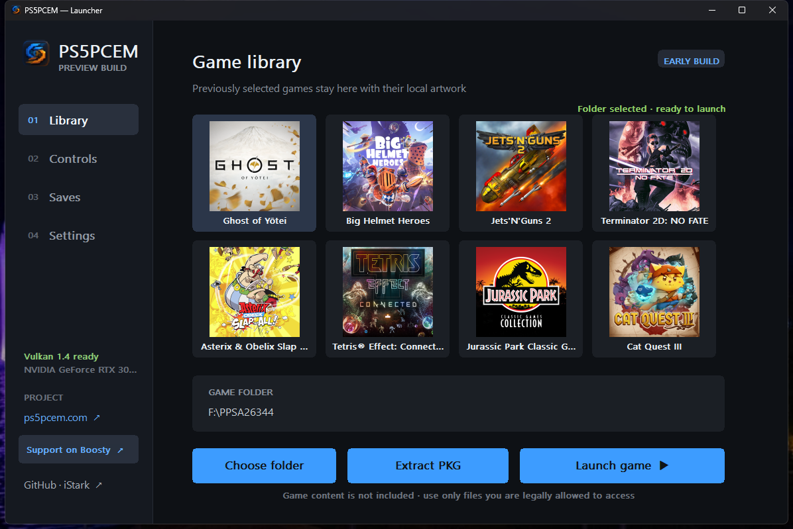

  
  <h1>PS5PCEM</h1>
  
<strong>Experimental PlayStation 5 emulation and interoperability research in Zig</strong>

  
Native guest execution · RDNA2 shader translation · Vulkan rendering · Windows launcher

  

    
    
    
    
    
  

  

    <a href="https://github.com/iStark/PS5PCEM/releases/tag/v0.3.0-alpha.2"><strong>Download prototype</strong></a>
    · <a href="docs/README.md">Documentation</a>
    · <a href="docs/project-status.md">Compatibility status</a>
    · <a href="https://github.com/iStark/PS5PCEM/issues">Report an issue</a>
  

> [!IMPORTANT]
> PS5PCEM is an experimental emulator under active development. A growing number
> of tested titles reach gameplay, and several are already playable, but
> compatibility, performance, graphics, audio, and stability still vary by title
> and hardware. Use only game content and system files that you are legally
> entitled to use. See the [current compatibility status](docs/project-status.md).

## Launcher

  

<em>A native Windows library with local cover art, per-title saves, input profiles, and direct game launching.</em>

The launcher remembers up to eight recent titles, reads artwork from each
title's local `sce_sys/icon0.png`, detects DualSense and DualShock controllers,
and keeps portable settings and savedata beside the application.

## See it running

<table>
  <tr>
    <td width="50%" align="center">
       
      Terminator 2D: No Fate — live gameplay
    </td>
    <td width="50%" align="center">
       
      Jets 'n' Guns 2 — tutorial gameplay
    </td>
  </tr>
  <tr>
    <td width="50%" align="center">
       
      Asterix &amp; Obelix: Slap Them All! — gameplay
    </td>
    <td width="50%" align="center">
       
      The Precinct — title menu and new-game prompt
    </td>
  </tr>
  <tr>
    <td width="50%" align="center">
       
      Ghost of Yotei — intro video, decoded and presented
    </td>
    <td width="50%" align="center">
       
      REANIMAL — animated title menu (option labels incomplete)
    </td>
  </tr>
</table>

These are development captures, not compatibility ratings. See the
[observed title milestones](docs/project-status.md#observed-title-milestones)
for the exact scope and current limits of every claim.

## What exists today

- Native x86-64 guest execution on Windows with ELF/SELF loading, relocation,
  module linking, TLS, firmware HLE, savedata, and contained-fault diagnostics.
- Stateful AGC command-stream execution and a growing RDNA2-to-SPIR-V shader
  pipeline for graphics and compute workloads.
- Vulkan VideoOut with resident render targets, image alias tracking, timeline
  scheduling, typed storage images, texture detiling, depth/stencil, and MSAA.
- Host audio, H.264/AAC playback through FFmpeg, Sony controller HID support,
  XInput and keyboard fallbacks, and launcher-managed input profiles.

The detailed implementation status lives in
[Implementation status](docs/implementation-status.md), the observed title
milestones in [Project status and compatibility](docs/project-status.md), and
subsystem internals are indexed in the
[architecture documentation](docs/README.md#architecture).

## Download

The current Windows x64 prototype is **0.3.0-alpha.2**:

- [Portable ZIP](https://github.com/iStark/PS5PCEM/releases/download/v0.3.0-alpha.2/PS5PCEM-0.3.0-alpha.2-windows-x64-portable.zip)
- [Per-user installer](https://github.com/iStark/PS5PCEM/releases/download/v0.3.0-alpha.2/PS5PCEM-0.3.0-alpha.2-windows-x64-setup.exe)
- [SHA-256 checksums](https://github.com/iStark/PS5PCEM/releases/download/v0.3.0-alpha.2/SHA256SUMS.txt)
- [Release notes](docs/release-notes/v0.3.0-alpha.2.md)

The prototype requires Windows 10 2004 or newer, x86-64, and a current Vulkan
1.2-capable graphics driver. The binaries are currently unsigned, so Windows
may display an Unknown Publisher or Microsoft Defender SmartScreen warning.

### Quick start

1. Install the per-user build or extract the portable ZIP.
2. Start `ps5pcem.exe`.
3. Choose a directory containing a decrypted title you are legally allowed to
   use, then select **Launch game**.

Games, firmware, keys, system libraries, and console software are not included.

## Documentation

| Guide | Contents |
|---|---|
| [Documentation index](docs/README.md) | Complete map of user and developer documentation |
| [Building and command-line usage](docs/getting-started.md) | Zig builds, tools, packaging, CLI usage, and library integration |
| [Project status and compatibility](docs/project-status.md) | Screenshots, measured title milestones, and current limits |
| [Implementation status](docs/implementation-status.md) | What the emulator can do, subsystem by subsystem |
| [Architecture](docs/README.md#architecture) | RDNA2, GPU, Vulkan, memory, loader, HLE, CPU, diagnostics, and runtime internals |
| [Release notes](docs/release-notes/v0.3.0-alpha.2.md) | Changes in the latest packaged prototype |
| [License and legal note](docs/legal.md) | GPL obligations, bundled dependencies, and project scope |

Architecture reference:
[`overview`](docs/architecture/overview.md) ·
[`rdna2`](docs/architecture/rdna2.md) ·
[`gpu`](docs/architecture/gpu.md) ·
[`vulkan`](docs/architecture/vulkan.md) ·
[`memory`](docs/architecture/memory.md) ·
[`loader`](docs/architecture/loader.md) ·
[`hle`](docs/architecture/hle.md) ·
[`cpu`](docs/architecture/cpu.md) ·
[`diag`](docs/architecture/diagnostics.md) ·
[`runtime`](docs/architecture/runtime.md)

## Support

Development can be supported through
[Boosty](https://boosty.to/ps5pcem) or
[Patreon](https://www.patreon.com/c/PS5PCEM).

## License and project scope

Copyright © 2026 Artur Strazewicz. PS5PCEM is licensed under the
[GNU General Public License, version 3 or later](LICENSE).

PS5PCEM ships no games, console firmware, system libraries, keys, or copyrighted
material belonging to the hardware vendor. It is intended for interoperability
research and education. Read the complete [legal note](docs/legal.md#legal-note).
