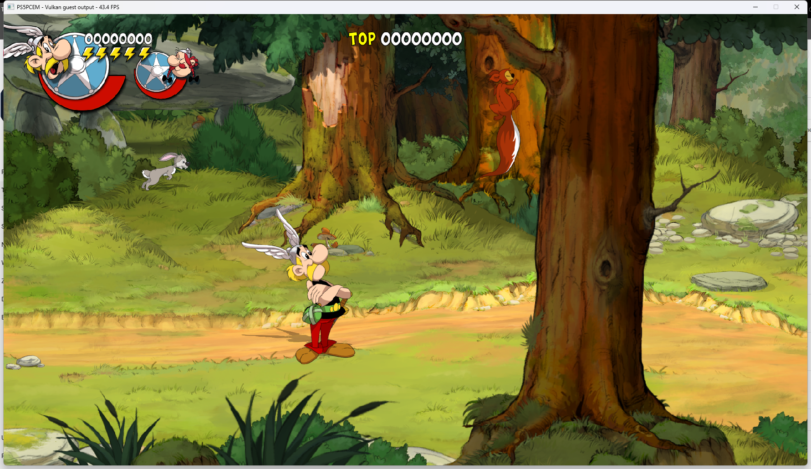

# Asterix & Obelix video-buffer startup regression — October 9, 2026

PPSA08576 reproduces a dark-green screen after the first two decoded frames
of `Media/StreamingAssets/Bumper.mp4`. The process keeps rendering, but cannot
leave the opening movie. Both the current runner and the preserved 0.3.4
runner from before the Jets audio fix reproduce the failure.

## Cause

AvPlayer cycles between two guest-allocated NV12 surfaces. After the GPU
observes a surface, page-generation tracking temporarily makes its pages
read-only so a subsequent CPU store can invalidate cached texture contents.
The old FFmpeg reader passed the guest surface directly to Windows file/pipe
I/O. A kernel write into protected pages cannot use the guest CPU write-fault
recovery path. The third frame therefore fails when the first surface is
reused. The failure was handled like an exhausted decoder, and this looping
presentation kept returning no video while `sceAvPlayerIsActive` stayed true.

Disabling `PS5_GPU_PAGE_TRACKER` for a diagnostic run allows all 180 frames of
the three-second bumper to be delivered and reaches the title screen. That
diagnostic override is not the fix.

## Change

Video and audio readers now consume their existing 64 KiB host pipe buffer
and publish its contents through the tracked guest-memory write path. Native
I/O never targets a watched guest page. Reused textures receive a new memory
generation instead of retaining the previous frame's cached contents. No new
full-frame allocation, game-ID exception, asset change or tracker disable is
required.

Allocator callbacks that return writable native CRT memory remain supported;
the host-memory fallback checks actual page permissions before copying.

The regression fixture uses a real Windows file reader and repeatedly fills
an unaligned GPU-watched buffer larger than the pipe buffer. It checks all
four decoded frames byte-for-byte, cache-generation changes, surrounding
sentinels, EOF, refusal to write a logically read-only guest mapping and the
native callback-buffer path.

## Validation

- Full ReleaseSafe HLE suite: **597/597 tests passed**.
- ReleaseFast `build-game-run`: all nine build steps succeeded.
- The prototype runner passed all 180 bumper frames, the 45.933-second story
  movie and the transition to the first forest level with
  `PS5_GPU_PAGE_TRACKER=1`. The title screen and adventure menus respond to
  keyboard input.
- The installed runner independently passed all 180 bumper frames with page
  tracking enabled, decoded 2,030 frames of the story movie and entered the
  first level after normal game input. Movement scrolls the forest and moves
  Asterix to the next section. No game content or cache deletion was needed.

Unedited window capture from the installed runner. The UI counter shows
43.4 FPS in this capture; it is a spot reading, not a timed benchmark.

The updated `zig-out/bin/game-run.exe` and matching PDB are installed locally.
The executable carries the existing **Artur Strazewicz / PS5PCEM** SHA-256
Authenticode signature and a DigiCert timestamp. Windows reports the existing
certificate chain as untrusted on this host; the trust store was not changed.
Installed SHA-256:
`E59490E485A122DA16FC0130C11973F99352DB203888F8C227506D83A22BE784`.

This is a development fix after 0.3.4. Published release archives are unchanged.
The earlier maintainer-confirmed **Playable · Completable** grade is retained;
this startup retest is not another full playthrough or a matched FPS benchmark.
