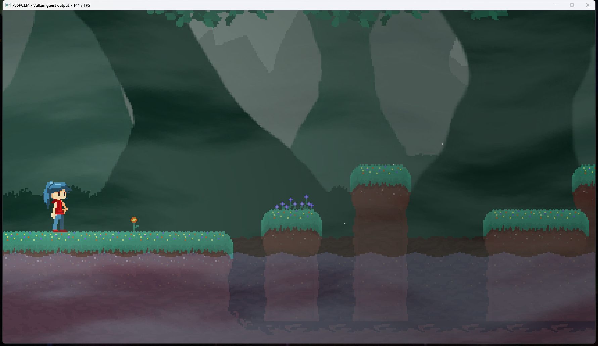

# Dreaming Sarah vertex upload performance — October 10, 2026

The maintainer reported approximately 50 FPS in Dreaming Sarah, with some
scenes reaching 120 FPS and others dropping to 30 FPS. The requested target
was at least 100 FPS in the opening scene.

## Reproduction and cause

PPSA02929 v01.000.000 starts normally with the installed runner from commit
`f0a947d`. A stationary 30-second sample of the opening forest, while Sarah
is asleep beneath the title, records **53.25 FPS median**, **53.14 mean**,
and a **48.7–56.2 FPS** range. Measurements sample the window counter once
per second, not the monitor refresh rate or a per-frame latency histogram.

The host is an RTX 3070 Ti, with the Speed preset, a 1920×1080 output request,
normal audio and warm shader caches. The game renders the forest at 1280×720
and composites to its registered 3840×2160 scanout. These dimensions are
unchanged by the optimization.

A traced frame contains 31 graphics draws and no compute dispatches. Most
sprite attributes name `0xffff0`-byte buffers with a 24-byte stride, even
when only four vertices are consumed. The renderer uploads **79,878 KiB**
per sampled frame, spills 78 snapshots out of its upload ring, and repeatedly
allocates and frees Vulkan buffers. Typical sampled frame time is **19 ms**;
shader and pipeline cache misses are zero in the settled scene.

Two conditions prevented the existing bounded-fetch path from helping:

1. The runner enabled it only for the Quake II and GTA III profiles.
2. The cache policy demanded a 16-fold saving after rounding the proven
   prefix to 64 KiB. For a descriptor just 16 bytes below 1 MiB, 64 KiB is
   one byte above that policy's integer-divided limit, so the full buffer
   was retained despite the tiny live vertex range.

Enabling the old option alone in the diagnostic process produces **52.60
FPS median** and still trims zero bytes. This isolates the size-policy
boundary from the option default.

## Shared renderer change

The runner now enables proven vertex-fetch bounds for all titles by default.
`PS5_GPU_BOUND_VERTEX_FETCHES=0` remains available for comparisons. Only
read-only, non-tessellated vertex programs with proven index origins and
in-range, plain formatted fetches qualify. Unknown indices, unsupported
addressing, arithmetic wrap and out-of-range fetches retain the full path.

The bucket policy still requires a 16-fold reduction before rounding, and
now accepts an eight-fold reduction after rounding. This preserves stable
64 KiB cache keys while covering padded arenas just below a power of two.
Attribute-table mappings also cover both the proven guest index and the
host VertexIndex range, preventing truncation from changing the later
attribute-index validation decision.

No game files, resolution, frame counter, frame limiter, shader effects or
draw selection are changed. The original save is backed up before testing.

## Correctness checks

- **235/235 Vulkan unit tests pass**, including the padded-arena boundary
  and the union of guest and host attribute-index bounds.
- **3/3 selected GPU origin-analysis tests pass**, covering changing draw
  limits, unknown/modifier/loop-carried indices and merged lane definitions.
- The native Vulkan bounded-vertex probe produces matching pixels for full,
  shortened and replayed buffers with vertex/instance selection, changing
  base instance and descriptor-ring wrap.
- The initial candidate renders the first forest, accepts movement and
  jumping, and reaches the next platform scene. Its sampled frames have no
  skipped draws, unresolved storage bindings or unsupported compute work.

The default is shared across games, but this session does not constitute a
fresh compatibility sweep of every title.

## Installed-run results

The final ReleaseFast runner is installed at `zig-out/bin/game-run.exe` and
signed with the existing **Artur Strazewicz / PS5PCEM** certificate and a
DigiCert timestamp. Its SHA-256 is
`6A2F7889EBB92DC2D1BBD2995A2875E10B0D8E0B031B6364EAA73AB9CBBC9F32`.
It is launched in a fresh process with normal settings and no diagnostic
memory patches, debugger, special GPU override or concurrent build/test work.

| Scene | Duration | Median FPS | Mean FPS | Sample range | Samples below 100 |
| --- | ---: | ---: | ---: | ---: | ---: |
| Opening forest, asleep under the title | 60 s | **198.25** | 197.95 | **187.8–203.2** | **0/60** |
| Opening forest, awake at the starting platform | 30 s | **197.25** | 196.61 | **187.8–201.7** | **0/30** |
| Next screen, at the first platform | 30 s | **144.35** | 144.56 | **140.8–148.5** | **0/30** |

The matching opening view improves from **53.25 to 198.25 FPS median**,
approximately **3.72×**. Its sampled GPU profile still records 31 draw
calls, but median uploads fall from **79,878 to 5,000 KiB/frame**, frame
time from **19 to 5 ms**, draw handling from **7 to 1 ms**, and fence wait
from **5,086 to 1,434 µs**. Upload spills and per-frame buffer allocations
are zero in the settled final samples. Sampled resource diagnostics contain
no skipped draws or unresolved storage bindings; no contained guest fault,
panic or device loss appears in the final run.

The requested 100 FPS threshold is exceeded throughout all recorded
one-second samples of these scenes. This is not a per-frame minimum, a
monitor refresh-rate claim, a full-game benchmark or a new playthrough.
The maintainer's earlier completed-playthrough confirmation is historical.

The test process is closed after the measurements. The original save is
restored from the pre-test backup and verified by hash; the test save is
preserved separately.
