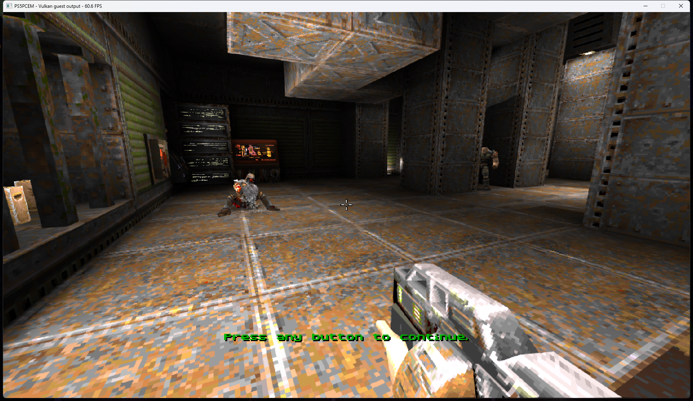
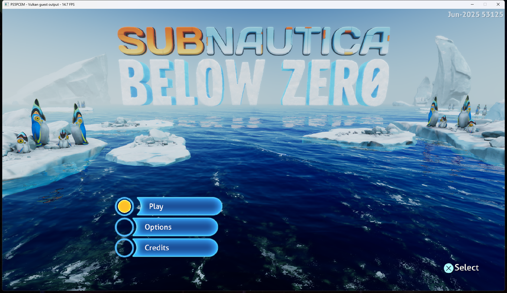

# Quake II and Subnautica audio investigation — October 9, 2026

The reported silence predates the October 9 Jets/Asterix fixes. The installed
runner and the preserved pre-Jets 0.3.4 runner both produce a completely silent
10-second Windows loopback recording in the Quake II attract sequence.
Subnautica produces nonzero native PCM after confirming its title screen;
this was observed before any code change in this investigation.

## Measured inputs

- Quake II PPSA09477 v1.003 sends NGS2 sampler setup `0x10000000` with
  waveform type `0x12`, two channels and 44,100 Hz. Its `0x10000001` commands
  enqueue 4,096-byte raw PCM blocks with 1,024 frames and continuation enabled.
  The existing implementation ignored setup and tried to parse each payload
  as a complete WAV/VAG file. Compact play/kill/volume commands were also
  accepted without being executed.
- NGS2 was deriving its render duration from output buffer capacity. Quake
  II's oversized destination produced a 4,096-frame quantum despite a
  256-frame AudioOut port. The default NGS2 system grain is now honored.
- Subnautica PPSA02457 supplies eight-channel float PCM through AudioOut2.
  The first title-screen interval contains zero-valued PCM. After Options,
  a 10-second speaker-loopback capture has peak 0.1301, RMS 0.0181 and no
  fully silent 10 ms blocks. This does not rule out shorter clicks.

The same settled Subnautica menu was sampled for 30 seconds with host output
enabled and disabled. The median window counters were **14.4 and 14.9 FPS**
respectively (means 14.35 and 14.83). These are sampled UI counters on separate
runs, not precise present counts or evidence of a major rendering regression.
No compilation overlapped those two measurement intervals.

## Changes

NGS2 PCM playback now retains a bounded queue of guest block descriptors and
reads source samples directly. It handles signed-16/float32 input, skips,
repeats, continuation and fractional resampling across block and render
boundaries. Compact play, pause, resume, kill and primary-port volume commands
are executed. Sampler state reports the consumed source samples, byte count
and read address so producers can refill their buffers. Full submixer routing,
matrix controls and additional compressed sampler formats are not implemented
by this change; the existing whole-file WAV/VAG path remains available.

Rendering uses the configured NGS2 grain, preserves unused destination space
and advances a source only once when several output buses are requested.
AudioOut supplies the playback clock; NGS2 no longer adds a second sleep.

AudioOut2 now retains fractional time when a depth-one guest queue drains.
Previously each completion reset its clock to the caller's polling time.
With 1 ms polling, a 256-frame/48 kHz queue completed only 166 grains in one
second instead of 187. A regression test demonstrates the corrected rate and
checks that a truly idle queue cannot accumulate unbounded catch-up work.

The ABI layouts and control behavior were cross-checked against the local
AnyPS5 and KytyPS5 sources. The Zig PCM stream implementation is independent;
no game assets or alternative-emulator binaries are bundled.

## Validation

Full ReleaseSafe HLE suite: **602/602 tests passed**. Coverage includes split
44.1/48 kHz resampling, block repeats/skips/refill, malformed block bounds,
compact commands, pause/resume, multiple buses, read-position reporting and
the configured grain's output bounds, null-list queue reset and sanitizing
non-finite float samples.

The first corrected Quake II run renders 256-frame NGS2 grains and no longer
reports unsupported sampler payloads. Its 10-second MAJOR V speaker-loopback
recording has peak **0.0979**, RMS **0.0188**, and **0/1,000 fully silent 10 ms
blocks**, versus 1,000/1,000 silent blocks on both baseline runners. No host
underrun, playback-failure or guest-fault messages occurred in this run.

A repeat with the final installed signed executable confirms nonzero output:
10 seconds, peak **0.0981**, RMS **0.0186**, **0/1,000** silent 10 ms blocks
and no recorder warnings. The final run likewise logs 256-frame renders and
no unsupported-sampler, host-underrun or guest-fault messages.

The capture shows the automatic attract sequence, not a new manual playthrough.
Its 60.6 FPS UI counter is a spot reading. The initial corrected run overlapped
compilation and is not used as a matched FPS benchmark.

Subnautica's corrected settled-menu sample has a **15.2 FPS** median UI
counter (mean 15.18, range 14.4–15.6 across 30 samples), with no build running.
A 30-second audio recording overlapping compilation contains 73 fully silent
10 ms blocks, a longest gap of 180 ms, and recorder discontinuity warnings.
A later 20-second recording after compilation has **0/2,000** silent 10 ms
blocks, peak 0.1560 and RMS 0.0207, but one recorder discontinuity warning.
These runs do not establish that every click or dropout is fixed. The earlier
8-second silence in a transition recording includes the menu's loading stage
and is not used as a settled-playback measurement.

The installed signed runner also reaches the Jets 'n' Guns 2 title menu,
shop, mission map and Pirate Base gameplay. Its existing WAV sampler path
and separate AudioOut streams remain active. Separate 15-second title and
mission-map recordings have no fully silent 10 ms blocks or recorder warnings.
A 15-second Pirate Base recording has 324 silent blocks and a longest pause
of 1.1 seconds, with no recorder warnings. No host-underrun or playback-failure
message accompanies that run. This smoke check confirms audible output, but
does not establish uninterrupted gameplay audio or an improvement over the
previous build; the source of those pauses still needs investigation.

## Installed build

`zig-out/bin/game-run.exe` and its matching PDB were updated. The executable is
signed with the existing Artur Strazewicz / PS5PCEM certificate and a DigiCert
timestamp. Windows retains its existing untrusted-root certificate status;
no trust settings were changed. Published 0.3.4 assets are unchanged.

Installed SHA-256:
`4942355A00DCFB90E8B297632458235D17EB38FE301F5AD40365EF2B56483823`.
