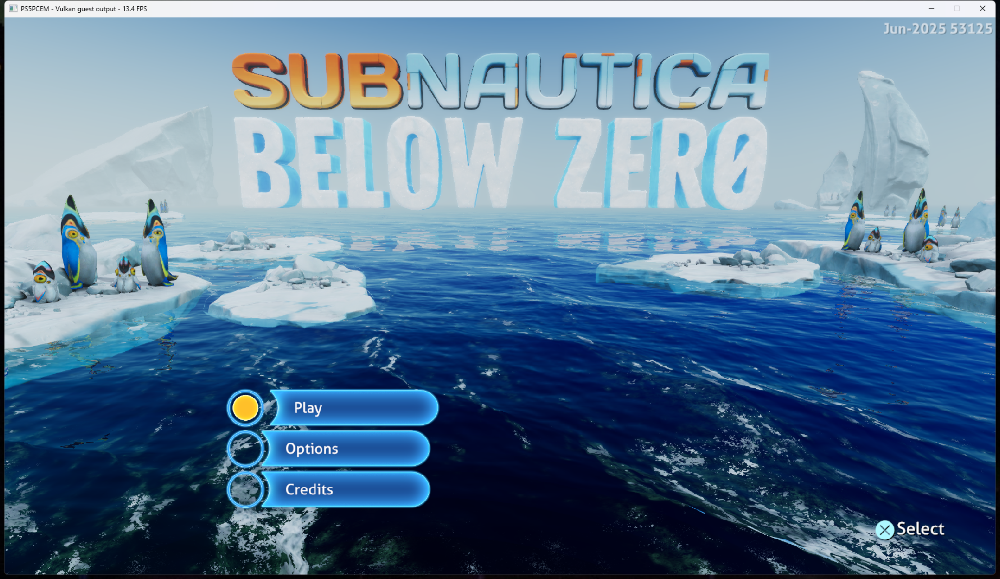

# Subnautica ACM convolution audio investigation — October 10, 2026

Subnautica: Below Zero PPSA02457 v1.022.125 could start with a loud crackle,
fall silent, and recover minutes later. Repeated launches invalidated the
earlier assumption that confirming the title screen or changing Options
caused audio to start. The launcher correctly enabled sound and selected the
same runner as the command line.

## Located failure

Read-only PCM sampling found non-finite floats before host playback.
An in-memory diagnostic wrapper around FMOD's DSP callbacks then captured
finite input entering **FMOD Convolution Reverb** and garbage leaving it.
This capture used no debugger exception or thread suspension. The diagnostic
wrappers were confined to test-process memory; game files were not modified.

The reverb uses `sceAcm_ConvReverb_SharedInput`, buffer-batch submission and
`sceAcmBatchWait`. These HLE functions previously returned success without
computing an output. FMOD therefore mixed an unwritten wet buffer into the
DSP graph. Huge values and NaNs propagated through later effects; AudioOut2's
non-finite sanitizer correctly replaced them with silence but could not
repair poisoned filter history.

There was a second error: waiting on the initial invalid batch ID `-1`
also succeeded. FMOD interprets a failed initial wait as “no previous wet
buffer yet,” and only mixes that buffer after a real completed job.

The observed Windows output queue was approximately 150–170 ms, not minutes.
Changing PCM container formats or adding a larger playback queue cannot fix
the upstream invalid samples.

## Implementation

- Shared-input and shared-IR builders capture temporary pointer arrays and
  gains into bounded HLE command records. PCM is read on submission.
- Buffer batches execute partitioned FFT convolution on the CPU, retain
  input history across grains and ring wrap, and carry overlap into the next
  output grain. Several outputs share one input transform/history advance.
- The observed float32 and float16 complex IR layouts are supported, including
  mono-to-multiple-channel routing. The inverse transform is normalized.
- Context destruction releases convolution history. Wait succeeds only for
  an actually completed batch belonging to that context.
- Invalid bounds, unknown command encodings and unsupported layouts report
  errors instead of claiming that an output was produced. Standalone ACM
  FFT/IFFT and panner operations remain unimplemented.

The descriptor interpretation was checked against FMOD's call sites and
live buffers. An independent inverse transform of an actual IR partition
placed its energy in the expected first half of the zero-padded block,
confirming the spectrum sign. The observed packed IR omits the Nyquist bin.
Nonzero spectrum offsets and additional routing/layout variants are not
claimed as supported.

The local SharpEmu, KytyPS5 and AnyPS5 ACM paths were inspected; all still
complete these DSP jobs without computing their outputs. SharpEmu commit
[`b02c061`](https://github.com/sharpemu/sharpemu/commit/b02c06181a296f4dc7d9ee2a44780a6ecd959592)
changes AudioOut2 behavior, including PCM snapshot timing, but does not supply
this convolution implementation. The Zig implementation is independent.

## Validation scope

Numerical tests compare streaming output with direct time-domain FIR
convolution across partition boundaries, history wrap and the complete tail.
Further tests cover half-float spectra, multiple outputs, shared-IR histories,
multi-grain batches, temporary descriptor arrays, malformed/truncated records
and invalid or stale batch IDs.

The full ReleaseSafe HLE suite passes **606/606 tests**. In a fresh muted
validation run, 90 once-per-second raw PCM snapshots contain **zero non-finite
samples**, with peak 0.1036 and first nonzero audio above 0.001 at **12.87 s**.
A separate audible launch first crosses that threshold at **11.00 s**; the
maintainer confirms that sound now works clearly. Neither run uses diagnostic
callback patches or a debugger.

The final installed, signed runner was then launched independently. Its 90
once-per-second PCM snapshots also contain **zero non-finite samples**, with
peak **0.1255** and first audio above 0.001 at **11.03 s** after process start.
The maintainer confirms that audio works on this repeat too. These are sampled
observations, not an exhaustive check of every sample emitted by the game.

A 20-second menu loopback during compilation has peak **0.1199**, RMS
**0.01526**, and 65 silent 10 ms blocks (longest gap 170 ms), with recording
discontinuity warnings. This is not a clean scheduling benchmark and does not
establish that every short dropout is fixed.

## Gameplay and performance checks

New Game / Survival reaches the opening sequence and controllable gameplay.
PCM snapshots during the intro and the first world interval remain finite;
the host reports no playback submission failures. Normal saving produces a
214,930-byte `slot0000.blb`. The new save was preserved before the repeat launch.

Two stationary 30-second intervals sample the window's FPS counter once per
second, with normal audio enabled, 1080p output and the Speed preset. No build
or test workloads run during either interval. Internal resolution remains
game-controlled.

| Scene | Runner | Median FPS | Mean FPS | Range |
| --- | --- | ---: | ---: | ---: |
| Snowy path beside the glowing plant | ACM validation candidate | 4.85 | 5.35 | 4.0–6.9 |
| Settled main menu | Final installed signed runner | 14.20 | 14.01 | 12.2–14.7 |

The earlier world interval included user movement and is excluded from the
stationary comparison. The plant view differs from the October 3 crash-site
measurements, so these results do not establish a regression or speedup from
the audio change. No controlled audio-on/audio-off comparison was performed.

Representative stationary-world GPU logs report 154–167 ms frames, with
150–163 ms in submission and approximately 4 ms outside submission. Graphics
draw handling accounts for 103–115 ms, compute dispatch handling for 13–14 ms;
shader/pipeline misses are zero in these samples. This points to graphics
submission/resource work as the next performance investigation, without
claiming that convolution has no CPU cost.

The stationary-world 30-second loopback has peak **0.4883**, RMS **0.09937**,
and 85 silent 10 ms blocks, with a longest gap of **170 ms**. The final-menu
recording has peak **0.1828**, RMS **0.01701**, and 63 silent blocks, with a
longest gap of **190 ms**. Both recordings report discontinuities, so these
gaps are not all proven audible game dropouts. They leave scheduling and
capture continuity open for further work; they do not reproduce the previous
minutes of poisoned PCM and silence.

The screenshot counters are spot readings; the table reports timed samples.
The installed ReleaseFast `zig-out/bin/game-run.exe`
is signed by **Artur Strazewicz / PS5PCEM** with a DigiCert timestamp.
Its SHA-256 is
`103B0E4BE844CCA948474BAAECCFD8ABC734BBC9CB3425532BADF16E0D140A2B`.

This is an audio correctness change. It does not establish 30 FPS, remove
rendering defects, or prove that every host scheduling dropout is fixed.
