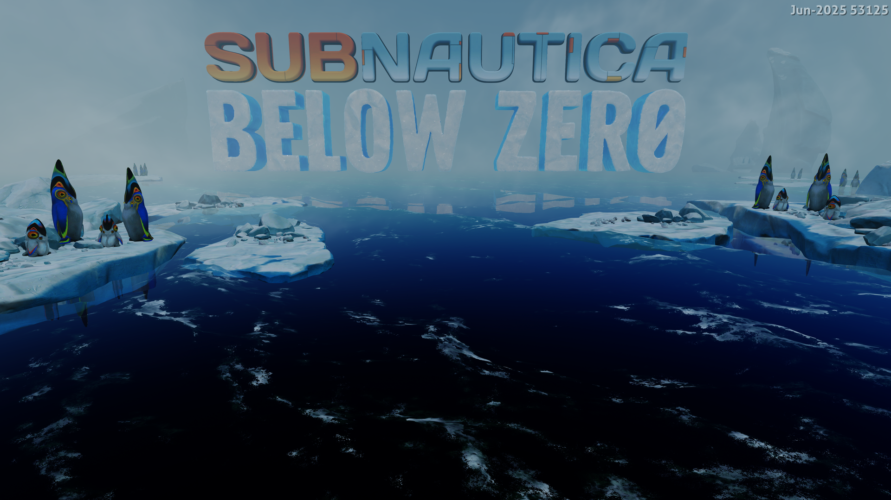

# Subnautica: Below Zero startup — September 26, 2026

Title: **PPSA02457, v1.022.125**. Host: Windows x64, NVIDIA GeForce RTX 3070 Ti.
This is a development-build result; the published 0.3.2 package predates the fix.

## Failure and cause

The original runner repeatedly stopped at guest RIP `0x55d36e`
(`eboot.bin+0x51d36e`), writing a string terminator to unmapped address
`0x79fa227f5`. Unity's shader reader had interpreted `0xbf7cd925` as a signed
string length. Those bytes were mesh data from offset `0x30010` of
`Media/Resources/unity default resources`, while the reader was loading the
shader at offset `0x2eff8` in `Media/Resources/unity_builtin_extra`.

The guest's PS5 file reader keeps a per-thread read-ahead buffer keyed by the
file descriptor. Its cache lookup at guest `0xf44659` compares the stored
descriptor before reusing buffered bytes. The emulator issued the lowest free
table slot as the next descriptor. Closing one resource and opening another
could therefore reuse a cached identity on the reading thread. Changing timing
with verbose file tracing sometimes concealed the failure.

Re-extracting the supplied package to a separate directory produced **21,895
files identical in size and SHA-256** to the existing installation. No game
content was modified as part of the fix. Matching extractions alone do not
independently validate a decoder; the guest reader and its mismatched source
bytes established the descriptor-cache problem.

## Change

Guest descriptor identities now increase within the mounted process and remain
separate from the 256 reusable host slots. Files, directories, devices and
offline sockets use the same allocator. Closed identities stay invalid, and
exhaustion returns an error instead of wrapping. A completed read also checks
the descriptor identity before updating a reused slot's position.

This is a filesystem change. It does not patch the game's executable or skip
the failing string operation.

## Verification and limits

- 74 focused filesystem, kernel file, AIO, APR and ioctl tests passed, including
  repeated reopen cycles, shared descriptor allocation, the live-file limit and
  descriptor exhaustion.
- The complete HLE module suite passed: 527 tests.
- Two 120-second runs without live firmware tracing passed the original failure
  and rendered the animated title scene, including a repeat with the final
  build. Captured frames show the title logo, ocean, ice and pengwings.
- The screenshot is a guest-renderer capture resized from 3840×2160 to
  1920×1080 for documentation.

Menu options are absent from the captured title scene. Menu interaction,
gameplay, visual accuracy and longer-run stability are not established by this
startup test. This result is not a claim of playability.

