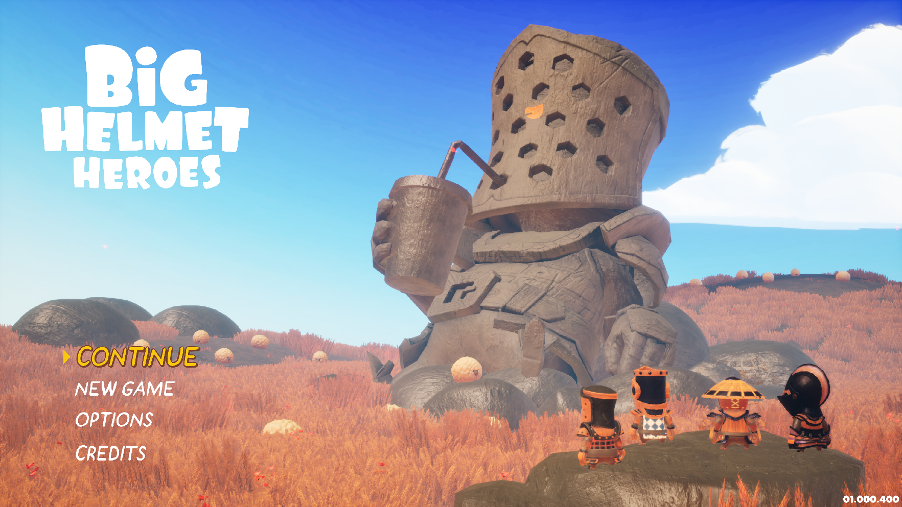
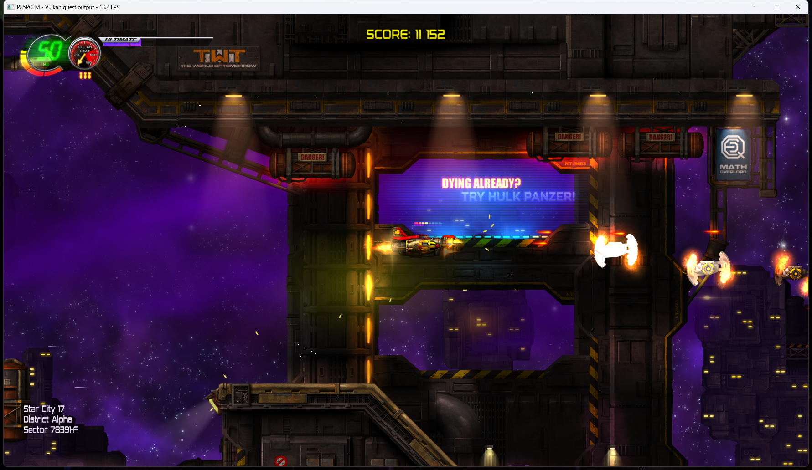
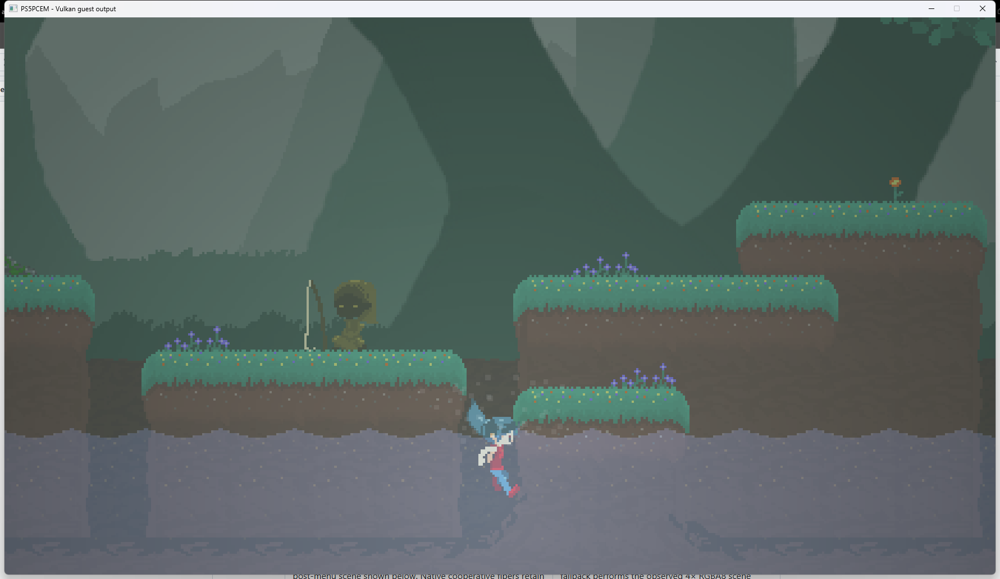
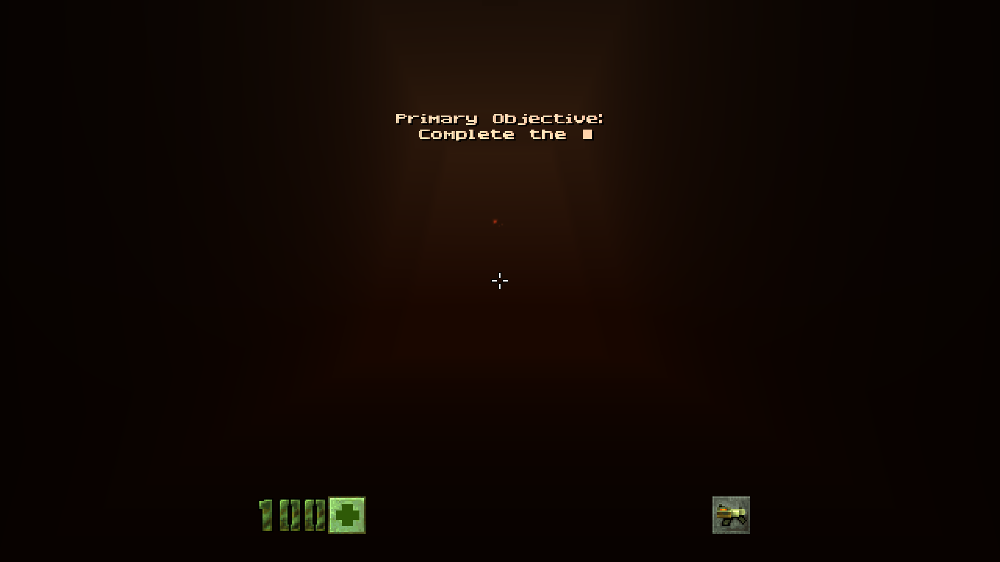
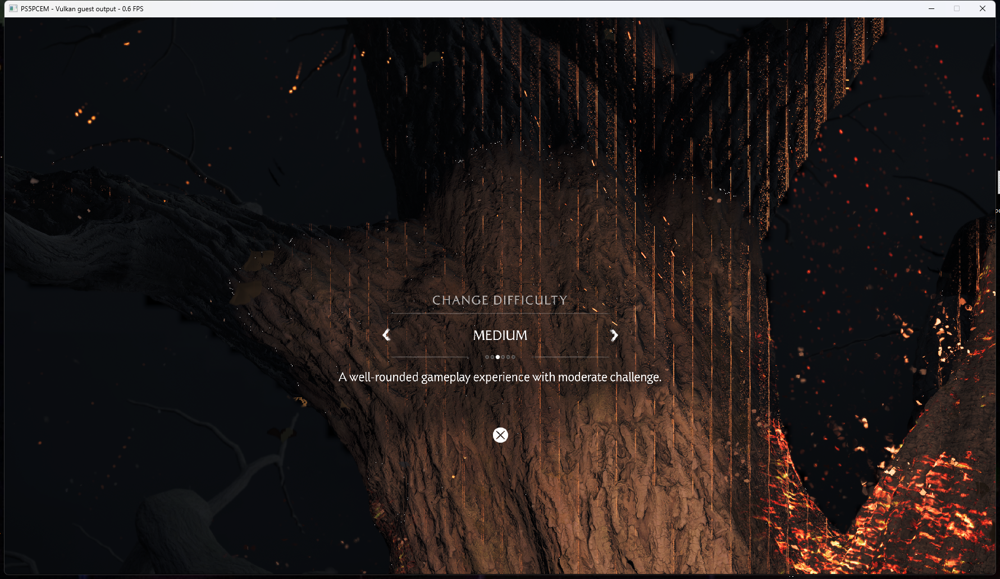
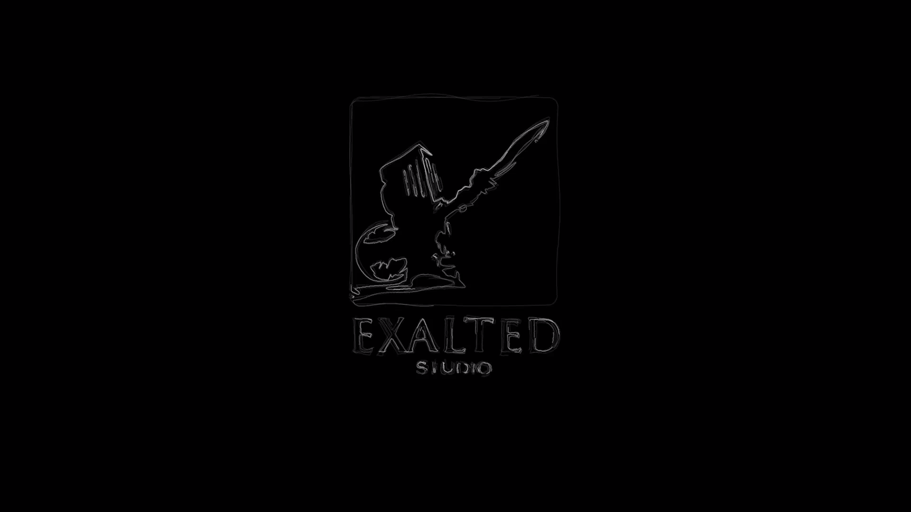
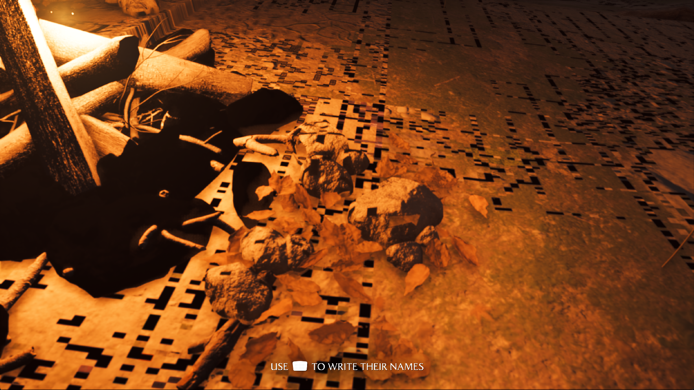

# Project status and compatibility

[← Documentation index](README.md) · [Project README](../README.md)

Development captures and the furthest repeatable point reached in each observed
title. What the emulator can do subsystem by subsystem is listed separately in
[Implementation status](implementation-status.md).

## Compatibility and progress

Playability and completion reports below were confirmed by the project
maintainer on September 8, 2026. **Playable · Completable** means the title
can be played through; other entries describe the furthest observed milestone.
Performance measurements refer to the current test host. Title content is
supplied locally and is not included in this repository.

| Title | Status | Notes |
|---|---|---|
| **Terminator 2D: No Fate**  | **Playable · Completable** | Completed without reported problems. Correct backgrounds, characters, HUD, textures and colors; warmed-up startup frames measure 22–65 ms on the current test host. [Gameplay capture](images/live-gameplay.png) |
| **Pistol Whip** | Maps the native PS VR2 plugin and Burst module, then starts loading Unity asset archives | Headset, tracking, controller, and host OpenXR support are intentionally deferred |
| **Propagation: Paradise Hotel** | Mounts the 8.8 GiB UE PAK, completes ICU/config bootstrap, opens the cooked Global shader archive, creates AGC shaders, and submits the first DCB | This milestone predates the new synchronization packet constructors and needs a fresh run; VR presentation still has no host headset bridge |
| **Big Helmet Heroes**  | **Intro playback · correctly rendered main menu · gameplay unverified** | Verified on September 20, 2026: the maintainer confirmed the captured menu's characters, 3D scenery, lighting and colors as the visual reference. Corrected texture addressing removes the blue tint and glare; two clean menu-only launches reproduced the result. Short menu measurements on the current test host are 3.2–3.3 FPS. Gameplay has not been verified. [Menu capture](images/big-helmet-heroes-menu.png) · [Intro capture](images/big-helmet-heroes-intro.png) |
| **Tetris Effect: Connected** | **Developer logos · readable license screen · Journey Mode selection · gameplay and stability unverified** | Verified on September 24, 2026 with PPSA07923 v2.000.022. The translated composite replaces speculative 4K overrides. Faster tiled clears reduce the median license frame from 235 to 159 ms (about 4.3 to 6.3 FPS). Publishing linear metadata fills and supporting R11G11B10/RGB10A2 DCC clears remove accumulated UI copies and the vertical scene boundary. A 128-target title profile retains the approximately 100-attachment working set; observed Journey frames take 318–396 ms instead of 1127–1276 ms with the smaller cache. Dark interface elements and an unresolved compute texture binding remain under investigation. Later video playback faults in the guest H.264 decoder; a secondary host diagnostic alignment panic is corrected and regression-tested. Longer-run stability and gameplay are not established. The particle capture below records an earlier milestone |
| **The Precinct** | Links the complete six-image guest graph, starts Unity plug-ins through `sceKernelLoadStartModule`, indexes its audio assets, and plays both observed intro movies as synchronized 3840×2160 NV12 video and 48 kHz stereo PCM. It renders the complete 1920×1080 title artwork, opens `PLAY GAME`, and displays the readable `NEW GAME` confirmation shown below. Holding `Triangle` enters the cold world load; an earlier guarded run reached the `Cross` prompt and produced the first verified in-engine gameplay image. Target-thread exception delivery completes Unity's stop-the-world handshake, resident typed storage images preserve its compute graph, and dynamic compute scalars prevent runtime SGPR values from generating a new Vulkan pipeline every frame. Its world-load frame measures 2.1 s where it measured 5.1 s, after descriptor recovery stopped replaying each kernel's prolog once per resource it names | The first world transition still takes several minutes on the current RTX 3070 Ti test host because first-use shader translation, NVIDIA pipeline compilation, synchronous submission, and resource staging remain expensive. The former title- and shader-signature-specific NVIDIA compiler guard has been removed in favor of the general shader path, so the transition needs a fresh end-to-end validation before current gameplay compatibility is claimed |
| **Jets 'n' Guns 2**  | **Playable · Completable** | Playthrough confirmed by the maintainer on September 15, 2026. Levels, HUD, score, enemies and the parallax scene render correctly in the captured gameplay. Measured frames on the current RTX 3070 Ti host take 70-92 ms, about 11-14 FPS: of a 70 ms frame, 18 ms is spent waiting on the GPU across 33 queue submissions, 11 ms preparing resource checkpoints, and 13 ms staging 894 distinct guest buffers totalling 15 MiB. Audio routing thrashed between two active output ports several times per frame, tearing the mix down and reopening the host device each time; that is fixed but the fix is not yet in a release. [Gameplay capture](images/jets-n-guns-2-gameplay.png) |
| **Asterix & Obelix: Slap Them All!**  | **Playable · Completable** | Playthrough confirmed. Gameplay and UI render upright; intro playback works. Observed gameplay typically measures 28–31 ms per frame, with a 3,000-flip development run free of rejected submissions. [Gameplay capture](images/asterix-obelix-gameplay.png) |
| **Cat Quest III**  | **Playable · Completable** | Playthrough confirmed. Menus, adventure cards, dialogue, island terrain and colors render correctly in the captured scenes. Latest opening-island samples have a median of 124 ms (about 8 FPS), versus roughly 148 ms before optimization. [Gameplay capture](images/cat-quest-iii-world.png) |
| **Dreaming Sarah**  | **Playable · Completable** | Playthrough confirmed on September 15, 2026. Menus, the animated title, world scenes, characters and NPCs render correctly. The title menu and first scene run at the 60 FPS cap on the current RTX 3070 Ti host, measured as 5,280 flips over 90 seconds; the maintainer reports the frame rate falling on the second gameplay scene, which is not yet measured. Loading required restoring `eboot.bin` and `sce_module/libc.prx` from the backups left by the copy's eboot patcher, which had truncated both. [Gameplay capture](images/dreaming-sarah-gameplay.png) |
| **Quake II (2023)**  | **Playable · Completable** | Playthrough confirmed on September 16, 2026. Menus, the photosensitivity warning, and the Tutorial level load; the HUD, health, weapon icon, objective text and crosshair render, and controller input reaches the in-game scene. Deferred colour writes honour `CB_COLOR_CONTROL.MODE=DISABLE` when `TARGET_MASK` is live, unified format 57 samples as RGBA8 SNORM, and the interpolator-less NGG rect no longer stamps a texture atlas over the mesh G-buffer. The presented scene is still dark while deferred lighting and composite are incomplete. [Gameplay capture](images/quake-ii-gameplay.png) |
| **Jurassic Park Classic Games Collection** | **Playable · Completable** | Playthrough confirmed. Intro, animated title and collection selection work. Earlier sampled title/selection frames measured about 27/33 ms; performance varies by collection game and hardware |
| **REANIMAL** | Resolves the observed native and firmware modules, plays the company-logo sequence, and sustains the animated 3840×2160 title-menu render graph. Narrow Unity UI intermediates no longer replace the full scanout, dynamic R8 font atlases invalidate stale sampled images, and the buoy background, full title logo, water highlights, and `SELECT` prompt are visible in the live capture below | The central menu-option labels are still reduced to small red marks, so navigation and the transition into gameplay have not been verified. Performance and longer-run stability remain unmeasured, and gameplay is not claimed |
| **Mighty Morphin Power Rangers: Rita's Rewind** | Resolves the observed Fiber, Pad, offline NP, AGC 1.1, and AGC driver imports, enters a stable 1920×1080 graphics/audio loop, and renders the animated publisher sequence, title menu, and post-menu scene shown below. Native cooperative fibers retain suspended guest stacks, `scePadGetHandle` supplies a readable primary controller, and exact `V_SAD_U32`, `V_MUL_HI_I32`, and `V_CVT_FLR_I32_F32` lowering removes the diagnostic shader fallback. Holding `Cross` advances through the title prompt, and the observed intro remains smooth at roughly 13–20 ms per frame on the current RTX 3070 Ti host | The exact guest CRT composite still produces static on the current host, so a strict shader-signature fallback performs the observed 4× RGBA8 scene scale before downstream post-processing. Dense post-menu frames can contain roughly 255 draws and currently take about 470 ms, dominated by repeated guest-buffer staging; broad gameplay and input compatibility are not claimed yet |
| **Ghost of Yōtei**  | **Intro playback · bonus notices · brightness calibration · reaches in-game scenes · not playable** | Reaching the difficulty selection shown here takes several minutes of intro and scene loading, and the frame rate there is 0.6 FPS: sampled frames measure 1504-1554 ms for 321 draws and about 1330 compute dispatches. The title is not playable at that rate; what is claimed is that it renders its menus and 3D scenes correctly. Time to reach a scene varies widely between runs on the same build. Intro movies play at about their native 30 FPS in ReleaseFast. The verified reference run reached the animated loading indicator, Digital Deluxe Bonus, Gift of the Northern Star, Pre-order Bonus, and brightness calibration with the wolf image, instructions, slider and confirmation glyph. The maintainer also observed trees and parts of the 3D background, with menu music audible. Streamed scene loading, material tables and shader execution have advanced substantially. Gameplay itself -- moving the character through a loaded world -- remains unverified, and scene preparation frames are still very slow. The latest renderer was checked through the intro into scene loading; the complete bonus/brightness sequence was verified on reference build `796a484`, not repeated on the release candidate. [Detailed results and build-specific limits](architecture/yotei-startup.md) |

## Screenshots

*The Exalted Studio logo during Big Helmet Heroes' opening movie, captured
from PS5PCEM's live 1920×1080 presentation output.*

*Maintainer-approved visual reference, captured from the emulator's actual game
window on September 20, 2026. The menu, characters and 3D background render with
correct lighting and colors. Two clean menu-only launches reproduced this
result; gameplay has not been verified.*

*A live Ghost of Yotei intro frame decoded from the title's own H.264 stream
through `libSceVideodec2` and presented at 1920×1080. The host decoder receives
the title's Annex B access units, the picture is converted from NV12 with BT.709
coefficients, and playback follows the frame rate reported by the decoded
stream. Build with `zig build build-game-run -Doptimize=ReleaseFast` to reproduce
the measured playback speed. Later development reached the bonus notices,
brightness calibration and parts of the 3D scene/interface; full title-menu
composition and gameplay remain unverified.*

*Captured directly from the emulator's live client area at 1624×941 on
September 23, 2026, using a development build.*

*A live Terminator 2D gameplay frame produced by the current guest VS/PS,
sampled-texture, render-target, and Vulkan presentation paths. Texture alpha,
component swizzles, and sRGB sampling now preserve the title's intended color
balance.*

*A live 3840×2160 Jets 'n' Guns 2 tutorial frame reached through `START GAME`
and the title's loading screen. The ship, HUD, layered level art, lighting, and
text are produced by the guest multi-draw, sampled-texture,
persistent-render-target, compute, and VideoOut paths.*

*A live 1920×1080 Asterix & Obelix: Slap Them All! gameplay frame captured at
flip 512. The scene, characters, HUD, and prompt come from the title's guest
draws. The final fullscreen compositor remains GPU-resident, while scanout
preserves the guest viewport's vertical orientation without a per-frame
host-memory round trip.*

*A live 1920×1080 Quake II Tutorial frame after the photosensitivity warning
and title menu. The HUD, health, blaster, objective text, and crosshair are
produced by the guest draws; the mesh G-buffer is filled at 960×540, and the
interpolator-less NGG atlas stamp is skipped so it no longer covers the scene.
Deferred lighting and the 960-to-1920 composite remain incomplete, so the
presented world is still dark.*

*A live 1920×1080 Rita's Rewind publisher/title intro frame produced by the
guest indexed vertex, sampled fragment, render-target composition, and VideoOut
paths. The corresponding animation and audio remain smooth in the observed
run; this is an intro milestone rather than a gameplay claim.*

*Rita's Rewind after the title menu, rendered from the real 480×270 guest scene
target and carried through the 1920×1080 CRT/post-processing chain. The strict
CRT-composite compatibility path removes the former full-screen static while
preserving the title's pixel-art presentation.*

*The Precinct's live 1920×1080 title menu and `NEW GAME` confirmation, composed
by the guest graphics and compute passes after both SceAvPlayer intro movies.
Structured shader control flow restores the UI text, while fixed-function DCC
decompression no longer executes its constant-white helper shader over the
completed scene. This capture predates the now-verified transition into the
first in-engine gameplay scene.*

*Game selection with cover art, navigation arrows, and an animated preview.
This earlier development capture precedes the maintainer's full-playability
confirmation.*

*A live REANIMAL title-menu frame produced by the guest Unity render graph. The
animated buoy background, title logo, water highlights, and `SELECT` prompt are
visible without the former full-screen stretch. The missing central option
labels remain an active rendering issue, so this capture is not a complete menu
or gameplay claim.*

*The first recognizable Tetris Effect render produced by the title's startup
graph: 595 guest draws and 63 compute dispatches complete without a rejected
draw. This 1920×1080 `R11G11B10_FLOAT` intermediate is converted for display
because the registered 3840×2160 VideoOut target was still black in that run.
This historical capture predates the September 24 startup rendering fix; it
does not document gameplay.*

*The language list now retains its text and clips it inside the panel; the
stencil pop no longer paints a white rectangle over the labels.*

*Island gameplay with the HUD, restored mountains, blue sea and sky, and
correct character colors. Cat Quest III is fully playable according to the
project maintainer's September 8 playtest.*

*Captain Cappey's dialogue remains readable over the rendered island scene.*

*Catventure selection now displays the slot artwork, labels, add buttons and
scroll arrows, with the clipping mask linked to the correct shader export.*
