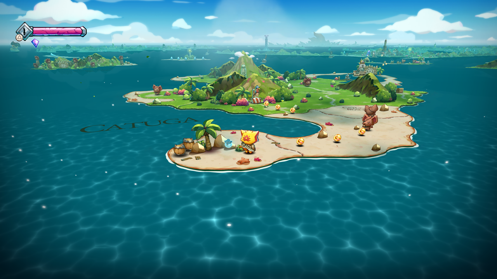
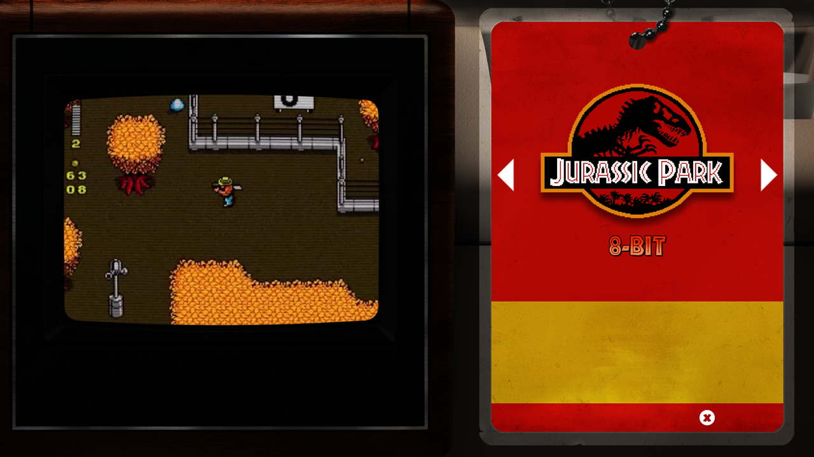
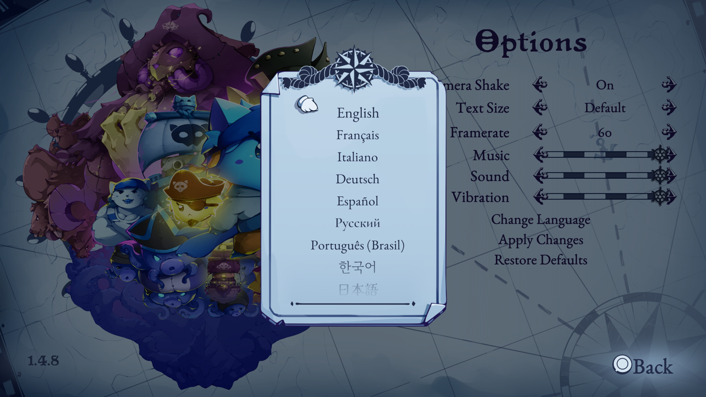
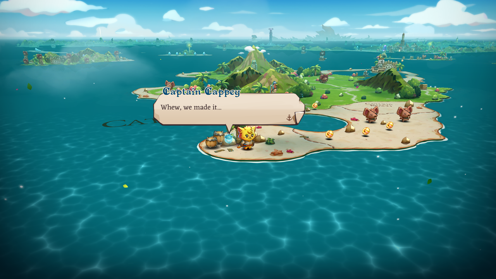
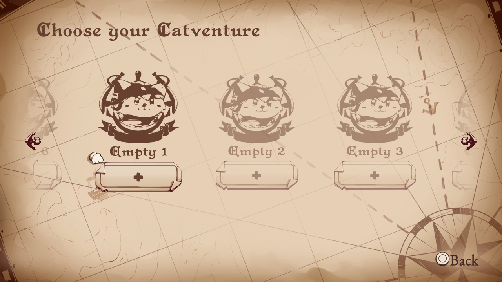

# Project status and compatibility

[← Documentation index](README.md) · [Project README](../README.md)

Development captures and the furthest repeatable point reached in each observed
title. What the emulator can do subsystem by subsystem is listed separately in
[Implementation status](implementation-status.md).

## Compatibility and progress

Playability and completion reports below were confirmed by the project
maintainer on September 8, 2026. **Playable ∑ Completable** means the title
can be played through; other entries describe the furthest observed milestone.
Performance measurements refer to the current test host. Title content is
supplied locally and is not included in this repository.

| Title | Status | Notes |
|---|---|---|
| **Terminator 2D: No Fate** | **Playable ∑ Completable** | Completed without reported problems. Correct backgrounds, characters, HUD, textures and colors; warmed-up startup frames measure 22ñ65 ms on the current test host |
| **Pistol Whip** | Maps the native PS VR2 plugin and Burst module, then starts loading Unity asset archives | Headset, tracking, controller, and host OpenXR support are intentionally deferred |
| **Propagation: Paradise Hotel** | Mounts the 8.8 GiB UE PAK, completes ICU/config bootstrap, opens the cooked Global shader archive, creates AGC shaders, and submits the first DCB | This milestone predates the new synchronization packet constructors and needs a fresh run; VR presentation still has no host headset bridge |
| **Tetris Effect: Connected** | Completes the Unreal bootstrap and a measured startup frame with 595 guest draws and 63 compute dispatches, including typed 2D/3D storage images, `64×64×64 RGBA16_FLOAT` volumes, layered post-process targets, `RGBA32_FLOAT` exposure surfaces, a `10_10_10_2_UNORM` lookup target, and the mixed image/LDS prepass. Ordered AGC completion acknowledgement removes the intermittent retirement race, and the latest unattended run advanced through 49 VideoOut cycles. Most post-bootstrap cycles measured about 3.3–3.8 seconds on the current RTX 3070 Ti host. The first generated `0xe060`-byte material pixel shader is now decoded within its exact AGC allocation instead of the old fixed instruction ceiling | The latest verified visible output is still the recognizable 1920×1080 HDR particle target shown below. The exact registered 3840×2160 VideoOut target remains black, so presentation falls back to a converted `R11G11B10_FLOAT` intermediate. NGG/fetch-shader continuations, exact layered rendering, final scanout aliasing/tonemapping, one oversized guest-buffer descriptor, and performance remain incomplete; neither a menu nor gameplay is claimed |
| **The Precinct** | Links the complete six-image guest graph, starts Unity plug-ins through `sceKernelLoadStartModule`, indexes its audio assets, and plays both observed intro movies as synchronized 3840√ó2160 NV12 video and 48 kHz stereo PCM. It renders the complete 1920√ó1080 title artwork, opens `PLAY GAME`, and displays the readable `NEW GAME` confirmation shown below. Holding `Triangle` enters the cold world load; an earlier guarded run reached the `Cross` prompt and produced the first verified in-engine gameplay image. Target-thread exception delivery completes Unity's stop-the-world handshake, resident typed storage images preserve its compute graph, and dynamic compute scalars prevent runtime SGPR values from generating a new Vulkan pipeline every frame. Its world-load frame measures 2.1 s where it measured 5.1 s, after descriptor recovery stopped replaying each kernel's prolog once per resource it names | The first world transition still takes several minutes on the current RTX 3070 Ti test host because first-use shader translation, NVIDIA pipeline compilation, synchronous submission, and resource staging remain expensive. The former title- and shader-signature-specific NVIDIA compiler guard has been removed in favor of the general shader path, so the transition needs a fresh end-to-end validation before current gameplay compatibility is claimed |
| **Jets 'n' Guns 2** | Resolves title content through `/app0`, completes AGC resource registration, and sustains the full graphics/compute/VideoOut loop. Targetless final passes are preserved through flip, while dynamic SGPR data and descriptor-sized buffer bounds keep streamed sprite batches on stable Vulkan pipelines. `START GAME` now passes the loading screen and reaches the recognizable 3840×2160 tutorial gameplay shown below; the unattended run remained live beyond flip 300. Firmware-default mutex compatibility preserves the CRT's recursive `trylock` guard without leaking recursion into the audio workers' blocking slow path | The cold transition into the first dense gameplay scene still takes roughly 30–40 seconds on the current RTX 3070 Ti host. Once loaded, observed 227–256-draw frames take about 0.6–1.6 seconds, dominated by synchronous Vulkan submission, resource staging, and first-use work; broad input and in-game audio compatibility still need longer validation |
| **Asterix & Obelix: Slap Them All!** | **Playable ∑ Completable** | Playthrough confirmed. Gameplay and UI render upright; intro playback works. Observed gameplay typically measures 28ñ31 ms per frame, with a 3,000-flip development run free of rejected submissions |
| **Cat Quest III**  | **Playable ∑ Completable** | Playthrough confirmed. Menus, adventure cards, dialogue, island terrain and colors render correctly in the captured scenes. Latest opening-island samples have a median of 124 ms (about 8 FPS), versus roughly 148 ms before optimization. [Gameplay capture](images/cat-quest-iii-world.png) |
| **Jurassic Park Classic Games Collection** | **Playable ∑ Completable** | Playthrough confirmed. Intro, animated title and collection selection work. Earlier sampled title/selection frames measured about 27/33 ms; performance varies by collection game and hardware |
| **REANIMAL** | Resolves the observed native and firmware modules, plays the company-logo sequence, and sustains the animated 3840√ó2160 title-menu render graph. Narrow Unity UI intermediates no longer replace the full scanout, dynamic R8 font atlases invalidate stale sampled images, and the buoy background, full title logo, water highlights, and `SELECT` prompt are visible in the live capture below | The central menu-option labels are still reduced to small red marks, so navigation and the transition into gameplay have not been verified. Performance and longer-run stability remain unmeasured, and gameplay is not claimed |
| **Mighty Morphin Power Rangers: Rita's Rewind** | Resolves the observed Fiber, Pad, offline NP, AGC 1.1, and AGC driver imports, enters a stable 1920×1080 graphics/audio loop, and renders the animated publisher sequence, title menu, and post-menu scene shown below. Native cooperative fibers retain suspended guest stacks, `scePadGetHandle` supplies a readable primary controller, and exact `V_SAD_U32`, `V_MUL_HI_I32`, and `V_CVT_FLR_I32_F32` lowering removes the diagnostic shader fallback. Holding `Cross` advances through the title prompt, and the observed intro remains smooth at roughly 13–20 ms per frame on the current RTX 3070 Ti host | The exact guest CRT composite still produces static on the current host, so a strict shader-signature fallback performs the observed 4× RGBA8 scene scale before downstream post-processing. Dense post-menu frames can contain roughly 255 draws and currently take about 470 ms, dominated by repeated guest-buffer staging; broad gameplay and input compatibility are not claimed yet |
| **Ghost of Yotei** | Plays the 1920×1080 intro sequence at approximately its native 30 fps with a `ReleaseFast` build on the current RTX 3070 Ti host; measured movie frames take about 30–32 ms. Correct Videodec2 output fields and 256-byte NV12 row alignment let the guest accept and retire pictures without its former 100 ms polling timeout. Stream-derived cadence, picture-specific presentation acknowledgements, asynchronous swapchain synchronization, reusable clear staging, and elision of covered raster/image work keep playback moving while preserving buffer/GDS producers. SDK 1.1 ACB retirement preserves release labels and completes validated active command ranges | Full rendering resumes after the movie and still costs roughly 1.5–1.6 seconds per frame. Menu rendering and gameplay remain unverified. Audible audio is also unverified: the observed post-intro ATRAC9 input matches the title's `silence_5sec.at9` asset and decodes to zero PCM. AudioOut2 now reports its speaker layout and complete port state and tracks queued grains, but that does not establish audible playback |

## Screenshots

*A live Ghost of Yotei intro frame decoded from the title's own H.264 stream
through `libSceVideodec2` and presented at 1920√ó1080. The host decoder receives
the title's Annex B access units, the picture is converted from NV12 with BT.709
coefficients, and playback follows the frame rate reported by the decoded
stream. Build with `zig build build-game-run -Doptimize=ReleaseFast` to reproduce
the measured playback speed. Menu and gameplay rendering remain unverified.*

*A live Terminator 2D gameplay frame produced by the current guest VS/PS,
sampled-texture, render-target, and Vulkan presentation paths. Texture alpha,
component swizzles, and sRGB sampling now preserve the title's intended color
balance.*

*A live 3840√ó2160 Jets 'n' Guns 2 tutorial frame reached through `START GAME`
and the title's loading screen. The ship, HUD, layered level art, lighting, and
text are produced by the guest multi-draw, sampled-texture,
persistent-render-target, compute, and VideoOut paths.*

*A live 1920√ó1080 Asterix & Obelix: Slap Them All! gameplay frame captured at
flip 512. The scene, characters, HUD, and prompt come from the title's guest
draws. The final fullscreen compositor remains GPU-resident, while scanout
preserves the guest viewport's vertical orientation without a per-frame
host-memory round trip.*

*A live 1920√ó1080 Rita's Rewind publisher/title intro frame produced by the
guest indexed vertex, sampled fragment, render-target composition, and VideoOut
paths. The corresponding animation and audio remain smooth in the observed
run; this is an intro milestone rather than a gameplay claim.*

*Rita's Rewind after the title menu, rendered from the real 480√ó270 guest scene
target and carried through the 1920√ó1080 CRT/post-processing chain. The strict
CRT-composite compatibility path removes the former full-screen static while
preserving the title's pixel-art presentation.*

*The Precinct's live 1920√ó1080 title menu and `NEW GAME` confirmation, composed
by the guest graphics and compute passes after both SceAvPlayer intro movies.
Structured shader control flow restores the UI text, while fixed-function DCC
decompression no longer executes its constant-white helper shader over the
completed scene. This capture predates the now-verified transition into the
first in-engine gameplay scene.*

*Game selection with cover art, navigation arrows, and an animated preview.
This earlier development capture precedes the maintainer's full-playability
confirmation.*

*A live REANIMAL title-menu frame produced by the guest Unity render graph. The
animated buoy background, title logo, water highlights, and `SELECT` prompt are
visible without the former full-screen stretch. The missing central option
labels remain an active rendering issue, so this capture is not a complete menu
or gameplay claim.*

*The first recognizable Tetris Effect render produced by the title's startup
graph: 595 guest draws and 63 compute dispatches complete without a rejected
draw. This 1920√ó1080 `R11G11B10_FLOAT` intermediate is converted for display
because the registered 3840√ó2160 VideoOut target is still black. It is an early
particle-scene milestone, not a title-screen or gameplay claim.*

*The language list now retains its text and clips it inside the panel; the
stencil pop no longer paints a white rectangle over the labels.*

*Island gameplay with the HUD, restored mountains, blue sea and sky, and
correct character colors. Cat Quest III is fully playable according to the
project maintainer's September 8 playtest.*

*Captain Cappey's dialogue remains readable over the rendered island scene.*

*Catventure selection now displays the slot artwork, labels, add buttons and
scroll arrows, with the clipping mask linked to the correct shader export.*
