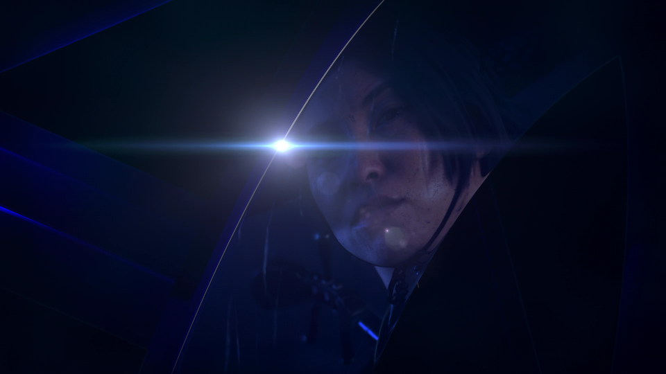
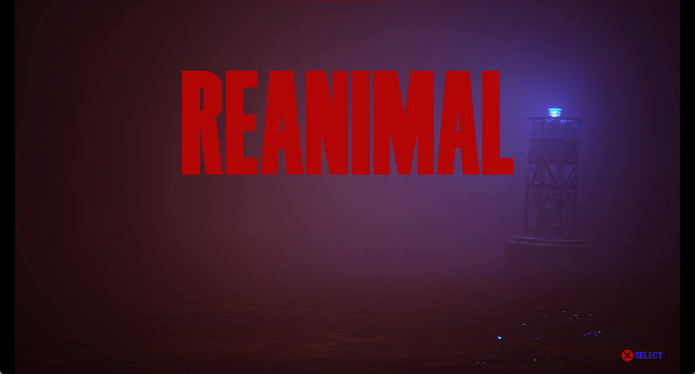

# Project status and compatibility

[← Documentation index](README.md) · [Project README](../README.md)

Development captures and the furthest repeatable point reached in each observed
title. What the emulator can do subsystem by subsystem is listed separately in
[Implementation status](implementation-status.md).

## Observed title milestones

These are development captures, not compatibility ratings. They describe the
furthest repeatable point reached with legally supplied local title content;
the repository contains none of that content.

| Title | Observed milestone | Current limit |
|---|---|---|
| **Terminator 2D: No Fate** | Reaches gameplay with correct color reproduction and clean title-provided backgrounds, characters, HUD elements, and textures; publisher logo screens and menus now match the console capture; warmed-up startup frames measure 22–65 ms on the current test host | First-use texture staging and the remaining compression metadata are incomplete |
| **Pistol Whip** | Maps the native PS VR2 plugin and Burst module, then starts loading Unity asset archives | Headset, tracking, controller, and host OpenXR support are intentionally deferred |
| **Propagation: Paradise Hotel** | Mounts the 8.8 GiB UE PAK, completes ICU/config bootstrap, opens the cooked Global shader archive, creates AGC shaders, and submits the first DCB | This milestone predates the new synchronization packet constructors and needs a fresh run; VR presentation still has no host headset bridge |
| **Tetris Effect: Connected** | Completes the Unreal bootstrap and a measured startup frame with 595 guest draws and 63 compute dispatches, including typed 2D/3D storage images, `64×64×64 RGBA16_FLOAT` volumes, layered post-process targets, `RGBA32_FLOAT` exposure surfaces, a `10_10_10_2_UNORM` lookup target, and the mixed image/LDS prepass. Ordered AGC completion acknowledgement removes the intermittent retirement race, and the latest unattended run advanced through 49 VideoOut cycles. Most post-bootstrap cycles measured about 3.3–3.8 seconds on the current RTX 3070 Ti host. The first generated `0xe060`-byte material pixel shader is now decoded within its exact AGC allocation instead of the old fixed instruction ceiling | The latest verified visible output is still the recognizable 1920×1080 HDR particle target shown below. The exact registered 3840×2160 VideoOut target remains black, so presentation falls back to a converted `R11G11B10_FLOAT` intermediate. NGG/fetch-shader continuations, exact layered rendering, final scanout aliasing/tonemapping, one oversized guest-buffer descriptor, and performance remain incomplete; neither a menu nor gameplay is claimed |
| **The Precinct** | Links the complete six-image guest graph, starts Unity plug-ins through `sceKernelLoadStartModule`, indexes its audio assets, and plays both observed intro movies as synchronized 3840×2160 NV12 video and 48 kHz stereo PCM. It renders the complete 1920×1080 title artwork, opens `PLAY GAME`, and displays the readable `NEW GAME` confirmation shown below. Holding `Triangle` enters the cold world load; an earlier guarded run reached the `Cross` prompt and produced the first verified in-engine gameplay image. Target-thread exception delivery completes Unity's stop-the-world handshake, resident typed storage images preserve its compute graph, and dynamic compute scalars prevent runtime SGPR values from generating a new Vulkan pipeline every frame. Its world-load frame measures 2.1 s where it measured 5.1 s, after descriptor recovery stopped replaying each kernel's prolog once per resource it names | The first world transition still takes several minutes on the current RTX 3070 Ti test host because first-use shader translation, NVIDIA pipeline compilation, synchronous submission, and resource staging remain expensive. The former title- and shader-signature-specific NVIDIA compiler guard has been removed in favor of the general shader path, so the transition needs a fresh end-to-end validation before current gameplay compatibility is claimed |
| **Jets 'n' Guns 2** | Resolves title content through `/app0`, completes AGC resource registration, and sustains the full graphics/compute/VideoOut loop. Targetless final passes are preserved through flip, while dynamic SGPR data and descriptor-sized buffer bounds keep streamed sprite batches on stable Vulkan pipelines. `START GAME` now passes the loading screen and reaches the recognizable 3840×2160 tutorial gameplay shown below; the unattended run remained live beyond flip 300. Firmware-default mutex compatibility preserves the CRT's recursive `trylock` guard without leaking recursion into the audio workers' blocking slow path | The cold transition into the first dense gameplay scene still takes roughly 30–40 seconds on the current RTX 3070 Ti host. Once loaded, observed 227–256-draw frames take about 0.6–1.6 seconds, dominated by synchronous Vulkan submission, resource staging, and first-use work; broad input and in-game audio compatibility still need longer validation |
| **Asterix & Obelix: Slap Them All!** | Maps the Unity/PSN plug-in graph, passes GameUpdate, trophy, entitlement, WebApi, and player-review bootstrap calls, accepts four-byte-aligned AGC shader headers, and reaches repeatable 1920×1080 gameplay. SceAvPlayer returns the ATL intro as correctly decoded NV12 frames; the translated guest pixel shader converts the staged planes on the GPU, resident fullscreen copies avoid the former GPU→CPU→GPU round trip, and synchronous AGC retirement removes the three-second Unity polling timeout. Equivalent completion edges are coalesced and paced by one display interval instead of the former fixed 250 ms delay. Frame-scoped command buffers, a 256-set descriptor/scalar ring and mapped read-only/index upload snapshots reduce the observed 48-draw workload from 52 Vulkan submissions to 13. Scanout orientation follows the final compositor's negative-height viewport, keeping gameplay and UI upright. The latest 3,000-flip run remained submission-clean and reproduced gameplay at typically 28–31 ms per frame on the current RTX 3070 Ti host | Gameplay is verified through the opening forest scene. The remaining submissions preserve actual guest ordering, compute-writeback and presentation boundaries. Roughly 751 KiB of storage upload and 192 KiB of storage readback per gameplay frame, broader input/audio coverage and longer play-session stability remain targets |
| **Cat Quest III** | Enters the Unity graphics loop and presents repeated 3840×2160 startup frames. The resident identity-compositor path recognizes the title's one-instance procedural full-screen triangle as well as the existing indexed-quad form, and carries its negative-height viewport into scanout, keeping the startup splash upright | Validation currently covers startup and splash presentation only; menu progression, gameplay, input, audio, and longer-run stability are not claimed |
| **Jurassic Park Classic Games Collection** | Resolves the observed firmware graph, enters Unity, opens the splash and intro MP4 assets through both SceAvPlayer ABIs, and presents the recognizable Jurassic gate intro shown below through the title's 3840×2160 VideoOut buffers. The matched NV12 path accepts UV/Y descriptor order, derives the 2048-byte decoder pitch from the plane layout, performs the observed 2× conversion, and rejects cleared all-zero surfaces during clip changes. It leaves the intro as well: the splash and intro clips play in sequence with sound, and the title reaches its menu and holds it at interactive rates. The alternate `IMAGE_SAMPLE_A` fragment encoding now translates and executes; a general attachment-extent check prevents stale 1×1 depth state from invalidating the 3840×2160 framebuffer. The latest regression run remained submission-clean beyond flip 1,200 and reproduced the illuminated gate scene | Gameplay is not claimed. Remaining shader operations, broader menu interaction, and a longer play-session regression still need validation |
| **REANIMAL** | Resolves the observed native and firmware modules, plays the company-logo sequence, and sustains the animated 3840×2160 title-menu render graph. Narrow Unity UI intermediates no longer replace the full scanout, dynamic R8 font atlases invalidate stale sampled images, and the buoy background, full title logo, water highlights, and `SELECT` prompt are visible in the live capture below | The central menu-option labels are still reduced to small red marks, so navigation and the transition into gameplay have not been verified. Performance and longer-run stability remain unmeasured, and gameplay is not claimed |
| **Mighty Morphin Power Rangers: Rita's Rewind** | Resolves the observed Fiber, Pad, offline NP, AGC 1.1, and AGC driver imports, enters a stable 1920×1080 graphics/audio loop, and renders the animated publisher sequence, title menu, and post-menu scene shown below. Native cooperative fibers retain suspended guest stacks, `scePadGetHandle` supplies a readable primary controller, and exact `V_SAD_U32`, `V_MUL_HI_I32`, and `V_CVT_FLR_I32_F32` lowering removes the diagnostic shader fallback. Holding `Cross` advances through the title prompt, and the observed intro remains smooth at roughly 13–20 ms per frame on the current RTX 3070 Ti host | The exact guest CRT composite still produces static on the current host, so a strict shader-signature fallback performs the observed 4× RGBA8 scene scale before downstream post-processing. Dense post-menu frames can contain roughly 255 draws and currently take about 470 ms, dominated by repeated guest-buffer staging; broad gameplay and input compatibility are not claimed yet |
| **Ghost of Yotei** | Decodes and presents its intro video. The title feeds H.264 access units to `libSceVideodec2`, which are decoded by the host and shown as the 1920×1080 picture above; audio plays alongside it. Reaching that required reporting a frame-slot size the title can divide its arena by, choosing the decoder's NV12 output by name, renegotiating only the output type on a stream change so the parsed parameter sets survive, and writing the readiness flag where the title reads it | The in-engine frame behind the video is still black: its scene colour and depth allocations have no producer among any of the observed draws or dispatches, and the presentation reverts to the black 3840×2160 scanout once the video stops. No menu or gameplay is claimed |

## Screenshots

*A live Ghost of Yotei intro frame decoded from the title's own H.264 stream
through `libSceVideodec2` and presented at 1920×1080. The host decoder receives
the title's Annex B access units, the picture is converted from NV12 with BT.709
coefficients, and playback is paced to one picture per display interval. The
in-engine frame behind the video remains black, so this is a video-playback
milestone rather than a menu or gameplay claim.*

*A live Terminator 2D gameplay frame produced by the current guest VS/PS,
sampled-texture, render-target, and Vulkan presentation paths. Texture alpha,
component swizzles, and sRGB sampling now preserve the title's intended color
balance.*

*A live 3840×2160 Jets 'n' Guns 2 tutorial frame reached through `START GAME`
and the title's loading screen. The ship, HUD, layered level art, lighting, and
text are produced by the guest multi-draw, sampled-texture,
persistent-render-target, compute, and VideoOut paths.*

*A live 1920×1080 Asterix & Obelix: Slap Them All! gameplay frame captured at
flip 512. The scene, characters, HUD, and prompt come from the title's guest
draws. The final fullscreen compositor remains GPU-resident, while scanout
preserves the guest viewport's vertical orientation without a per-frame
host-memory round trip.*

*A live 1920×1080 Rita's Rewind publisher/title intro frame produced by the
guest indexed vertex, sampled fragment, render-target composition, and VideoOut
paths. The corresponding animation and audio remain smooth in the observed
run; this is an intro milestone rather than a gameplay claim.*

*Rita's Rewind after the title menu, rendered from the real 480×270 guest scene
target and carried through the 1920×1080 CRT/post-processing chain. The strict
CRT-composite compatibility path removes the former full-screen static while
preserving the title's pixel-art presentation.*

*The Precinct's live 1920×1080 title menu and `NEW GAME` confirmation, composed
by the guest graphics and compute passes after both SceAvPlayer intro movies.
Structured shader control flow restores the UI text, while fixed-function DCC
decompression no longer executes its constant-white helper shader over the
completed scene. This capture predates the now-verified transition into the
first in-engine gameplay scene.*

*A live Jurassic Park Classic Games Collection intro frame presented from the
title's 1920×1080 NV12 movie surface through its 3840×2160 VideoOut target. The
legacy SceAvPlayer path, padded decoder pitch, Y/UV conversion, render-target
selection, and Vulkan scanout all run in the observed title process. The same
scene is now reproduced after enabling the title's alternate image-sample
encoding and rejecting its stale 1×1 depth attachment; gameplay is not claimed.*

*A live REANIMAL title-menu frame produced by the guest Unity render graph. The
animated buoy background, title logo, water highlights, and `SELECT` prompt are
visible without the former full-screen stretch. The missing central option
labels remain an active rendering issue, so this capture is not a complete menu
or gameplay claim.*

*The first recognizable Tetris Effect render produced by the title's startup
graph: 595 guest draws and 63 compute dispatches complete without a rejected
draw. This 1920×1080 `R11G11B10_FLOAT` intermediate is converted for display
because the registered 3840×2160 VideoOut target is still black. It is an early
particle-scene milestone, not a title-screen or gameplay claim.*

