# Project status and compatibility

[← Documentation index](README.md) · [Project README](../README.md)

Development captures and the furthest repeatable point reached in each observed
title. What the emulator can do subsystem by subsystem is listed separately in
[Implementation status](implementation-status.md).

**Release 0.3.4:** fixes packaged-launcher process creation and includes the
font-atlas startup fix, firmware additions and shader work below. See the
[complete changes since 0.3.3](release-notes/v0.3.4.md) and
[release checks](development/release-0.3.4-validation.md). Existing game grades
and dated FPS results are unchanged by the release preparation.

## Compatibility and progress

Compatibility grades are maintained by the project maintainer; dated notes
below distinguish playthrough reports from development checks. **Playable · Completable** means the title
can be played through; other entries describe the furthest observed milestone.
Performance measurements refer to the current test host. Title content is
supplied locally and is not included in this repository.

| Title | Status | Notes |
|---|---|---|
| **Little Nightmares Enhanced Edition**  | **In-game · save/reload verified · rendering incomplete** | October 3, 2026, PPSA10737 v01.004.000. Fixed asynchronous save writes, positional writes and truncation; fresh processes now Resume the opening room from nonempty saves. Shared HTILE handling and eager readback batching reduce CPU/transfer costs; the title uses four copy workers. The updated installed runner records **4.46 FPS beside the suitcase and 3.73 FPS after moving right**, each over 30 seconds. RTX 3070 Ti, 1080p output request, Speed preset, in-game Performance; internal resolution remains game-controlled. **5 FPS is not achieved.** Dark/reflective materials, unsupported FLAT/ray-intersection shaders, resource-binding gaps and intermittent allocator failures during startup remain. Completion and long-session stability are unverified. [Fixes, measurements and validation](development/little-nightmares-saves-performance-2026-10-03.md) · [Current capture](images/little-nightmares-saves-performance-2026-10-03.png) · [Earlier 2.16 FPS check](development/little-nightmares-gameplay-2026-10-03.md) |
| **Grand Theft Auto III: The Definitive Edition** 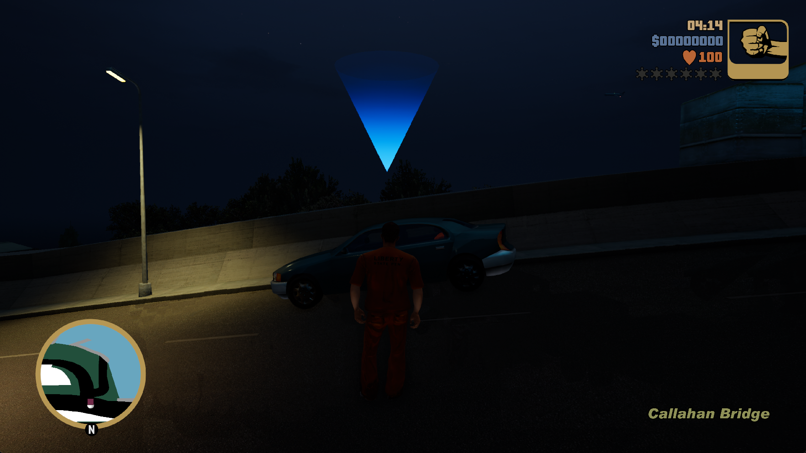 | **Playable · Completable** | October 10–11, 2026, PPSA03527 v1.007. The real launcher reaches the menu automatically in **139 seconds** with both active emulator caches absent; neither startup movie was manually skipped. AvPlayer callback/EOF ordering fixes remove the observed startup hang. Ordered buffer, storage-image and cube-face publication removes the observed green reflections, verified in all eight captured reflection mips. Read-only uniform shader guards remove inactive resource references; the tested opening scene reports **zero draw/dispatch failures, unsupported compute and unresolved/null/rejected storage bindings**. A 30-second opening-street sample records **8.27 FPS**; 10 FPS and later-game shader coverage remain unverified. Performance mode, Bloom/Motion Blur off, Classic Lighting on; output 1080p, internal resolution game-controlled. Moving vehicle/object shadows and duplicated player shadows are reported and remain open; one vertex-only initialization draw is still under investigation. Whole-game completion, saves and audio correctness are unverified. [Investigation and measurements](development/gta3-startup-reflections-2026-10-10.md) · [Gameplay capture](images/gta3-startup-reflections-2026-10-10.png) · [Previous performance report](development/gta3-renderer-performance-2026-10-03.md) |
| **Subnautica: Below Zero** 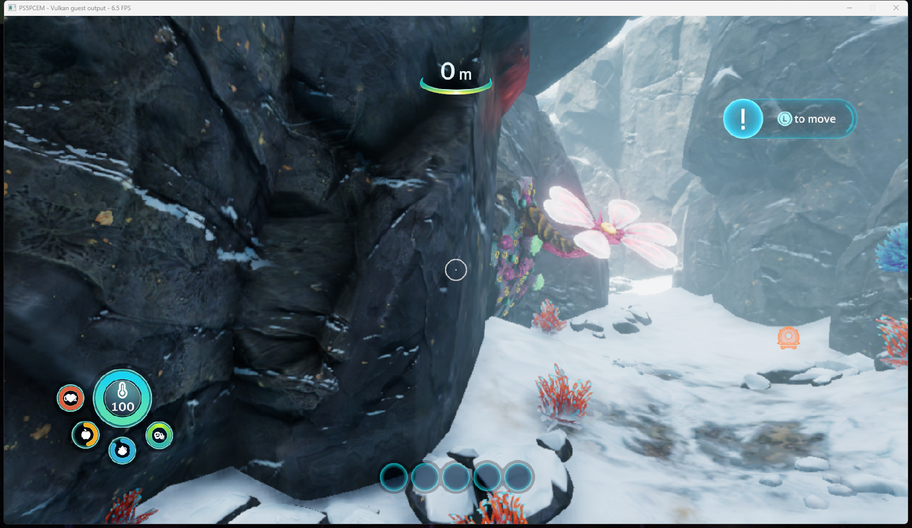 | **Playable · Completable** | **October 10, 2026, PPSA02457 v1.022.125:** ACM convolution and valid batch completion fix the reproduced startup crackle/NaN/silence chain. Fresh launches produce finite PCM; the maintainer confirms clear sound on repeated starts. New Game / Survival reaches controllable gameplay and writes a nonempty save. Stationary 30-second window-counter samples give **4.85 FPS median near the glowing plant** on the validation candidate and **14.20 FPS in the main menu** on the final signed runner. Output 1080p, Speed preset, normal audio enabled. These differ from the October 3 crash-site view and do not establish an audio-related slowdown or speedup. **30 FPS is unmet.** Rendering defects, long-session stability, a new full playthrough and short audio/capture discontinuities remain open. [Current audio investigation, FPS and captures](development/subnautica-acm-audio-2026-10-10.md) · [Historical October 3 measurements](development/subnautica-performance-repeat-2026-10-03.md) · [Save, startup and stack checks](development/subnautica-vector-walk-save-2026-10-02.md) · [sRGB fix](development/subnautica-backing-spans-2026-10-01.md) · [New-game investigation](development/subnautica-new-game-2026-10-01.md) |
| **Terminator 2D: No Fate** 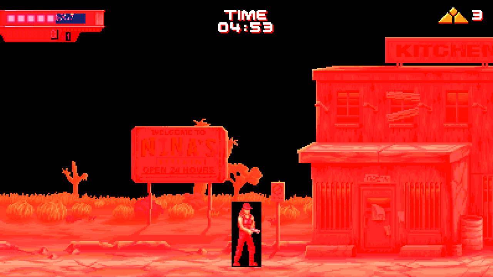 | **Playable · Completable** | Completed without reported problems. Correct backgrounds, characters, HUD, textures and colors; warmed-up startup frames measure 22–65 ms on the current test host. [Gameplay capture](images/live-gameplay.png) |
| **Pistol Whip** | Maps the native PS VR2 plugin and Burst module, then starts loading Unity asset archives | Headset, tracking, controller, and host OpenXR support are intentionally deferred |
| **Propagation: Paradise Hotel** | Mounts the 8.8 GiB UE PAK, completes ICU/config bootstrap, opens the cooked Global shader archive, creates AGC shaders, and submits the first DCB | This milestone predates the new synchronization packet constructors and needs a fresh run; VR presentation still has no host headset bridge |
| **Big Helmet Heroes** 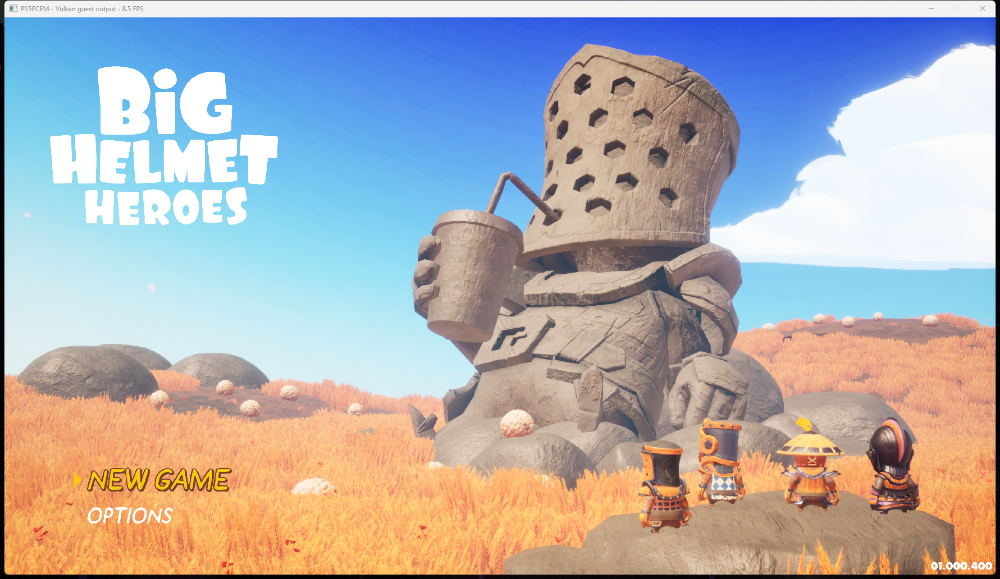 | **Main menu · tutorial scene renders · playability unverified** | **October 10, 2026, PPSA19943 v01.000.400:** stationary menu improves from **4.9 to 9.4 FPS median (9.0–9.5)** over 45 seconds on the RTX 3070 Ti. Bounded readbacks, coherent volume/mip reuse, parallel publication and shorter asynchronous batches reduce repeated work. Dense grass is restored after excluding a faulty intermediate stencil-image discard. Sampled draw/dispatch/resource failure counters are zero; this is not proof of universal shader coverage. **Stable 15 FPS is unmet.** 1080p output, internal targets up to 2848×1600; normal audio. Tutorial performance, gameplay and long-session stability are not revalidated. [Current measurements, changes and limits](development/big-helmet-heroes-menu-performance-2026-10-10.md) · [Historical tutorial check](development/big-helmet-heroes-scalar-history-2026-09-29.md) |
| **Tetris Effect: Connected** | **Developer logos · readable license screen · Journey Mode selection · gameplay and stability unverified** | Verified on September 24, 2026 with PPSA07923 v2.000.022. The translated composite replaces speculative 4K overrides. Faster tiled clears reduce the median license frame from 235 to 159 ms (about 4.3 to 6.3 FPS). Publishing linear metadata fills and supporting R11G11B10/RGB10A2 DCC clears remove accumulated UI copies and the vertical scene boundary. A 128-target title profile retains the approximately 100-attachment working set; observed Journey frames take 318–396 ms instead of 1127–1276 ms with the smaller cache. Dark interface elements and an unresolved compute texture binding remain under investigation. Later video playback faults in the guest H.264 decoder; a secondary host diagnostic alignment panic is corrected and regression-tested. Longer-run stability and gameplay are not established. The particle capture below records an earlier milestone |
| **The Precinct** | Links the complete six-image guest graph, starts Unity plug-ins through `sceKernelLoadStartModule`, indexes its audio assets, and plays both observed intro movies as synchronized 3840×2160 NV12 video and 48 kHz stereo PCM. It renders the complete 1920×1080 title artwork, opens `PLAY GAME`, and displays the readable `NEW GAME` confirmation shown below. Holding `Triangle` enters the cold world load; an earlier guarded run reached the `Cross` prompt and produced the first verified in-engine gameplay image. Target-thread exception delivery completes Unity's stop-the-world handshake, resident typed storage images preserve its compute graph, and dynamic compute scalars prevent runtime SGPR values from generating a new Vulkan pipeline every frame. Its world-load frame measures 2.1 s where it measured 5.1 s, after descriptor recovery stopped replaying each kernel's prolog once per resource it names | The first world transition still takes several minutes on the current RTX 3070 Ti test host because first-use shader translation, NVIDIA pipeline compilation, synchronous submission, and resource staging remain expensive. The former title- and shader-signature-specific NVIDIA compiler guard has been removed in favor of the general shader path, so the transition needs a fresh end-to-end validation before current gameplay compatibility is claimed |
| **Jets 'n' Guns 2** 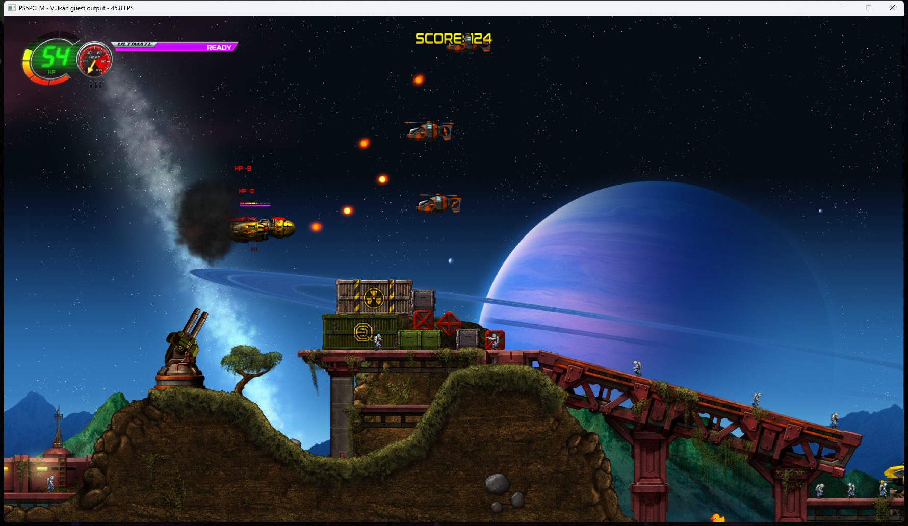 | **Playable · Completable** | Playthrough confirmed by the maintainer on September 15, 2026. October 9 development build: music and effects have independent host streams, and underrun recovery preserves PCM order. The 20-second mission-menu recording falls from 92.25% silent blocks to zero; two 13-second combat samples also have no silent 10 ms blocks. The 0.3.2 routing mitigation did not cover this batch-output path; this fix postdates 0.3.4. Combat UI counters sampled at 35.7–45.8 FPS; the older 11–14 FPS measurement is historical and is not a matched comparison. [Retest, limits and capture](development/jets-audio-streams-2026-10-09.md) |
| **Asterix & Obelix: Slap Them All!** 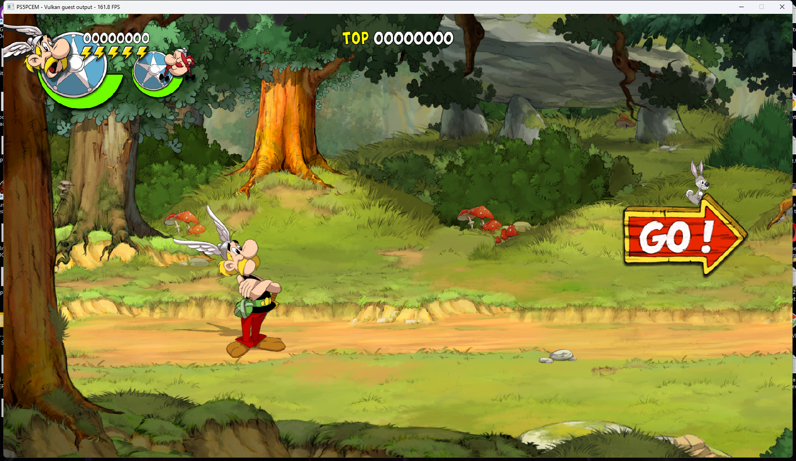 | **Playable · Completable** | Earlier playthrough confirmed by the maintainer. October 9 development build: matching MSAA depth/stencil-only passes restore stencil masks and eliminate four accidental full-frame diagnostic readbacks. Matched stationary opening-forest UI-counter medians rise from **46.45 to 162.20 FPS**, each sampled for 30 seconds on the RTX 3070 Ti at 1080p output. This is not a minimum across levels. Movement, jumping and the first Roman encounter are rechecked; all 233 Vulkan tests and native 2×/4× depth/stencil probes pass. The signed runner is updated. The earlier movie-startup fix remains included; these changes postdate 0.3.4. [Performance comparison and capture](development/asterix-msaa-depth-performance-2026-10-09.md) · [Movie-startup fix](development/asterix-video-buffers-2026-10-09.md) |
| **Cat Quest III** 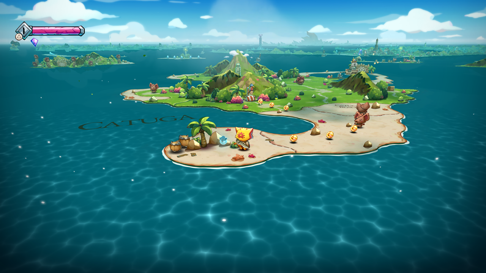 | **Playable · Completable** | Playthrough confirmed. Menus, adventure cards, dialogue, island terrain and colors render correctly in the captured scenes. Latest opening-island samples have a median of 124 ms (about 8 FPS), versus roughly 148 ms before optimization. [Gameplay capture](images/cat-quest-iii-world.png) |
| **Dreaming Sarah** 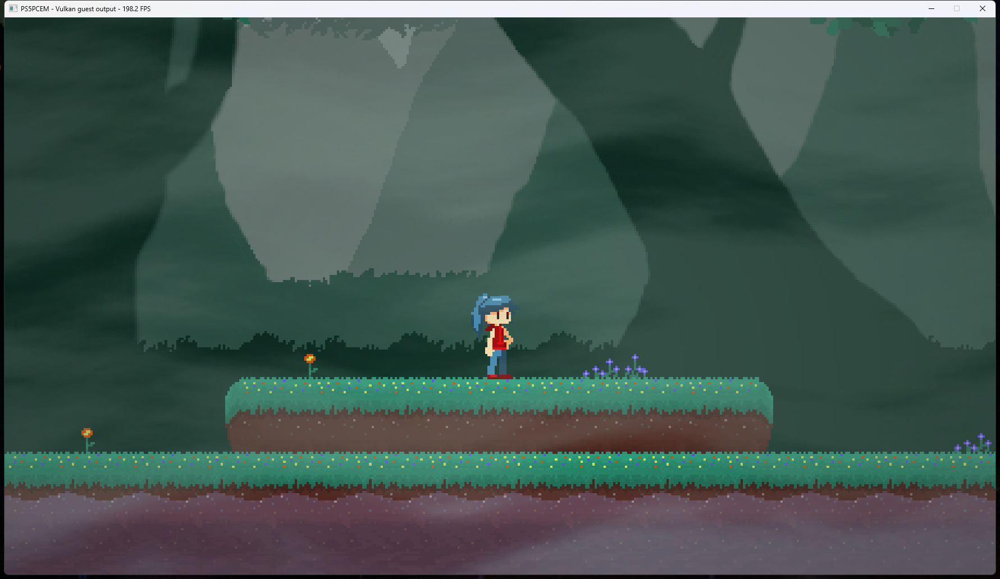 | **Playable · Completable** | **October 10, 2026:** proven vertex ranges reduce oversized sprite uploads from about 78 to 4.9 MiB per opening frame. The signed installed runner records **198.25 FPS median (187.8–203.2)** over 60 seconds in the opening forest, up from **53.25 FPS**. After waking: **197.25 FPS**; next platform screen: **144.35 FPS**, each over 30 seconds. All sampled seconds exceed 100 FPS. RTX 3070 Ti, 1080p output request, Speed preset, normal audio; internal resolution unchanged. Movement, jumping and the next screen are verified. These are window-counter samples, not a minimum across the entire game. The September 15 completed-playthrough report remains historical. [Fix, measurements and captures](development/dreaming-sarah-vertex-upload-performance-2026-10-10.md) |
| **Quake II (2023)** 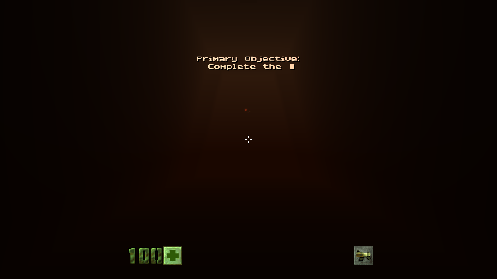 | **Playable · Completable** | Playthrough confirmed on September 16, 2026; rendering rechecked on September 25 with PPSA09477 v1.003. Level lighting, textures, weapons and NPCs are visible: the earlier dark-world and missing-model problems are resolved in the observed gameplay. Menus, HUD and controller input work. Buffer reuse and GPU clears reduce transfer overhead; the maintainer reports peaks of 60–70 FPS in lighter scenes, while busy combat scenes still run more slowly. Performance optimization continues; these peaks are not a stable minimum. [Gameplay capture](images/quake-ii-gameplay.png) · [Performance investigation](development/quake2-performance-2026-09-25.md) |
| **Jurassic Park Classic Games Collection** | **Playable · Completable** | Playthrough confirmed. Intro, animated title and collection selection work. Earlier sampled title/selection frames measured about 27/33 ms; performance varies by collection game and hardware |
| **REANIMAL** | Resolves the observed native and firmware modules, plays the company-logo sequence, and sustains the animated 3840×2160 title-menu render graph. Narrow Unity UI intermediates no longer replace the full scanout, dynamic R8 font atlases invalidate stale sampled images, and the buoy background, full title logo, water highlights, and `SELECT` prompt are visible in the live capture below | The central menu-option labels are still reduced to small red marks, so navigation and the transition into gameplay have not been verified. Performance and longer-run stability remain unmeasured, and gameplay is not claimed |
| **Mighty Morphin Power Rangers: Rita's Rewind** 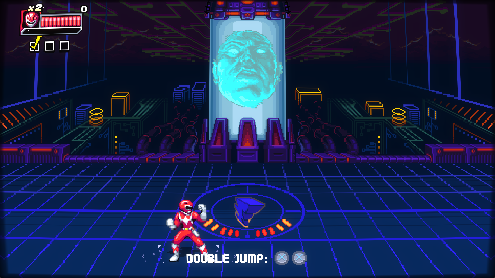 | **Playable · Completable** | Playthrough confirmed by the maintainer on September 24, 2026. The publisher sequence, title menu, and gameplay render and respond to controller input; the capture shows the Red Ranger in the Command Center training stage with the HUD, health bar, objectives, and button prompts. Native cooperative fibers retain suspended guest stacks, and exact `V_SAD_U32`, `V_MUL_HI_I32`, and `V_CVT_FLR_I32_F32` lowering removes the diagnostic shader fallback. The exact guest CRT composite still produces static on the current host, so a strict shader-signature fallback performs the observed 4× RGBA8 scene scale before post-processing. [Gameplay capture](images/ritas-rewind-gameplay.png) |
| **Ghost of Yōtei**  | **Intro · setup · post-tree cinematic and illustrated movie · character control unconfirmed** | **October 5 checkpoint:** a live repeat reaches the post-tree 3D cinematic. The tree presents **37 frames in 30.046 seconds (1.231 FPS)**; a later cinematic interval presents **two frames in 30.045 seconds (0.0666 FPS)**. First-use pipeline creation consumes 177 seconds of one 198-second transition frame. Tree streaks, incomplete lighting, active packed-color blending and heavy texture churn remain unresolved. Shared shader-key prefixes and file-mapped Windows cache snapshots pass 21 focused tests and three native Vulkan probes; the local runner/PDB is updated (`706151525938`). No FPS gain has yet been measured for these memory changes, and character control is unconfirmed. This checkpoint is included in release 0.3.3; its measurements predate the final cache-memory changes. [Memory changes and measurements](development/yotei-cache-memory-2026-10-05.md) · [Color export investigation](development/yotei-color-export-routing-2026-10-05.md) · [Earlier measurements and captures](development/yotei-array-layers-2026-10-04.md) |

## Dated development reports

**October 10, 2026 — Dreaming Sarah opening performance:** bounded sprite
vertex uploads raise the opening-forest median from **53.25 to 198.25 FPS**.
The installed signed runner stays above 100 FPS in all one-second samples of
the opening, awake and next-platform intervals. The optimization is shared
across titles and retains full ranges when the shader bounds are unproven.
[Measurements, validation and screenshots](development/dreaming-sarah-vertex-upload-performance-2026-10-10.md).

**October 10, 2026 — Subnautica delayed/crackling audio:** ACM now computes
the convolution reverb instead of returning success with unwritten output.
Invalid initial batch waits also fail correctly. Two fresh launches produce
finite, nonzero PCM within 11–13 seconds; the maintainer confirms clear audio
on the audible repeat. The earlier Options/title-confirmation explanation is
withdrawn. This fixes an upstream DSP failure; host scheduling dropouts and
rendering performance still require separate checks. See the
[investigation and validation](development/subnautica-acm-audio-2026-10-10.md).

**October 9, 2026 — Asterix & Obelix MSAA performance:** retaining the sample
count in depth/stencil-only passes removes four accidental diagnostic
readbacks per frame and restores their stencil writes. Stationary opening-forest
30-second UI-counter medians rise from **46.45 to 162.20 FPS** on the RTX 3070 Ti
host; these are scene-specific measurements. All 233 Vulkan tests and native
2×/4× depth/stencil probes pass. The signed development runner is updated.
See the [comparison and capture](development/asterix-msaa-depth-performance-2026-10-09.md).

**October 9, 2026 — Quake II and Subnautica audio:** raw PCM sampler blocks,
compact playback commands and the configured NGS2 grain restore Quake II
attract-sequence audio. Subnautica's AudioOut2 queue preserves fractional
playback time; menu music works, but short dropouts remain. All 602 HLE tests
pass. These development changes postdate 0.3.4. See the
[audio report, FPS checks and captures](development/quake2-subnautica-audio-2026-10-09.md).

**October 9, 2026 — Asterix & Obelix startup:** AvPlayer now stages decoded
video and audio in host memory before publishing tracked guest writes. This
fixes the opening movie freezing when a GPU-watched video buffer is reused.
The retest passes the bumper and story movie and reaches the first level with
page tracking enabled; all 597 HLE tests pass. This development fix postdates
0.3.4. See the [startup report and capture](development/asterix-video-buffers-2026-10-09.md).

**October 9, 2026 — Jets 'n' Guns 2 audio:** concurrent music and effects now
keep separate host streams, and underrun recovery preserves PCM order. The
20-second mission-menu loopback sample falls from 92.25% silent blocks to zero;
two 13-second active combat intervals also contain no silent 10 ms blocks.
This development fix postdates 0.3.4. See the
[audio retest and gameplay capture](development/jets-audio-streams-2026-10-09.md).

**October 9, 2026 — shared shader support:** MIMG BY2/BY4 and PCK2/PCK4
loads, including explicit mip levels, now execute for the measured native 2D
formats. Native Vulkan checks cover packing, bounds and register preservation;
game compatibility grades and FPS measurements are unchanged by this check.
See the [implementation and validation report](development/mimg-multi-texel-2026-10-09.md).

**October 9, 2026 — horizontal gathers:** `IMAGE_GATHER4H` and
`IMAGE_GATHER4H_PCK` now execute with typed texture access, correct result
widths and edge handling. A native GPU matrix passes 1,242 dispatches and
635,904 checked words. This instruction-level check does not change game
grades or FPS measurements. See the [gather report](development/gather4h-2026-10-09.md).

**October 9, 2026 — scalar shader calls:** `S_SWAPPC_B64` and `S_CALL_B64`
now execute bounded local subroutines and verified external fetch-shader calls.
Native GPU checks pass 42 dispatches and 21,504 exact result words, including
nested calls and inactive lanes. Game grades and FPS are unchanged by this
instruction-level check. See the [scalar call report](development/scalar-calls-2026-10-09.md).

## Package extraction checks

**October 2, 2026 — Grand Theft Auto III: The Definitive Edition,
PPSA03527 v1.007:** corrected NAPS block-table alignment removes the
`InvalidPfs` failure after CNT metadata extraction. The debug package now
extracts all 48 files, including `eboot.bin`, six modules and both PAK archives;
both PAK index checksums match. All 21 package tests pass. The local extractor
is updated; public release archives are unchanged. This is an extraction
check only, with game execution and compatibility untested.
[Failure, fix and validation](development/gta3-pkg-extraction-2026-10-02.md).

## Screenshots

*Subnautica: Below Zero, PPSA02457 v1.022.125, October 1, 2026. An unedited
1765×993 client-window capture with 1080p guest output after starting a new
Survival game. Correct sRGB attachment encoding restores visible material
detail and brighter lighting. The following 30.05-second world sample records
9.49 FPS. Rendering defects, an unresolved scalar binding and intermittent
loading failures remain under investigation; this run did not test a full
playthrough. [Run report](development/subnautica-backing-spans-2026-10-01.md).*

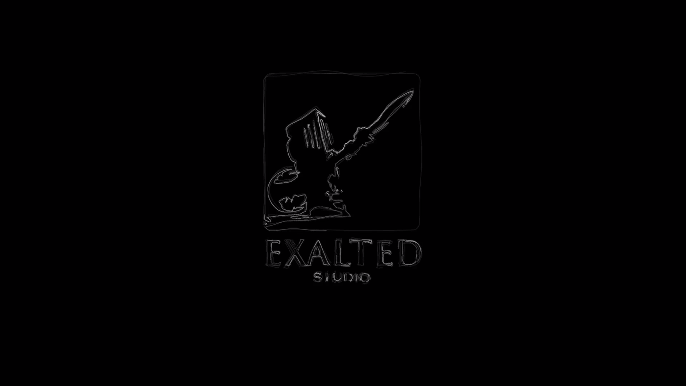

*The Exalted Studio logo during Big Helmet Heroes' opening movie, captured
from PS5PCEM's live 1920×1080 presentation output.*

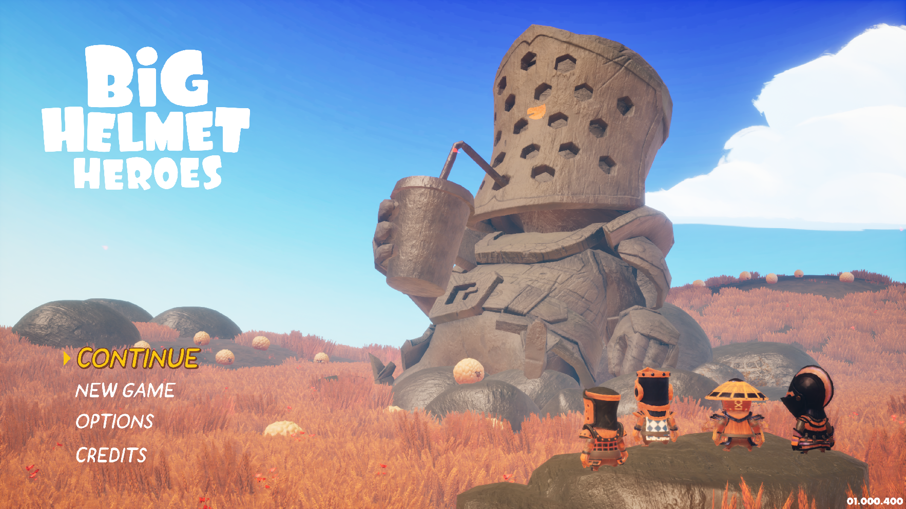

*Maintainer-approved visual reference, captured from the emulator's actual game
window on September 20, 2026. The menu, characters and 3D background render with
correct lighting and colors. Two clean menu-only launches reproduced this
result; gameplay has not been verified.*

*September 28, 2026: a 1765×993 capture of the actual game window after the
GPU-watched file-read and interrupted-save mount fixes. The character, HUD and
windmills render in the tutorial. This is a limited startup check; visual
artifacts remain and a complete playthrough has not been tested. The internal
captured framebuffer is still 3840×2160; this image does not demonstrate a
1080p internal-rendering change.*

*September 29, 2026: an unedited 1765×993 capture of the actual game window.
The character, HUD, windmills and Move/Sprint prompts render after the fix for
false command-header protection. Separate sampled runs measure 6.13 FPS in the
menu and 3.57 FPS in the tutorial. A repeatable FPS improvement is not established;
30 FPS has not been reached. Output is 1920×1080, with larger internal targets.
Visual artifacts remain, and full playability and long-session stability are
unverified.*

*September 29, 2026: an unedited capture of the actual game window after the
shared CPU texture-copy optimization. Separate standard-setting runs measure
6.25 FPS in the menu versus 5.85–5.95 FPS in two controls; the completed tutorial
check measures 3.57 FPS without a valid matched comparison. 30 FPS has not been
reached. Output is 1920×1080, with larger internal targets. Visual artifacts
remain; full playability and long-session stability are unverified.*

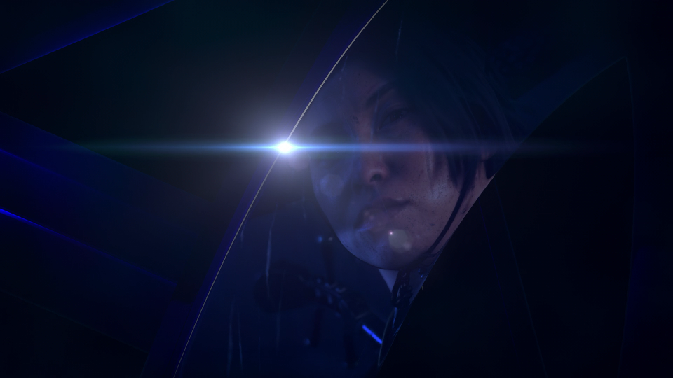

*A live Ghost of Yotei intro frame decoded from the title's own H.264 stream
through `libSceVideodec2` and presented at 1920×1080. The host decoder receives
the title's Annex B access units, the picture is converted from NV12 with BT.709
coefficients, and playback follows the frame rate reported by the decoded
stream. Build with `zig build build-game-run -Doptimize=ReleaseFast` to reproduce
the measured playback speed. Later development reached the bonus notices,
brightness calibration and parts of the 3D scene/interface; full title-menu
composition and gameplay remain unverified.*

*September 30 development build, unedited game-window capture. This debugger-assisted run completes
all 920 background warmups naturally and reaches the tree, but vertical streaks,
excessive brightness, later block corruption and long pipeline compilation stalls
remain. The native relocation test proves pipeline reuse; a game FPS improvement
is not established. [Current findings and second capture](development/yotei-scalar-tables-2026-09-30.md).*

*September 29, 2026: an unedited game-window capture from the 25-minute
buffer-publication diagnostic run. The wolf and tree were reached without a
logged guest fault; queued background warmups were cancelled during the run.
Vertical streaks, excessive brightness and stray elements remain. No FPS gain,
repeatable startup or playability is established. [Evidence and tests](development/yotei-buffer-publication-2026-09-29.md).*

*September 29, 2026: unedited 1765×993 captures of the actual game window in
a diagnostic repeat with default buffer reuse. The updated development runner
reached both screens, but another launch exited with a guest read fault.
The intermittent failure remains unresolved. Diagnostic instrumentation
affects timing; these images do not establish an FPS improvement, 30 FPS or
stable gameplay. [Investigation and validation](development/yotei-warmup-priority-2026-09-29.md).*

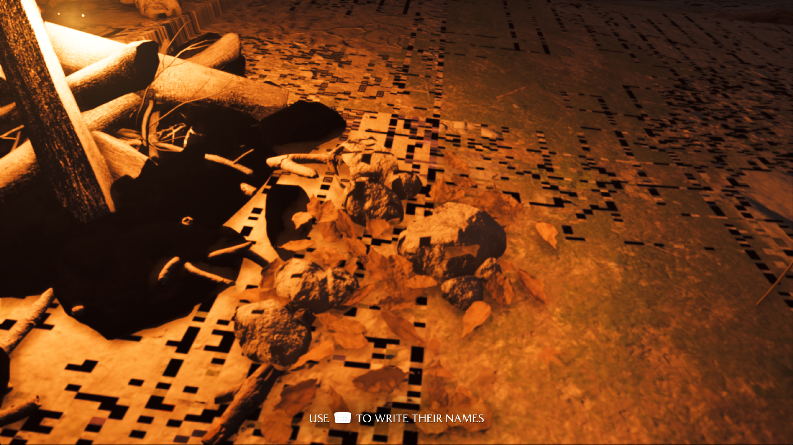

*Captured directly from the emulator's live client area at 1624×941 on
September 23, 2026, using a development build.*

*A live Terminator 2D gameplay frame produced by the current guest VS/PS,
sampled-texture, render-target, and Vulkan presentation paths. Texture alpha,
component swizzles, and sRGB sampling now preserve the title's intended color
balance.*

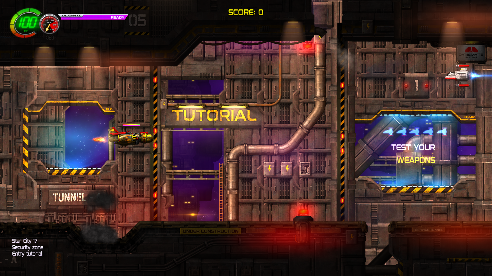

*A live 3840×2160 Jets 'n' Guns 2 tutorial frame reached through `START GAME`
and the title's loading screen. The ship, HUD, layered level art, lighting, and
text are produced by the guest multi-draw, sampled-texture,
persistent-render-target, compute, and VideoOut paths.*

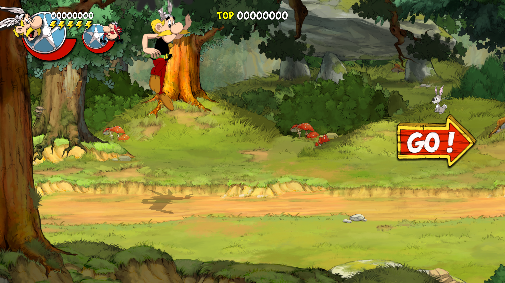

*A live 1920×1080 Asterix & Obelix: Slap Them All! gameplay frame captured at
flip 512. The scene, characters, HUD, and prompt come from the title's guest
draws. The final fullscreen compositor remains GPU-resident, while scanout
preserves the guest viewport's vertical orientation without a per-frame
host-memory round trip.*

*Captured directly from the emulator's live client area at 1765×993 on
September 25, 2026. The attract demo shows the lit level, textured enemies,
player's hand and weapon. The earlier dark-world and missing-NPC rendering
problems are resolved in this scene. Frame rate still varies with scene
complexity; work on the remaining performance dips continues.*

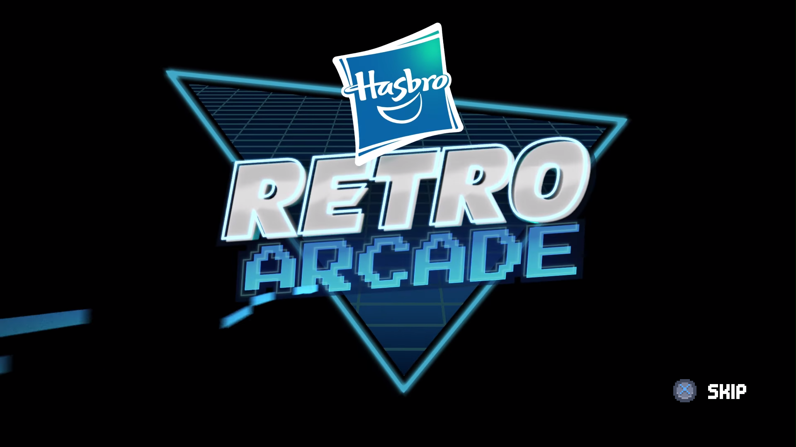

*A live 1920×1080 Rita's Rewind publisher/title intro frame produced by the
guest indexed vertex, sampled fragment, render-target composition, and VideoOut
paths. The corresponding animation and audio remain smooth in the observed
run; this is an intro milestone rather than a gameplay claim.*

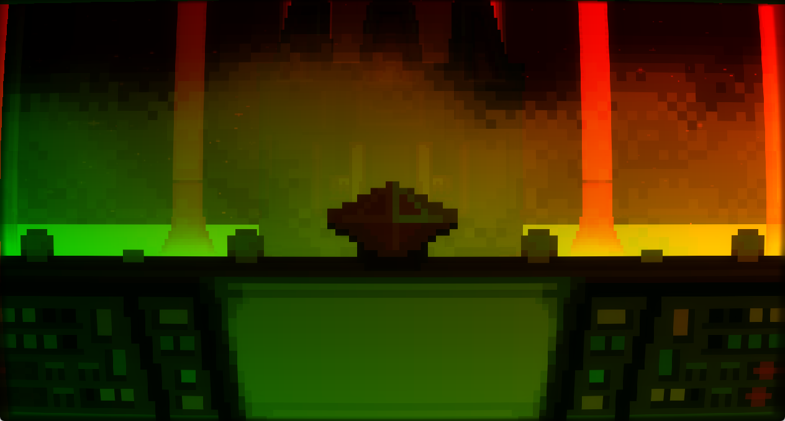

*Rita's Rewind after the title menu, rendered from the real 480×270 guest scene
target and carried through the 1920×1080 CRT/post-processing chain. The strict
CRT-composite compatibility path removes the former full-screen static while
preserving the title's pixel-art presentation.*

*Rita's Rewind gameplay: the Red Ranger in the Command Center training stage,
with the HUD, health bar, objective checklist, and `Double Jump` prompt,
captured from a live game-run window on September 24, 2026.*

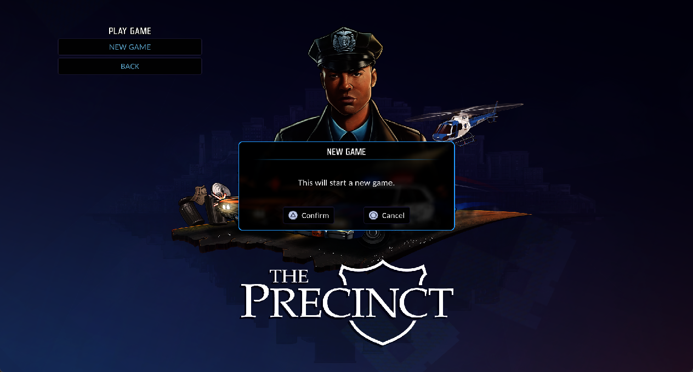

*The Precinct's live 1920×1080 title menu and `NEW GAME` confirmation, composed
by the guest graphics and compute passes after both SceAvPlayer intro movies.
Structured shader control flow restores the UI text, while fixed-function DCC
decompression no longer executes its constant-white helper shader over the
completed scene. This capture predates the now-verified transition into the
first in-engine gameplay scene.*

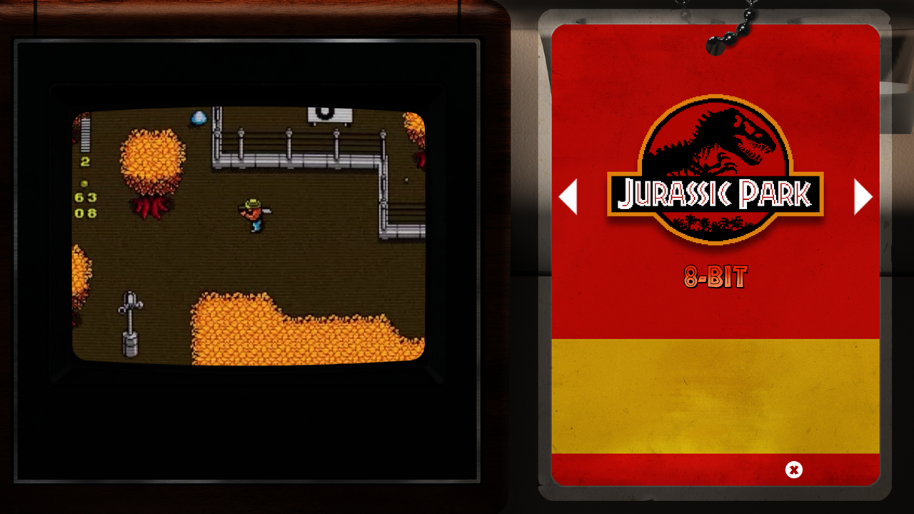

*Game selection with cover art, navigation arrows, and an animated preview.
This earlier development capture precedes the maintainer's full-playability
confirmation.*

*October 8, 2026 startup regression check: the new Font HLE rejected `U+007F`
while the collection built its ImGui atlas, triggering `CalcGlyphInfo`'s
assertion and terminating `CarbonMainThread`. Other threads kept waiting and
reported pending AGC commands. Missing characters now use the font's `.notdef`
glyph; the corrected runner reaches the first level shown above. All 569 HLE
tests pass, including complete Latin-1 atlas metrics and rendering coverage.*

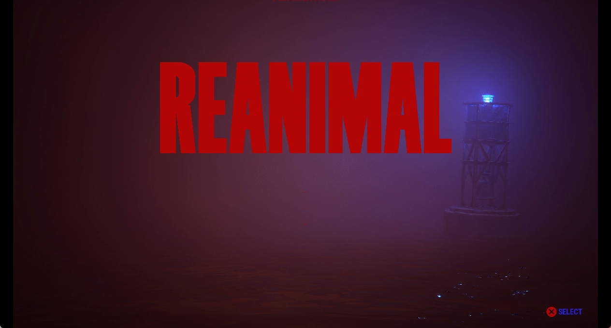

*A live REANIMAL title-menu frame produced by the guest Unity render graph. The
animated buoy background, title logo, water highlights, and `SELECT` prompt are
visible without the former full-screen stretch. The missing central option
labels remain an active rendering issue, so this capture is not a complete menu
or gameplay claim.*

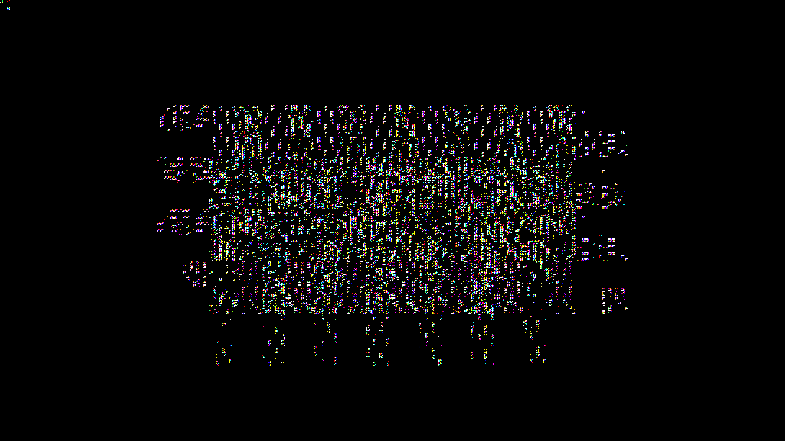

*The first recognizable Tetris Effect render produced by the title's startup
graph: 595 guest draws and 63 compute dispatches complete without a rejected
draw. This 1920×1080 `R11G11B10_FLOAT` intermediate is converted for display
because the registered 3840×2160 VideoOut target was still black in that run.
This historical capture predates the September 24 startup rendering fix; it
does not document gameplay.*

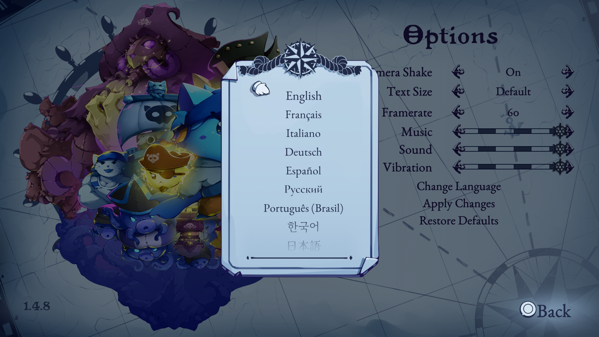

*The language list now retains its text and clips it inside the panel; the
stencil pop no longer paints a white rectangle over the labels.*

*Island gameplay with the HUD, restored mountains, blue sea and sky, and
correct character colors. Cat Quest III is fully playable according to the
project maintainer's September 8 playtest.*

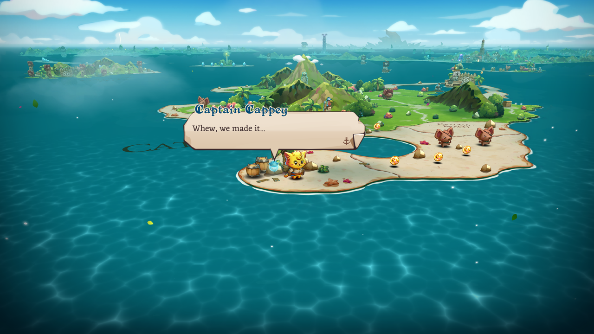

*Captain Cappey's dialogue remains readable over the rendered island scene.*

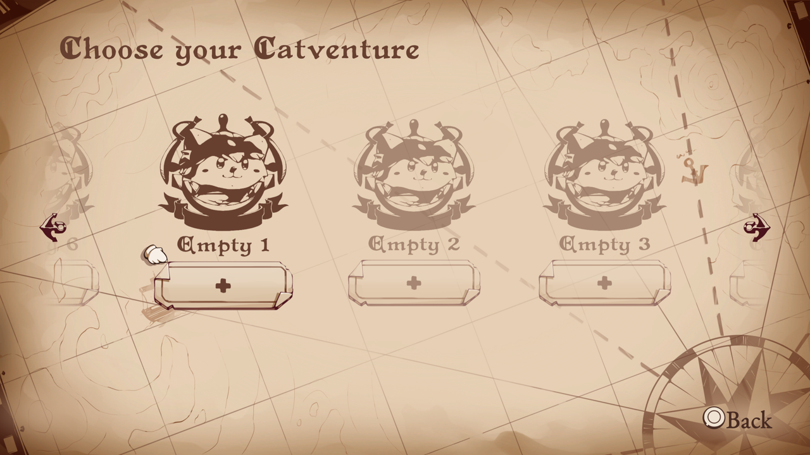

*Catventure selection now displays the slot artwork, labels, add buttons and
scroll arrows, with the clipping mask linked to the correct shader export.*

*September 29, 2026: an unedited capture of the actual game window. Separate
matched runs measure 6.21 FPS in the menu and 3.61 FPS in the tutorial.
Sample ranges overlap the controls; a repeatable FPS gain is not established.
30 FPS has not been reached. Output is 1920×1080, with larger internal targets.
Visual artifacts remain; full playability and long-session stability are unverified.*

*September 29, 2026: an unedited capture of the actual game window. Separate
matched runs measure 6.54 FPS in the menu and 3.61 FPS in the tutorial.
Sample ranges overlap the controls; a repeatable FPS gain is not established.
30 FPS has not been reached. Output is 1920×1080, with larger internal targets.
Visual artifacts remain; full playability and long-session stability are unverified.*

*September 29, 2026: an unedited 1765×993 capture from the actual game
window, after profiled flip 300. The default spare pool reuses compatible
Vulkan buffers after GPU completion. Separate matched samples measure 6.54 FPS
in the menu and 3.77 FPS in the tutorial; buffer creation and destruction time
in the tutorial falls from 28.8 to 15.8 ms. Frame ranges overlap, so a repeatable
FPS gain is not established. 30 FPS has not been reached. Output is 1920×1080,
with larger internal targets. Visual artifacts remain; full playability and
long-session stability are unverified.*

*September 29, 2026: an unedited 1765×993 capture of the actual game window,
about 67 seconds after launch following profiled flip 300. The HUD, windmills,
Move/Sprint prompts and a blue circular effect are visible. Separate matched
samples measure 6.37 FPS in the menu and 3.70 FPS in the tutorial. No game FPS
improvement is demonstrated. Longer isolated scalar-load fixtures are 9–45%
cheaper; short walks are effectively unchanged. 30 FPS has not been reached.
Output is 1920×1080, with larger internal targets. Visual artifacts remain;
full playability and long-session stability are unverified.*
